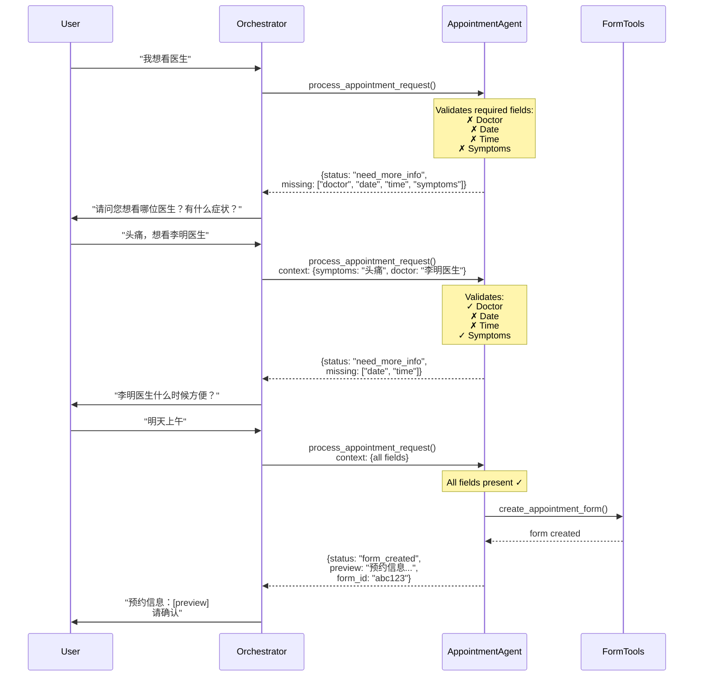

# Appointment Agent Pattern - Correct Architecture

## The Right Way: Appointment Agent Validates and Requests Information

You're absolutely correct! The pattern should be:

1. **Orchestrator** receives user request
2. **Orchestrator** calls appointment agent
3. **Appointment Agent** validates if it has enough information
4. **Appointment Agent** returns either:
   - "I need more info" (tells orchestrator what's missing)
   - "Here's the form preview" (ready for confirmation)
   - "Booking confirmed" (if user already confirmed)

## Architecture Flow



## Key Design Principles

### 1. **Appointment Agent Owns Validation**
```python
class AppointmentAgentEnhanced:
    def __init__(self):
        self.required_fields = {
            'doctor': 'Need doctor name or department',
            'date': 'Need appointment date',
            'time': 'Need time slot',
            'symptoms': 'Need symptoms description'
        }
    
    async def process_appointment_request(self, query, context, user_id):
        # Validate what we have
        info = self._extract_info(query, context)
        validation = self._validate(info)
        
        if not validation['is_complete']:
            return {
                'status': 'need_more_info',
                'missing_info': validation['missing'],
                'message': 'Need more information for appointment'
            }
        
        # We have everything, create form
        return await self._create_form(info, user_id)
```

### 2. **Orchestrator Just Orchestrates**
```python
# In orchestrator's appointment tool
async def call_appointment_agent(query: str) -> str:
    result = await appointment_agent.process_appointment_request(
        query=query,
        context=self._current_state.context,
        user_id=self._current_state.user_id
    )
    
    if result['status'] == 'need_more_info':
        # Update context so orchestrator knows what to ask
        self._current_state.missing_appointment_info = result['missing_info']
        return f"预约需要更多信息：{result['message']}"
    
    elif result['status'] == 'form_created':
        # Store form_id in context
        self._current_state.active_form_id = result['form_id']
        return result['preview']
    
    # Handle other statuses...
```

### 3. **Context Accumulation**
The orchestrator accumulates information across turns:
```python
Turn 1: User says "我想看医生"
        Context: {}
        Agent returns: need_more_info

Turn 2: User says "头痛"
        Context: {symptoms: "头痛"}
        Agent returns: need_more_info

Turn 3: User says "李明医生，明天上午"
        Context: {symptoms: "头痛", doctor: "李明医生", date: "明天", time: "上午"}
        Agent returns: form_created
```

## Benefits of This Pattern

### 1. **Clear Responsibilities**
- **Orchestrator**: Manages conversation flow
- **Appointment Agent**: Validates and manages appointments
- **Form Tools**: Handle form CRUD operations

### 2. **Stateless Agents**
- Each call to appointment agent is self-contained
- Agent doesn't maintain conversation state
- All state is in orchestrator's context

### 3. **Reusable**
- Same appointment agent can be used by different orchestrators
- Clear interface: query + context → result

### 4. **Testable**
```python
# Easy to test appointment agent
result = await agent.process_appointment_request(
    query="看医生",
    context={},
    user_id="test"
)
assert result['status'] == 'need_more_info'
assert 'doctor' in result['missing_info']
```

## Implementation in Pattern 2

### Update the Appointment Tool:
```python
def call_appointment_agent(query: str) -> str:
    """Book medical appointments - validates and collects required info"""
    logger.info(f"📅 AppointmentAgent called with: {query}")
    
    # Update state
    if self._current_state:
        self._current_state.agents_called.append("AppointmentAgent")
    
    # Get agent
    if agent := self.agents.get("AppointmentAgent"):
        try:
            async def run_agent():
                # Pass accumulated context
                context = {
                    'symptoms': self._current_state.symptoms,
                    'doctor': self._current_state.preferred_doctor,
                    'date': self._current_state.preferred_date,
                    'time': self._current_state.preferred_time,
                    'active_form_id': self._current_state.active_form_id
                }
                
                result = await agent.process_appointment_request(
                    query=query,
                    context=context,
                    user_id=self._current_state.user_id
                )
                
                # Handle different statuses
                if result['status'] == 'need_more_info':
                    self._current_state.appointment_missing = result['missing_info']
                    return result['message']
                    
                elif result['status'] == 'form_created':
                    self._current_state.active_form_id = result['form_id']
                    return f"{result['message']}\n\n{result['preview']}"
                
                # ... handle other statuses
                
            # Run with proper async handling
            result = asyncio.run(run_agent())
            return result
            
        except Exception as e:
            logger.error(f"AppointmentAgent error: {e}")
            return f"预约服务暂时不可用: {str(e)}"
```

## Summary

The correct pattern is:

1. **Appointment agent validates** - Not orchestrator
2. **Agent returns status** - need_info, form_created, confirmed, etc.
3. **Orchestrator handles conversation** - Asks for missing info naturally
4. **Context accumulates** - Each turn adds information
5. **Agent is stateless** - Gets context each time

This creates a clean separation where:
- Appointment agent is the **expert** on appointments
- Orchestrator is the **conversationalist**
- Neither needs to know the other's internals