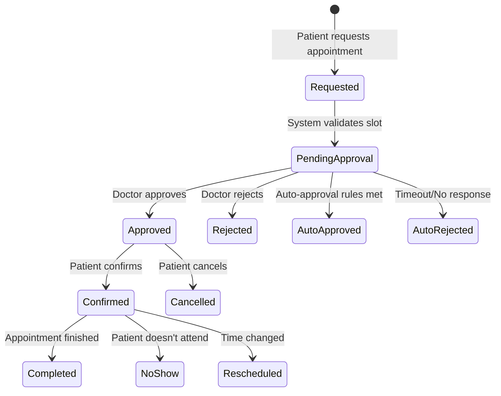

# Appointment Approval System Design

## Overview
Design for a comprehensive appointment approval workflow that handles doctor confirmations, patient notifications, and booking state management.

## System Architecture

### 1. Database Schema

```sql
-- Appointment status enum
CREATE TYPE appointment_status AS ENUM (
    'pending',        -- Initial state after patient request
    'confirmed',      -- Doctor approved
    'rejected',       -- Doctor rejected
    'cancelled',      -- Patient cancelled
    'completed',      -- Appointment finished
    'no_show',        -- Patient didn't show up
    'rescheduled'     -- Appointment time changed
);

-- Main appointment table (extending existing)
ALTER TABLE humansa_appointment ADD COLUMN IF NOT EXISTS (
    status appointment_status DEFAULT 'pending',
    doctor_notes TEXT,
    rejection_reason TEXT,
    approved_at TIMESTAMP,
    approved_by VARCHAR(100),
    reminder_sent BOOLEAN DEFAULT FALSE,
    reminder_sent_at TIMESTAMP,
    confirmation_code VARCHAR(20) UNIQUE,
    created_by VARCHAR(100),
    updated_at TIMESTAMP DEFAULT CURRENT_TIMESTAMP
);

-- Appointment approval queue
CREATE TABLE humansa_appointment_approval_queue (
    id SERIAL PRIMARY KEY,
    appointment_id INTEGER REFERENCES humansa_appointment(id),
    doctor_id INTEGER REFERENCES humansa_doctor(id),
    requested_at TIMESTAMP DEFAULT CURRENT_TIMESTAMP,
    priority INTEGER DEFAULT 0, -- 0=normal, 1=urgent, 2=emergency
    patient_symptoms TEXT,
    requires_review BOOLEAN DEFAULT TRUE,
    reviewed_at TIMESTAMP,
    response_deadline TIMESTAMP, -- Doctor must respond by this time
    auto_rejected BOOLEAN DEFAULT FALSE,
    UNIQUE(appointment_id)
);

-- Appointment notifications
CREATE TABLE humansa_appointment_notifications (
    id SERIAL PRIMARY KEY,
    appointment_id INTEGER REFERENCES humansa_appointment(id),
    user_id VARCHAR(255),
    notification_type VARCHAR(50), -- 'pending_approval', 'approved', 'rejected', 'reminder'
    channel VARCHAR(50), -- 'sms', 'wechat', 'app_push', 'email'
    sent_at TIMESTAMP DEFAULT CURRENT_TIMESTAMP,
    delivered BOOLEAN DEFAULT FALSE,
    read_at TIMESTAMP,
    content JSONB,
    retry_count INTEGER DEFAULT 0,
    next_retry_at TIMESTAMP
);

-- Appointment history for audit trail
CREATE TABLE humansa_appointment_history (
    id SERIAL PRIMARY KEY,
    appointment_id INTEGER REFERENCES humansa_appointment(id),
    action VARCHAR(50), -- 'created', 'approved', 'rejected', 'cancelled', etc
    actor_id VARCHAR(255), -- User or doctor ID who performed action
    actor_type VARCHAR(20), -- 'patient', 'doctor', 'system'
    previous_status appointment_status,
    new_status appointment_status,
    metadata JSONB, -- Additional context
    created_at TIMESTAMP DEFAULT CURRENT_TIMESTAMP
);

-- Doctor availability preferences
CREATE TABLE humansa_doctor_availability_rules (
    id SERIAL PRIMARY KEY,
    doctor_id INTEGER REFERENCES humansa_doctor(id),
    auto_approve BOOLEAN DEFAULT FALSE,
    max_daily_appointments INTEGER DEFAULT 20,
    buffer_time_minutes INTEGER DEFAULT 15, -- Time between appointments
    advance_booking_days INTEGER DEFAULT 30, -- How far ahead patients can book
    same_day_booking BOOLEAN DEFAULT TRUE,
    emergency_slots_per_day INTEGER DEFAULT 2,
    approval_required_conditions TEXT[], -- Conditions requiring manual approval
    created_at TIMESTAMP DEFAULT CURRENT_TIMESTAMP,
    updated_at TIMESTAMP DEFAULT CURRENT_TIMESTAMP
);
```

### 2. Approval Workflow States



### 3. API Endpoints

```python
# Appointment approval endpoints
POST   /api/appointments/request          # Patient requests appointment
GET    /api/appointments/pending          # Doctor views pending approvals
POST   /api/appointments/{id}/approve     # Doctor approves
POST   /api/appointments/{id}/reject      # Doctor rejects with reason
GET    /api/appointments/{id}/status      # Check appointment status
POST   /api/appointments/{id}/confirm     # Patient confirms approved appointment
POST   /api/appointments/{id}/cancel      # Cancel appointment
GET    /api/appointments/my-appointments  # Patient's appointments
POST   /api/appointments/{id}/reschedule  # Request reschedule

# Notification endpoints
GET    /api/notifications/unread          # Get unread notifications
POST   /api/notifications/{id}/mark-read  # Mark as read
POST   /api/notifications/preferences     # Set notification preferences
```

### 4. Approval Logic Implementation

```python
class AppointmentApprovalService:
    """Handles appointment approval workflow"""
    
    async def request_appointment(
        self,
        patient_id: str,
        doctor_id: int,
        slot_id: int,
        symptoms: str,
        is_urgent: bool = False
    ) -> Dict[str, Any]:
        """Patient requests an appointment"""
        
        # 1. Validate slot availability
        slot = await self.validate_slot(slot_id, doctor_id)
        if not slot.is_available:
            raise SlotNotAvailableError()
        
        # 2. Check patient history
        patient_history = await self.get_patient_history(patient_id)
        
        # 3. Apply auto-approval rules
        auto_approve = await self.check_auto_approval(
            doctor_id, symptoms, patient_history, is_urgent
        )
        
        # 4. Create appointment
        appointment = await self.create_appointment(
            patient_id=patient_id,
            doctor_id=doctor_id,
            slot_id=slot_id,
            symptoms=symptoms,
            status='pending' if not auto_approve else 'confirmed',
            confirmation_code=self.generate_confirmation_code()
        )
        
        if auto_approve:
            # 5a. Auto-approved path
            await self.notify_patient(appointment, 'approved')
            await self.update_slot_availability(slot_id, available=False)
        else:
            # 5b. Manual approval path
            await self.add_to_approval_queue(
                appointment_id=appointment.id,
                priority=2 if is_urgent else 0,
                response_deadline=self.calculate_deadline(is_urgent)
            )
            await self.notify_doctor(doctor_id, appointment)
            await self.notify_patient(appointment, 'pending_approval')
        
        return appointment
    
    async def check_auto_approval(
        self,
        doctor_id: int,
        symptoms: str,
        patient_history: Dict,
        is_urgent: bool
    ) -> bool:
        """Check if appointment can be auto-approved"""
        
        # Get doctor's auto-approval rules
        rules = await self.get_doctor_rules(doctor_id)
        
        if not rules.auto_approve:
            return False
        
        # Check conditions requiring manual approval
        if any(condition in symptoms.lower() 
               for condition in rules.approval_required_conditions):
            return False
        
        # Check daily appointment limit
        today_count = await self.get_doctor_appointments_count(doctor_id, date.today())
        if today_count >= rules.max_daily_appointments:
            return False
        
        # Check patient history (e.g., no-show rate)
        if patient_history.get('no_show_rate', 0) > 0.2:  # >20% no-show
            return False
        
        return True
    
    async def approve_appointment(
        self,
        appointment_id: int,
        doctor_id: int,
        notes: Optional[str] = None
    ) -> Dict[str, Any]:
        """Doctor approves appointment"""
        
        appointment = await self.get_appointment(appointment_id)
        
        # Validate doctor
        if appointment.doctor_id != doctor_id:
            raise UnauthorizedError()
        
        # Update appointment
        appointment.status = 'confirmed'
        appointment.approved_at = datetime.now()
        appointment.approved_by = f"doctor_{doctor_id}"
        appointment.doctor_notes = notes
        
        await self.save_appointment(appointment)
        
        # Update slot
        await self.update_slot_availability(appointment.slot_id, available=False)
        
        # Remove from queue
        await self.remove_from_approval_queue(appointment_id)
        
        # Notifications
        await self.notify_patient(appointment, 'approved')
        
        # Audit trail
        await self.log_appointment_action(
            appointment_id=appointment_id,
            action='approved',
            actor_id=str(doctor_id),
            actor_type='doctor'
        )
        
        return appointment
```

### 5. Notification System

```python
class AppointmentNotificationService:
    """Handles all appointment-related notifications"""
    
    async def notify_patient(
        self,
        appointment: Appointment,
        notification_type: str
    ):
        """Send notification to patient"""
        
        templates = {
            'pending_approval': {
                'title': '预约申请已提交',
                'body': f'您的预约申请已提交给{appointment.doctor_name}医生，请等待确认。预约码：{appointment.confirmation_code}'
            },
            'approved': {
                'title': '预约已确认',
                'body': f'您的预约已被确认。时间：{appointment.datetime}，地点：{appointment.clinic_name}。请准时到达。'
            },
            'rejected': {
                'title': '预约未通过',
                'body': f'抱歉，您的预约申请未通过。原因：{appointment.rejection_reason}。请选择其他时间或医生。'
            },
            'reminder': {
                'title': '预约提醒',
                'body': f'您明天{appointment.time}有预约。医生：{appointment.doctor_name}，地点：{appointment.clinic_name}'
            }
        }
        
        template = templates.get(notification_type)
        if not template:
            return
        
        # Send via multiple channels
        channels = await self.get_user_notification_preferences(appointment.patient_id)
        
        for channel in channels:
            await self.send_notification(
                user_id=appointment.patient_id,
                channel=channel,
                title=template['title'],
                body=template['body'],
                appointment_id=appointment.id,
                notification_type=notification_type
            )
```

### 6. Automated Tasks

```python
# Cron jobs / Scheduled tasks

async def process_expired_approvals():
    """Auto-reject appointments not responded to by deadline"""
    expired = await db.query("""
        SELECT a.* FROM humansa_appointment a
        JOIN humansa_appointment_approval_queue q ON a.id = q.appointment_id
        WHERE q.response_deadline < NOW()
        AND a.status = 'pending'
        AND q.reviewed_at IS NULL
    """)
    
    for appointment in expired:
        await reject_appointment(
            appointment.id,
            reason="医生未在规定时间内响应",
            auto_rejected=True
        )

async def send_appointment_reminders():
    """Send reminders 24 hours before appointment"""
    tomorrow_appointments = await db.query("""
        SELECT * FROM humansa_appointment
        WHERE status = 'confirmed'
        AND appointment_datetime BETWEEN NOW() + INTERVAL '23 hours' 
            AND NOW() + INTERVAL '25 hours'
        AND reminder_sent = FALSE
    """)
    
    for appointment in tomorrow_appointments:
        await notify_patient(appointment, 'reminder')
        await mark_reminder_sent(appointment.id)

async def update_appointment_slots():
    """Release slots for expired/cancelled appointments"""
    released_slots = await db.query("""
        UPDATE humansa_appointment_slot
        SET is_available = TRUE
        WHERE id IN (
            SELECT slot_id FROM humansa_appointment
            WHERE status IN ('cancelled', 'rejected', 'no_show')
            AND updated_at > NOW() - INTERVAL '1 hour'
        )
    """)
```

### 7. Integration with HUMANSA V2

```python
# Update appointment tool in HUMANSA V2
class EnhancedAppointmentTool:
    """Enhanced appointment tool with approval workflow"""
    
    @tool
    async def book_appointment_with_approval(
        self,
        patient_id: str,
        doctor_name: str,
        date: str,
        time: str,
        symptoms: str,
        is_urgent: bool = False
    ) -> str:
        """Book appointment with approval workflow"""
        
        # Find doctor
        doctor = await self.find_doctor(doctor_name)
        if not doctor:
            return "未找到该医生"
        
        # Find available slot
        slot = await self.find_slot(doctor.id, date, time)
        if not slot:
            return "该时间段已满"
        
        # Request appointment
        approval_service = AppointmentApprovalService()
        appointment = await approval_service.request_appointment(
            patient_id=patient_id,
            doctor_id=doctor.id,
            slot_id=slot.id,
            symptoms=symptoms,
            is_urgent=is_urgent
        )
        
        if appointment.status == 'confirmed':
            return f"""
预约成功确认！
医生：{doctor.name}
时间：{appointment.datetime}
地点：{appointment.clinic_name}
确认码：{appointment.confirmation_code}
请准时到达。
"""
        else:
            return f"""
预约申请已提交，等待医生确认。
预约码：{appointment.confirmation_code}
您将在24小时内收到确认通知。
如有紧急情况，请拨打急诊电话。
"""
```

## Security Considerations

1. **Authentication**: All API endpoints require proper authentication
2. **Authorization**: Doctors can only approve their own appointments
3. **Rate Limiting**: Prevent spam appointment requests
4. **Data Privacy**: Patient symptoms and notes are encrypted
5. **Audit Trail**: All actions are logged for compliance

## Performance Optimizations

1. **Caching**: Cache doctor availability rules
2. **Batch Processing**: Process notifications in batches
3. **Indexes**: Add indexes on frequently queried columns
4. **Async Processing**: Use message queues for notifications

## Next Steps

1. Implement database migrations
2. Create API endpoints
3. Add approval UI for doctors
4. Integrate with notification services
5. Set up automated tasks
6. Update HUMANSA tools to use new workflow
7. Add monitoring and analytics