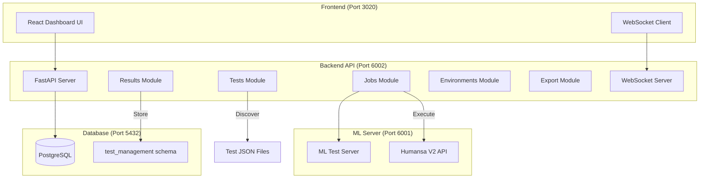
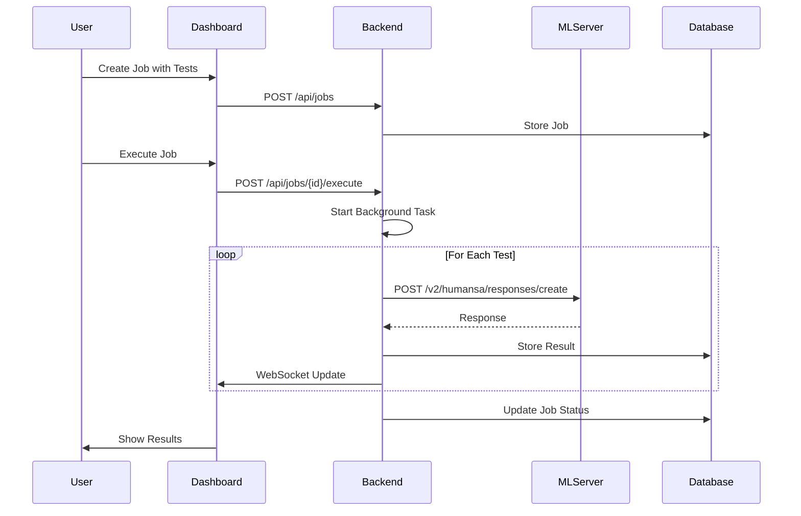
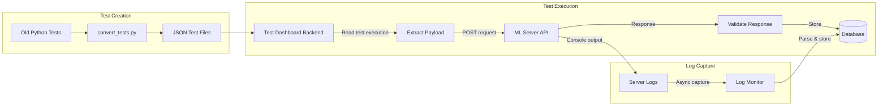

# Test Dashboard Implementation Documentation

This document provides comprehensive documentation for the Test Management Dashboard system.

## Architecture Overview



## Test Execution Flow



## File Structure

```
test_dashboard/
├── backend/
│   ├── api/                    # API Modules
│   │   ├── __init__.py        # Package initialization
│   │   ├── environments.py    # Environment management (9 routes)
│   │   ├── jobs.py           # Job creation & execution (13 routes)
│   │   ├── tests.py          # Test discovery & validation (10 routes)
│   │   ├── runs.py           # Execution monitoring (13 routes)
│   │   ├── results.py        # Results analysis (9 routes)
│   │   └── export.py         # Data export (10 routes)
│   ├── core/
│   │   ├── config.py         # Settings & ML server detection
│   │   ├── database.py       # PostgreSQL connection & queries
│   │   └── websocket.py      # Real-time WebSocket updates
│   └── main.py               # FastAPI application entry point
└── frontend/
    └── src/
        ├── App.tsx           # Main React component
        ├── components/       # UI components
        └── types/           # TypeScript definitions
```

## Backend API Endpoints (64+ total)

### Environment Management (`/api/environments`)
- `GET /` - List all environments
- `GET /current` - Get current active environment
- `GET /scan` - Scan for running ML servers
- `GET /{id}` - Get specific environment
- `GET /{id}/health` - Check environment health
- `POST /{id}/start` - Start ML server
- `POST /{id}/stop` - Stop ML server
- `POST /{id}/restart` - Restart ML server
- `GET /stats` - Environment statistics

### Job Management (`/api/jobs`)
- `GET /` - List jobs with filtering
- `POST /` - Create new job
- `GET /{id}` - Get job details
- `PUT /{id}` - Update job
- `DELETE /{id}` - Delete job
- `POST /{id}/execute` - Execute job
- `POST /{id}/stop` - Stop running job
- `POST /{id}/pause` - Pause job
- `POST /{id}/resume` - Resume job
- `GET /{id}/progress` - Get execution progress
- `GET /{id}/runs/{run_id}` - Get specific run
- `GET /{id}/logs` - Get job logs
- `POST /templates/{template}` - Create from template

### Test Management (`/api/tests`)
- `GET /` - List tests with search/filter
- `GET /{id}` - Get test details
- `POST /validate` - Validate test definition
- `POST /discover` - Auto-discover test files
- `GET /suites` - List test suites
- `POST /suites` - Create test suite
- `GET /suites/{id}` - Get suite details
- `DELETE /suites/{id}` - Delete suite
- `POST /upload` - Upload test file
- `GET /catalog` - Get test catalog

### Results Management (`/api/results`)
- `GET /` - List results with filtering
- `GET /{job_id}/{run_id}/{test_id}` - Get specific result
- `GET /{job_id}/{run_id}/{test_id}/logs` - Get test logs
- `GET /summary` - Get summary statistics
- `GET /suites/{suite}/analytics` - Suite analytics
- `GET /tests/{test_id}/history` - Test history
- `GET /trends/{metric}` - Trend analysis
- `GET /failures/analysis` - Failure analysis
- `GET /performance/metrics` - Performance metrics

### Export Functionality (`/api/export`)
- `POST /` - Create export job
- `GET /jobs` - List export jobs
- `GET /jobs/{id}` - Get export job status
- `GET /jobs/{id}/download` - Download export
- `GET /quick/{format}` - Quick export (JSON/CSV/XML)
- `POST /reports/generate` - Generate report
- `GET /reports/{id}` - Get report
- `GET /templates` - List export templates
- `POST /templates` - Create template
- `DELETE /templates/{id}` - Delete template

## Database Schema

```sql
-- Schema: test_management

-- Jobs table
CREATE TABLE jobs (
    id UUID PRIMARY KEY,
    name VARCHAR(255),
    description TEXT,
    status VARCHAR(50),
    priority VARCHAR(20),
    created_at TIMESTAMP,
    updated_at TIMESTAMP,
    completed_at TIMESTAMP,
    total_tests INTEGER,
    failed_tests INTEGER
);

-- Runs table
CREATE TABLE runs (
    id UUID PRIMARY KEY,
    job_id UUID REFERENCES jobs(id),
    environment_id INTEGER,
    status VARCHAR(50),
    started_at TIMESTAMP,
    completed_at TIMESTAMP,
    total_tests INTEGER,
    passed_tests INTEGER,
    failed_tests INTEGER,
    error_message TEXT
);

-- Results table
CREATE TABLE results (
    id SERIAL PRIMARY KEY,
    run_id UUID REFERENCES runs(id),
    test_id VARCHAR(255),
    suite_name VARCHAR(255),
    test_name VARCHAR(255),
    status VARCHAR(50),
    started_at TIMESTAMP,
    completed_at TIMESTAMP,
    execution_time FLOAT,
    error_message TEXT
);

-- Test case logs table
CREATE TABLE test_case_logs (
    id SERIAL PRIMARY KEY,
    result_id INTEGER REFERENCES results(id),
    request JSONB,
    response JSONB,
    server_logs JSONB,
    context_snapshot JSONB,
    performance_metrics JSONB,
    validation_details JSONB
);
```

## Test Definition Structure

```json
{
  "id": "APT_001",
  "name": "Complete appointment booking",
  "suite": "appointment",
  "type": "single|multi_turn",
  "priority": 1-5,
  "tags": ["appointment", "booking"],
  "config": {
    "timeout": 30,
    "retries": 1,
    "parallel_safe": true,
    "requirements": ["pattern2"]
  },
  "setup": {
    "user_context": {
      "user_id": "test_user_001",
      "profile": {}
    },
    "previous_turns": [],
    "environment": {}
  },
  "execution": {
    "endpoint": "/v2/humansa/responses/create",
    "method": "POST",
    "headers": {},
    "payload": {
      "model": "gpt-4.1",  // MUST be gpt-4.1
      "input": "User message",
      "user_id": "${user_context.user_id}",
      "metadata": {}
    }
  },
  "expectations": {
    "response": {
      "status_code": 200,
      "output_contains": ["expected", "content"],
      "output_excludes": ["error"],
      "min_length": 100,
      "max_length": 1000
    }
  }
}
```

## ML Server Integration

### How Tests Call Port 6001

1. **Server Detection**: Backend detects ML server on startup
   ```python
   # In config.py
   ML_SERVER_PORT = 6001  # Default test port
   ML_SERVER_URL = "http://localhost:6001"
   ```

2. **Test Execution**: Jobs module executes tests
   ```python
   # In jobs.py execute_job_background()
   async with httpx.AsyncClient() as client:
       response = await client.post(
           f"{ml_url}{test_endpoint}",  # e.g., http://localhost:6001/v2/humansa/responses/create
           json=test_payload
       )
   ```

3. **Multi-turn Support**: Handles conversation context
   - Executes previous turns first
   - Captures response IDs
   - Replaces `{{previous_response_id}}` placeholders

### Server Log Capture Plan

**Current Issue**: Only storing metadata, not actual server logs

**Proposed Solutions**:

1. **Log File Monitoring**
   ```python
   async def capture_ml_logs(test_id, start_time):
       log_file = f"/logs/ml_server_{ml_port}.log"
       async with aiofiles.open(log_file, 'r') as f:
           await f.seek(0, 2)  # Go to end
           while test_running:
               line = await f.readline()
               if line and timestamp > start_time:
                   store_log_entry(test_id, line)
   ```

2. **Subprocess Output Capture**
   ```python
   # When starting ML server
   process = await asyncio.create_subprocess_exec(
       'python3', '-m', 'src.main', '--port', str(ml_port),
       stdout=asyncio.subprocess.PIPE,
       stderr=asyncio.subprocess.PIPE
   )
   
   # Capture output
   async for line in process.stdout:
       log_buffer.append(line.decode())
   ```

3. **WebSocket Log Streaming**
   - ML server sends logs via WebSocket
   - Backend subscribes to log stream
   - Associates logs with active test execution

## Response Data Structure

### Current Response Storage
```python
# In jobs.py
result_data = response.json()  # For JSON responses
# OR
result_data = {
    "stream": True,
    "chunks": chunks,
    "message": combined_message
}  # For streaming responses

# Stored in database
test_case_logs.response = json.dumps(result_data)
```

### Response Display Fix
- Ensure `result_data` is properly populated
- Handle both JSON and streaming responses
- Store complete response content, not just metadata

## Critical Configuration Points

1. **Model Configuration** (MUST be gpt-4.1):
   - `agent5_converter.py:56`
   - `test_dashboard/backend/api/jobs.py:1066`
   - `src/humansa/v2/response_formatter.py:72,274`
   - `src/humansa/v2/api_conversation.py:53`
   - All test JSON files

2. **Port Configuration**:
   - Backend API: 6002
   - Frontend: 3020
   - ML Test Server: 6001
   - PostgreSQL: 5432

3. **Database**:
   - Name: test1 (or test{digit})
   - Schema: test_management
   - Password: 12931

## Monitoring & Debugging

### Check System Status
```bash
# Backend health
curl http://localhost:6002/health

# ML server health
curl http://localhost:6001/health

# System info
curl http://localhost:6002/system-info

# Trigger test discovery
curl -X POST http://localhost:6002/api/tests/discover
```

### View Logs
- Backend logs: `test_dashboard/backend/backend.log`
- Frontend logs: `test_dashboard/frontend/frontend.log`
- ML server logs: Check process output or log files

### Database Queries
```sql
-- Recent jobs
SELECT * FROM test_management.jobs ORDER BY created_at DESC LIMIT 10;

-- Failed tests
SELECT * FROM test_management.results 
WHERE status = 'failed' 
ORDER BY completed_at DESC;

-- Test execution logs
SELECT tcl.* FROM test_management.test_case_logs tcl
JOIN test_management.results r ON tcl.result_id = r.id
WHERE r.test_id = 'APT_001';
```

## Common Issues & Solutions

1. **Empty Response Data**
   - Check if ML server is returning valid JSON
   - Verify response parsing in jobs.py
   - Check test_case_logs table for stored data

2. **Model Configuration**
   - Ensure ALL references use "gpt-4.1"
   - No "gpt-4-turbo" or other variants

3. **Server Logs Missing**
   - Implement log capture mechanism
   - Store logs during test execution
   - Associate with test results

## Server Log Capture Implementation ✅ ENHANCED

The enhanced server log capture system now provides:

1. **Multiple Log Sources**:
   - ML server log files (auto-discovered from multiple locations)
   - Process stdout/stderr when starting ML server
   - Temporary log files for test execution
   - Real-time capture during test execution
   - Enhanced logging with agent thinking process

2. **Log Capture Features**:
   - Asynchronous log monitoring with 100ms polling interval
   - Automatic log file discovery
   - Process output redirection to log files
   - Full console output preservation including:
     - 🤔 Agent thinking process
     - 💭 Reasoning steps
     - 🔧 Tool/agent calls
     - 📊 Observations and results
     - ✅ Final answers
   - Timestamp and source tracking
   - Support for emoji-enhanced logs

3. **Storage and Display**:
   - Complete logs stored in `test_case_logs` table as JSON
   - Server logs array with all captured lines
   - Log count and capture timestamp metadata
   - Frontend displays full ML server execution logs
   - Multi-line format for easy reading

4. **Implementation Details**:
   - Enhanced execution in `jobs_enhanced.py`
   - `capture_ml_server_logs()` function for async monitoring
   - `ensure_ml_server_running()` for server lifecycle with:
     - `HUMANSA_ENHANCED_LOGGING=true` environment variable
     - `HUMANSA_USE_PATTERN2=true` for Pattern 2 orchestrator
   - `execute_test_with_log_capture()` for test execution

### What Server Logs Contain

The server logs now capture the ACTUAL ML server console output, including:

1. **Test Execution Metadata**:
   ```
   [SERVER] Starting ML server on port 6001
   [SERVER] Enhanced logging: ENABLED
   [SERVER] Pattern 2 orchestrator: ENABLED
   ```

2. **Agent Thinking Process** (with enhanced logging):
   ```
   🏃 Processing query: "帮我预约明天下午3点看李医生"
   🤔 正在思考...
   💭 Thought: User wants to book an appointment with Dr. Li tomorrow at 3 PM
   🔧 Action: AppointmentAgent.book_appointment
   📊 Observation: Found available slot for Dr. Li tomorrow at 3:00 PM
   ✅ Final Answer: 好的，我已经帮您预约了明天下午3点与李医生的门诊...
   ```

3. **Error and Debug Information**:
   ```
   ⚠️ Warning: No previous appointment history found
   ❌ Error: Time slot already booked
   ```

## Response Data Display ✅ FIXED

The response display system now properly shows:

1. **Streaming Responses**:
   - Parses SSE (Server-Sent Events) format
   - Extracts text from OpenAI Responses API events
   - Accumulates full response text
   - Handles both `response.output_item.done` and standard formats

2. **Non-Streaming Responses**:
   - Direct JSON response parsing
   - Supports multiple response formats:
     - OpenAI Responses API (`output` array)
     - Standard OpenAI (`choices` array)
     - Direct message/content fields
   - Full response preservation

3. **Response Validation**:
   - Status code checking
   - Content keyword validation (contains/excludes)
   - Response length validation
   - Detailed error reporting

4. **Data Storage**:
   - Complete response data in results
   - Request/response pairs in test_case_logs
   - Performance metrics tracking
   - Validation results logging

## Test Format Conversion and Execution Flow

### Test Format Journey



### Test File Format Explained

Each test is defined in JSON format with these key sections:

1. **Metadata**: Test ID, name, suite, priority
2. **Execution**: How to call the ML server
   - `endpoint`: API path (e.g., `/v2/humansa/responses/create`)
   - `payload`: Actual request body sent to ML server
3. **Expectations**: What to validate in response
4. **Server Logs**: What to check in ML server output

### Example Test Execution Flow

```json
// Test file: IDT_001.json
{
  "execution": {
    "endpoint": "/v2/humansa/responses/create",
    "payload": {
      "model": "gpt-4.1",
      "input": "你是谁？",
      "user_id": "test_user_001"
    }
  }
}

// Backend sends to ML server:
POST http://localhost:6001/v2/humansa/responses/create
{
  "model": "gpt-4.1",
  "input": "你是谁？",
  "user_id": "test_user_001"
}

// ML server responds:
{
  "id": "resp_123",
  "model": "gpt-4.1",
  "output": [
    {"type": "text", "text": "我是诺亚新舟..."}
  ]
}
```

### ML Server Log Capture

With enhanced logging enabled (`HUMANSA_ENHANCED_LOGGING=true`), the ML server outputs:

```
🏃 Starting request processing...
🤔 正在思考...
💭 Thought: User is asking about my identity
🔧 Action: Using IdentityAgent
📊 Observation: Retrieved HUMANSA identity information
✅ Final Answer: 我是诺亚新舟健康医疗助理小诺...
```

These logs are captured in real-time and stored with each test result.

### Key Files in the System

1. **Test Converter**: `convert_tests.py`
   - Converts old Python test format to JSON
   - Generates test IDs and categorizes tests
   - Creates standardized execution payloads

2. **Test Executor**: `backend/api/jobs_enhanced.py`
   - Reads test JSON files
   - Starts ML server with enhanced logging
   - Executes tests against ML server
   - Captures full console output
   - Validates responses

3. **ML Server API**: `src/humansa/v2/api_responses.py`
   - Handles `/v2/humansa/responses/create` endpoint
   - Processes requests with Pattern 2 orchestrator
   - Outputs enhanced logging when enabled

## Future Enhancements

1. **Real-time Log Streaming**
   - WebSocket connection for live logs
   - Log filtering and search
   - Log export functionality

2. **Advanced Analytics**
   - Test performance trends
   - Failure pattern analysis
   - ML model comparison

3. **Test Generation**
   - AI-powered test case generation
   - Test mutation for edge cases
   - Coverage analysis