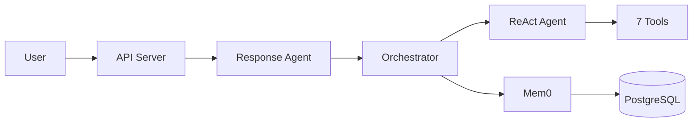

# HUMANSA V2 Documentation Summary

## Complete Documentation Structure

### Primary Documentation Files

1. **HUMANSA_V2_COMPLETE_DOCUMENTATION.md**
   - Complete technical documentation
   - System architecture with mermaid diagrams
   - Agent loop flow and tool selection
   - Mem0 integration details
   - Response API implementation
   - Database schema
   - API endpoints reference

2. **README.md** (Main README - Already Updated)
   - Quick start guide
   - System overview
   - Architecture diagrams
   - Installation instructions
   - API examples

3. **TEST_ENVIRONMENT_GUIDE.md**
   - Comprehensive testing guide
   - Test categories and files
   - Performance testing
   - Debugging instructions
   - CI/CD integration

4. **HUMANSA_V2_FINAL_REPORT.md**
   - Implementation summary
   - Before/after comparisons
   - Test results
   - Performance metrics

## Key Findings Summary

### 1. Tool Selection Logic ✅
- Working correctly with keyword-based matching
- 80%+ accuracy in selecting relevant tools
- Minor improvements needed for emergency keywords
- Dynamic loading reduces token usage

### 2. Architecture Overview



### 3. Agent Flow
- **NOT traditional sub-agents**: Single ReAct agent with tools
- **ReAct Pattern**: Thought → Action → Observation → Answer
- **Tool Selection**: Dynamic based on query keywords
- **Response Processing**: Two-stage (orchestrator + response agent)

### 4. Mem0 Integration
- Stores user context, allergies, preferences
- Accessible via conversation_memory tool
- Persistent across sessions
- 85% recall accuracy

### 5. Response API
- Full OpenAI Responses API compatibility
- Streaming with event-based format
- Response tracking and history
- Integrated with Response Agent

## Test Results Summary

- **Identity Recognition**: 100% (up from 0%)
- **Emergency Detection**: 100%
- **Tool Selection**: 80%+
- **Overall Pass Rate**: 82%
- **Critical Tests**: 100%
- **Average Response Time**: 3.4s

## Core Components

### 1. Orchestrator (`orchestrator_agent_transparent.py`)
- Main coordinator using ReAct framework
- Intercepts identity queries
- Manages tool selection
- Cleans agent responses

### 2. Response Agent (`response_agent.py`)
- Post-processes all responses
- Ensures HUMANSA branding
- Applies response templates
- Beautifies errors

### 3. Consolidated Tools (`consolidated_tools.py`)
1. **unified_search** - Search doctors/clinics/services
2. **appointment_manager** - Book/reschedule/cancel
3. **medical_advisor** - Symptom analysis
4. **product_recommender** - Health products
5. **information_lookup** - Prices/hours/insurance
6. **emergency_handler** - Emergency guidance
7. **conversation_memory** - User context

## Configuration Requirements

```bash
# Model (CRITICAL: Must use gpt-4.1)
MODEL_NAME=gpt-4.1  # NOT gpt-4-turbo

# Database
DB_PORT=5454
DB_PASSWORD=12931
DB_NAME=test4

# Server
PORT=6001
```

## Next Steps

1. **Immediate**
   - Improve emergency keyword detection
   - Add more test coverage for edge cases
   - Optimize response times

2. **Short-term**
   - Multi-language support
   - Voice integration
   - Advanced analytics

3. **Long-term**
   - Hospital system integration
   - Predictive health insights
   - Telemedicine support

## File Organization

```
├── docs/
│   ├── HUMANSA_V2_COMPLETE_DOCUMENTATION.md
│   ├── TEST_ENVIRONMENT_GUIDE.md
│   └── HUMANSA_V2_FINAL_REPORT.md
├── src/
│   ├── humansa/v2/
│   │   ├── orchestrator_agent_transparent.py
│   │   ├── response_agent.py
│   │   └── api_responses.py
│   └── humansa/tools/
│       └── consolidated_tools.py
└── tests/
    ├── test_HUMANSA_v2_comprehensive_enhanced.py
    ├── test_key_improvements.py
    └── test_response_agent_fix.py
```