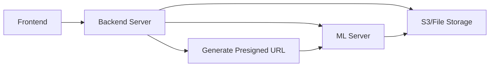

# Enhanced YouWoAI ML Server API Documentation

## Overview

The Enhanced YouWoAI ML Server provides GPT-level API endpoints with advanced features including:

- **Multiple LLM Providers**: OpenAI, Anthropic Claude, DeepSeek, xAI Grok, Google Gemini
- **Auto-provider Selection**: Intelligent selection of the best available provider
- **OpenAI-Compatible API**: Drop-in replacement for OpenAI API
- **Node ID Context**: Integration with YouWoAI note system (replaces PDF processing)
- **Web Search**: Real-time web search integration with caching
- **Streaming Responses**: Real-time streaming support
- **Link Analysis**: Analyze and chat about web content

## Important: PDF Processing Deprecated

**PDFs are no longer processed directly**. Instead:

- Convert PDFs to notes in your system
- Reference them using `note_ids` parameter
- This approach is more cost-effective and integrates better with existing note system

## Authentication

Set the following environment variables for different providers:

```bash
# OpenAI (required)
OPENAI_API_KEY=your_openai_api_key

# Anthropic Claude (optional)
ANTHROPIC_API_KEY=your_anthropic_api_key

# Groq (optional)
GROQ_API_KEY=your_groq_api_key

# DeepSeek (optional)
DEEPSEEK_API_KEY=your_deepseek_api_key

# xAI Grok (optional)
XAI_API_KEY=your_xai_api_key

# Web Search (optional - choose one)
SERPER_API_KEY=your_serper_api_key
SERPAPI_API_KEY=your_serpapi_api_key
BING_SEARCH_API_KEY=your_bing_api_key

# Spider API for web scraping (optional)
SPIDER_API_KEY=your_spider_api_key
```

## API Endpoints

### 1. OpenAI-Compatible Chat Completions

**POST** `/v1/chat/completions`

Drop-in replacement for OpenAI's chat completions API with enhanced features.

#### Request Body

```json
{
  "messages": [
    {
      "role": "system",
      "content": "You are a helpful assistant."
    },
    {
      "role": "user",
      "content": "Hello, how are you?"
    }
  ],
  "model": "gpt-4o",
  "provider": "openai",
  "temperature": 0.7,
  "max_tokens": 1000,
  "stream": false,

  // Enhanced features
  "note_ids": [1, 2, 3],
  "enable_web_search": true,
  "search_query": "latest news about AI",
  "attachments": [
    {
      "type": "application/pdf",
      "content": "base64_encoded_pdf_content",
      "filename": "document.pdf"
    }
  ]
}
```

#### Standard OpenAI Parameters

- `messages`: Array of message objects with `role` and `content`
- `model`: Model name (e.g., "gpt-4o", "claude-3-5-sonnet-20241022")
- `temperature`: Sampling temperature (0.0 to 2.0)
- `max_tokens`: Maximum tokens to generate
- `top_p`: Nucleus sampling parameter
- `frequency_penalty`: Frequency penalty (-2.0 to 2.0)
- `presence_penalty`: Presence penalty (-2.0 to 2.0)
- `stop`: Stop sequences
- `stream`: Enable streaming responses

#### Enhanced Parameters

- `provider`: Force specific provider ("openai", "anthropic", "groq", "deepseek", "xai")
- `note_ids`: Array of note IDs for context retrieval
- `enable_web_search`: Enable real-time web search
- `search_query`: Custom search query (optional, will auto-extract from messages)
- `attachments`: **DEPRECATED** - Use `note_ids` instead for document content

#### Response

```json
{
  "id": "chatcmpl-123",
  "object": "chat.completion",
  "created": 1677652288,
  "model": "gpt-4o",
  "provider": "openai",
  "choices": [
    {
      "index": 0,
      "message": {
        "role": "assistant",
        "content": "Hello! I'm doing well, thank you for asking."
      },
      "finish_reason": "stop"
    }
  ],
  "usage": {
    "prompt_tokens": 20,
    "completion_tokens": 12,
    "total_tokens": 32
  },
  "used_notes": [1, 2],
  "search_results": [
    {
      "title": "Latest AI News",
      "link": "https://example.com/ai-news",
      "snippet": "Recent developments in AI...",
      "source": "serper"
    }
  ]
}
```

### 2. Enhanced Chat (Simplified)

**POST** `/v1/chat`

Simplified chat endpoint with enhanced features.

#### Request Body

```json
{
  "question": "What are the latest developments in AI?",
  "system_message": "You are an AI expert.",
  "model": "gpt-4o",
  "provider": "openai",
  "temperature": 0.7,
  "note_ids": [1, 2, 3],
  "enable_web_search": true,
  "search_query": "AI developments 2024",
  "stream": false,
  "attachments": [
    {
      "type": "image/jpeg",
      "content": "base64_encoded_image",
      "filename": "chart.jpg"
    }
  ]
}
```

#### Response

```json
{
  "answer": "Based on the latest information...",
  "provider": "openai",
  "model": "gpt-4o",
  "used_notes": [1, 2],
  "search_results": [
    {
      "title": "AI Developments 2024",
      "link": "https://example.com",
      "snippet": "Recent advances...",
      "source": "serper"
    }
  ],
  "usage": {
    "prompt_tokens": 150,
    "completion_tokens": 300,
    "total_tokens": 450
  }
}
```

### 3. List Models

**GET** `/v1/models`

List all available models and providers.

#### Response

```json
{
  "object": "list",
  "data": [
    {
      "id": "gpt-4o",
      "object": "model",
      "provider": "openai",
      "created": 1677610602,
      "owned_by": "openai"
    },
    {
      "id": "claude-3-5-sonnet-20241022",
      "object": "model",
      "provider": "anthropic",
      "created": 1677610602,
      "owned_by": "anthropic"
    }
  ]
}
```

### 4. Analyze and Chat

**POST** `/v1/analyze_and_chat`

Analyze a web link and chat about its content.

#### Request Body

```json
{
  "url": "https://example.com/article",
  "question": "What are the main points of this article?",
  "platform": "web",
  "model": "gpt-4o",
  "provider": "openai",
  "temperature": 0.7,
  "enable_web_search": false,
  "stream": false,
  "link_options": {
    "languages": ["en"],
    "spider_api_key": "your_spider_key"
  }
}
```

#### Response

```json
{
  "answer": "The main points of the article are...",
  "link_analysis": {
    "success": true,
    "platform": "web",
    "data": {
      "title": "Article Title",
      "content": "Full article content...",
      "url": "https://example.com/article",
      "metadata": {}
    }
  },
  "provider": "openai",
  "model": "gpt-4o",
  "usage": {
    "prompt_tokens": 500,
    "completion_tokens": 200,
    "total_tokens": 700
  }
}
```

## Streaming Responses

For streaming responses, set `"stream": true` in your request. The response will be sent as Server-Sent Events (SSE):

```
data: {"id":"chatcmpl-123","object":"chat.completion.chunk","created":1677652288,"model":"gpt-4o","provider":"openai","choices":[{"index":0,"delta":{"content":"Hello"},"finish_reason":null}]}

data: {"id":"chatcmpl-123","object":"chat.completion.chunk","created":1677652288,"model":"gpt-4o","provider":"openai","choices":[{"index":0,"delta":{"content":" there"},"finish_reason":null}]}

data: {"id":"chatcmpl-123","object":"chat.completion.chunk","created":1677652288,"model":"gpt-4o","provider":"openai","choices":[{"index":0,"delta":{},"finish_reason":"stop"}],"used_notes":[1,2]}

data: [DONE]
```

## Web Search Caching

### Intelligent Caching System

The server implements smart caching to reduce web search costs and improve response times:

#### Cache Logic

- **Query Hashing**: Similar queries are cached together
- **TTL (Time To Live)**: Results expire based on content type
- **Cost Optimization**: Avoids redundant API calls

#### Cache Duration by Query Type

```
News queries: 1-4 hours
Stock prices: 5-15 minutes
Weather: 1-2 hours
Product reviews: 1-7 days
General information: 24 hours
```

#### Cost Savings

- **Without caching**: $1-5 per 1000 searches
- **With caching**: 70-90% cost reduction
- **Typical savings**: $0.10-0.50 per 1000 searches

### Using Web Search

```json
{
  "messages": [
    { "role": "user", "content": "What are the latest AI developments?" }
  ],
  "enable_web_search": true,
  "search_query": "AI developments 2024" // Optional, auto-extracted if not provided
}
```

Response includes cached/fresh search results:

```json
{
  "choices": [...],
  "search_results": [
    {
      "title": "Latest AI News",
      "link": "https://example.com",
      "snippet": "Recent developments...",
      "source": "serper",
      "cached": true,
      "cache_age": "2 hours"
    }
  ]
}
```

## Note-Based Document Processing

### Recommended Approach (Replaces PDF Processing)

Instead of uploading PDFs directly, convert them to notes and reference by ID:

```json
{
  "type": "application/pdf",
  "url": "https://your-s3-bucket.s3.amazonaws.com/documents/report.pdf",
  "filename": "report.pdf"
}
```

**Advantages:**

- ✅ No size limits in API payload
- ✅ Faster API calls (no base64 encoding/decoding)
- ✅ Files already stored in your infrastructure
- ✅ Better for large files (videos, high-res images)
- ✅ Reduces memory usage on ML server

#### Method 2: Base64 Content (For Direct Upload)

```json
{
  "type": "application/pdf",
  "content": "base64_encoded_file_content",
  "filename": "document.pdf"
}
```

**Advantages:**

- ✅ Simple implementation
- ✅ No external dependencies
- ✅ Works without S3/storage setup
- ✅ Good for small files and testing

**Disadvantages:**

- ❌ 25-33% larger payload due to base64 encoding
- ❌ Request size limits (typically 10-50MB)
- ❌ Higher memory usage
- ❌ Slower for large files

### Example: Sending a PDF

```python
import base64
import requests

# Read and encode PDF
with open("document.pdf", "rb") as f:
    pdf_content = base64.b64encode(f.read()).decode()

# Send request
response = requests.post("http://localhost:5001/v1/chat/completions", json={
    "messages": [
        {"role": "user", "content": "Summarize this document"}
    ],
    "model": "gpt-4o",
    "attachments": [
        {
            "type": "application/pdf",
            "content": pdf_content,
            "filename": "document.pdf"
        }
    ]
})
```

## Web Search Integration

The server supports multiple web search providers:

1. **Serper** (Recommended): Fast Google search API
2. **SerpAPI**: Google search with more features
3. **Bing Search API**: Microsoft's search API

### Configuration

Set one of these environment variables:

```bash
# Serper (recommended)
SERPER_API_KEY=your_serper_api_key

# SerpAPI
SERPAPI_API_KEY=your_serpapi_api_key

# Bing Search
BING_SEARCH_API_KEY=your_bing_api_key
```

### Usage

```json
{
  "messages": [
    { "role": "user", "content": "What's the latest news about AI?" }
  ],
  "enable_web_search": true,
  "search_query": "AI news 2024" // Optional, will auto-extract from messages
}
```

## Provider Auto-Selection

If no provider is specified, the system will automatically select the best available provider in this order:

1. **OpenAI** (highest priority)
2. **Anthropic**
3. **Groq**
4. **DeepSeek**
5. **xAI**

## Note-Based Context System

### Current RAG Implementation

When `note_ids` are provided, the system:

1. **Note Content Retrieval**: For each note ID, fetches content using `get_note_text(note_id)` which returns formatted text:
   ```
   AI Content:
   {current_prompt_content}
   
   UserContent:
   {assembled_transcript_from_all_parts}
   ```

2. **Context Selection**: 
   - If ≤3 note IDs provided: Uses all notes without similarity filtering
   - If >3 note IDs provided: Uses semantic similarity search to select most relevant notes

3. **Document Creation**: Each note's formatted content becomes a LlamaIndex Document for RAG retrieval

4. **Query Processing**: User messages are converted to a query string and processed against the note context

### Important Context Behavior

- **No Conversation History Embedding**: The system does NOT embed conversation history for search
- **Direct Note Reference**: Context comes from pre-specified `note_ids`, not from searching user's current message
- **Dynamic Injection**: Note content is fetched fresh on each request, not stored in conversation history
- **Formatted Context**: Notes are formatted with "AI Content:" and "UserContent:" sections, not as plain text

### Context Storage

- **RAG Content**: Stored in database as note content, fetched dynamically
- **Conversation History**: Stored separately, contains only user/assistant messages
- **No Persistence**: RAG context is not persisted in conversation, re-fetched each time

## Error Handling

### Standard Error Response

```json
{
  "error": {
    "message": "Invalid request: missing required field 'messages'",
    "type": "invalid_request_error",
    "code": "missing_field"
  }
}
```

### Common Error Types

- `invalid_request_error`: Malformed request
- `authentication_error`: Invalid API key
- `rate_limit_error`: Rate limit exceeded
- `internal_error`: Server error
- `provider_error`: LLM provider error

## Rate Limits

Rate limits depend on the underlying provider:

- **OpenAI**: According to your OpenAI plan
- **Anthropic**: According to your Anthropic plan
- **Groq**: High rate limits for most models
- **DeepSeek**: Generous rate limits
- **xAI**: According to your xAI plan

## Best Practices

### 1. Provider Selection

```python
# Force specific provider for consistency
{
  "provider": "anthropic",
  "model": "claude-3-5-sonnet-20241022"
}

# Let system auto-select best available
{
  "model": "gpt-4o"  # Will use OpenAI if available, fallback to others
}
```

### 2. Context Management

```python
# Use note IDs for personal context
{
  "note_ids": [1, 2, 3],
  "messages": [{"role": "user", "content": "Based on my notes, what should I do?"}]
}

# Combine with web search for current information
{
  "note_ids": [1, 2, 3],
  "enable_web_search": true,
  "messages": [{"role": "user", "content": "Update my travel plans with current weather"}]
}
```

### 3. File Processing

```python
# Process multiple files
{
  "attachments": [
    {"type": "application/pdf", "content": "...", "filename": "report.pdf"},
    {"type": "image/jpeg", "content": "...", "filename": "chart.jpg"}
  ],
  "messages": [{"role": "user", "content": "Analyze these documents"}]
}
```

### 4. Streaming for Long Responses

```python
# Use streaming for long responses
{
  "stream": true,
  "max_tokens": 2000,
  "messages": [{"role": "user", "content": "Write a detailed analysis"}]
}
```

## Examples

### Basic Chat

```bash
curl -X POST http://localhost:5001/v1/chat/completions \
  -H "Content-Type: application/json" \
  -d '{
    "messages": [
      {"role": "user", "content": "Hello, how are you?"}
    ],
    "model": "gpt-4o"
  }'
```

### Chat with Web Search

```bash
curl -X POST http://localhost:5001/v1/chat/completions \
  -H "Content-Type: application/json" \
  -d '{
    "messages": [
      {"role": "user", "content": "What are the latest developments in AI?"}
    ],
    "model": "gpt-4o",
    "enable_web_search": true
  }'
```

### Chat with Note Context

```bash
curl -X POST http://localhost:5001/v1/chat/completions \
  -H "Content-Type: application/json" \
  -d '{
    "messages": [
      {"role": "user", "content": "What did I plan for my vacation?"}
    ],
    "model": "gpt-4o",
    "note_ids": [1, 2, 3, 4, 5]
  }'
```

### Streaming Response

```bash
curl -X POST http://localhost:5001/v1/chat/completions \
  -H "Content-Type: application/json" \
  -d '{
    "messages": [
      {"role": "user", "content": "Tell me a long story"}
    ],
    "model": "gpt-4o",
    "stream": true
  }'
```

### Analyze and Chat

```bash
curl -X POST http://localhost:5001/v1/analyze_and_chat \
  -H "Content-Type: application/json" \
  -d '{
    "url": "https://example.com/article",
    "question": "What are the main points?",
    "model": "gpt-4o"
  }'
```

## Migration from Legacy API

### Old Format

```json
{
  "question": "What's the weather?",
  "note_ids": [1, 2, 3]
}
```

### New Format

```json
{
  "messages": [{ "role": "user", "content": "What's the weather?" }],
  "note_ids": [1, 2, 3]
}
```

The legacy `/chat_bot` endpoint remains available for backward compatibility.

## Installation

### Additional Dependencies

```bash
pip install llama-index-llms-anthropic==0.4.0
pip install llama-index-llms-groq==0.4.0
pip install llama-index-readers-file==0.4.7
```

### Environment Setup

Create a `.env` file with your API keys:

```bash
# Required
OPENAI_API_KEY=your_openai_key

# Optional providers
ANTHROPIC_API_KEY=your_anthropic_key
GROQ_API_KEY=your_groq_key
DEEPSEEK_API_KEY=your_deepseek_key
XAI_API_KEY=your_xai_key

# Optional web search
SERPER_API_KEY=your_serper_key

# Optional web scraping
SPIDER_API_KEY=your_spider_key

# Database (existing)
DB_HOST=localhost
DB_PORT=5432
DB_USERNAME=youwo
DB_ACTIVE_DATABASE=youwo
```

## Support

For questions or issues with the enhanced API, please refer to:

1. This documentation
2. The original API documentation for link analysis features
3. OpenAI API documentation for standard parameters
4. Provider-specific documentation for advanced features

## API Endpoint Comparison

### `/v1/chat/completions` vs `/v1/chat` - What's the Difference?

#### `/v1/chat/completions` (OpenAI-Compatible)

- **Purpose**: Drop-in replacement for OpenAI's API
- **Format**: Exactly matches OpenAI's chat completions API
- **Use Case**: For applications already using OpenAI API
- **Input**: Array of message objects with roles
- **Output**: OpenAI-compatible response format

```json
{
  "messages": [
    { "role": "system", "content": "You are helpful" },
    { "role": "user", "content": "Hello" }
  ],
  "model": "gpt-4o"
}
```

#### `/v1/chat` (Simplified Enhanced)

- **Purpose**: Simplified interface with YouWoAI-specific features
- **Format**: Single question + context parameters
- **Use Case**: For new integrations or simpler implementations
- **Input**: Plain question string + parameters
- **Output**: Simplified response format

```json
{
  "question": "Hello",
  "model": "gpt-4o",
  "note_ids": [1, 2, 3]
}
```

#### Which Should You Use?

- **Use `/v1/chat/completions`** if:

  - You're migrating from OpenAI API
  - You need conversation history
  - You want standard OpenAI format
  - You're building a chat interface

- **Use `/v1/chat`** if:
  - You have simple Q&A use cases
  - You prefer simplified parameters
  - You're building new integrations
  - You primarily use note context

## Recommended Architecture for Production

#### Backend Server → ML Server Flow



#### Implementation Steps:

1. **Frontend uploads file to Backend Server**
2. **Backend Server stores file in S3**
3. **Backend Server generates presigned URL or uses permanent URL**
4. **Backend Server calls ML Server with URL**
5. **ML Server downloads file from S3**
6. **ML Server processes file and returns analysis**

### Example Usage

#### Using S3 URL (Recommended)

```python
import requests

# Your backend uploads file to S3 and gets URL
s3_url = "https://mybucket.s3.amazonaws.com/uploads/document.pdf"

# Call ML Server with URL
response = requests.post("http://localhost:5001/v1/chat/completions", json={
    "messages": [
        {"role": "user", "content": "Analyze this document"}
    ],
    "attachments": [
        {
            "type": "application/pdf",
            "url": s3_url,
            "filename": "document.pdf"
        }
    ]
})
```

#### Using Base64 (For Testing/Small Files)

```python
import base64
import requests

# Read and encode file
with open("document.pdf", "rb") as f:
    pdf_content = base64.b64encode(f.read()).decode()

# Call ML Server with base64 content
response = requests.post("http://localhost:5001/v1/chat/completions", json={
    "messages": [
        {"role": "user", "content": "Analyze this document"}
    ],
    "attachments": [
        {
            "type": "application/pdf",
            "content": pdf_content,
            "filename": "document.pdf"
        }
    ]
})
```

### File Size Considerations

| Method | Max File Size | Performance | Use Case            |
| ------ | ------------- | ----------- | ------------------- |
| S3 URL | Unlimited\*   | High        | Production          |
| Base64 | ~10-50MB      | Medium      | Testing/Small files |

\*Limited by ML server processing capabilities and timeout settings
