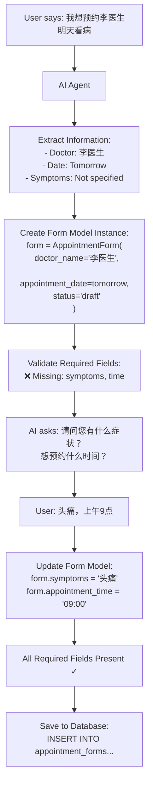

# Form Model Explanation

## What is a Form Model?

A **Form Model** is a data structure (class) that represents an appointment form in our system. Think of it as a blueprint or template that defines:

1. **What data fields** an appointment form contains
2. **What data types** each field should be
3. **What validations** apply to each field
4. **What methods** can be used to manipulate the form

## The AppointmentForm Model

```python
@dataclass
class AppointmentForm:
    """Core appointment form model"""
    # Unique identifiers
    form_id: str                    # Unique ID for this form (e.g., "3166456b-2fad-43df-92f6-337d5823e143")
    user_id: str                    # User who created the form
    status: FormStatus              # Current status (draft, confirmed, submitted, etc.)
    
    # Patient information
    patient_name: Optional[str]     # Patient's name
    patient_phone: Optional[str]    # Contact phone
    patient_id_card: Optional[str]  # ID card number
    
    # Appointment details
    doctor_name: Optional[str]      # Doctor's name (e.g., "李明医生")
    doctor_id: Optional[str]        # Doctor's system ID
    department: Optional[str]       # Department (e.g., "内科")
    appointment_date: Optional[date] # Date of appointment
    appointment_time: Optional[str]  # Time slot (e.g., "09:00")
    
    # Medical information
    symptoms: Optional[str]         # Symptom description
    medical_history: Optional[str]  # Past medical history
    
    # Financial information
    consultation_fee: float         # Doctor consultation fee
    registration_fee: float         # Hospital registration fee
    service_fee: float             # Platform service fee
    total_fee: float               # Total amount
    
    # Timestamps
    created_at: datetime           # When form was created
    expires_at: Optional[datetime] # When form expires
```

## How It Works

### 1. Form Creation Flow



### 2. Form Model vs Database Table

| Form Model (Python Object) | Database Table (PostgreSQL) |
|---------------------------|----------------------------|
| `form.doctor_name` | `form_data->>'doctor_name'` |
| `form.appointment_date` | `form_data->>'appointment_date'` |
| `form.status` | `status` column |
| `form.calculate_total_fee()` | Calculated in application |

### 3. Why Use a Form Model?

1. **Type Safety**: Ensures data has correct types
2. **Validation**: Built-in methods to check completeness
3. **Business Logic**: Methods like `calculate_total_fee()`
4. **Serialization**: Easy conversion to/from JSON
5. **Documentation**: Self-documenting code structure

## Example Usage

```python
# 1. Create empty form
form = AppointmentForm.create_new(user_id="user_123")

# 2. Fill form from natural language
form.doctor_name = "李明医生"
form.appointment_date = date(2025, 2, 10)
form.symptoms = "头痛，发烧"

# 3. Check if complete
if form.is_complete():
    # 4. Generate preview
    preview = form.get_preview_message()
    # Shows: "预约信息：李明医生，2025-02-10..."
    
# 5. Save to database
form_service.save_form(form)

# 6. Later, retrieve and update
form = form_service.get_form(form_id)
form.appointment_time = "14:00"
form_service.update_form(form)
```

## Form Model Benefits

1. **Separation of Concerns**: Business logic separate from database
2. **Flexibility**: Can change database structure without changing code
3. **Testing**: Easy to test without database
4. **Consistency**: All forms follow same structure
5. **Extensibility**: Easy to add new fields or methods

The Form Model is the **heart of our form system** - it defines what an appointment form IS and how it BEHAVES.