# HUMANSA V2 Architecture Diagrams

## Level 1: Simple Overview
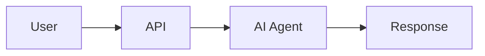

## Level 2: Basic Flow
```mermaid
graph TD
    User[User Query] --> API[/v2/humansa/chat]
    API --> Orchestrator[Orchestrator]
    Orchestrator --> Agent[Medical Agent]
    Agent --> Database[(Database)]
    Database --> Agent
    Agent --> Orchestrator
    Orchestrator --> User
```

## Level 3: Sub-Agent Architecture
```mermaid
graph TD
    User[User: "我想预约心内科医生"] --> API[API Endpoint]
    API --> Orchestrator[Main Orchestrator]
    
    Orchestrator --> Product[Product Agent]
    Orchestrator --> Appointment[Appointment Agent]
    Orchestrator --> Clinical[Clinical Agent]
    Orchestrator --> Medication[Medication Agent]
    Orchestrator --> General[General Agent]
    
    Appointment --> DB[(PostgreSQL)]
    DB --> Appointment
    Appointment --> Orchestrator
    Orchestrator --> Response[Response Agent]
    Response --> User
```

## Level 4: Appointment Agent Tools
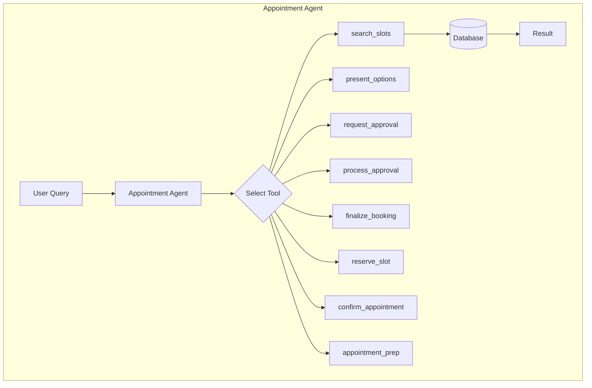

## Level 5: Complete Request Flow
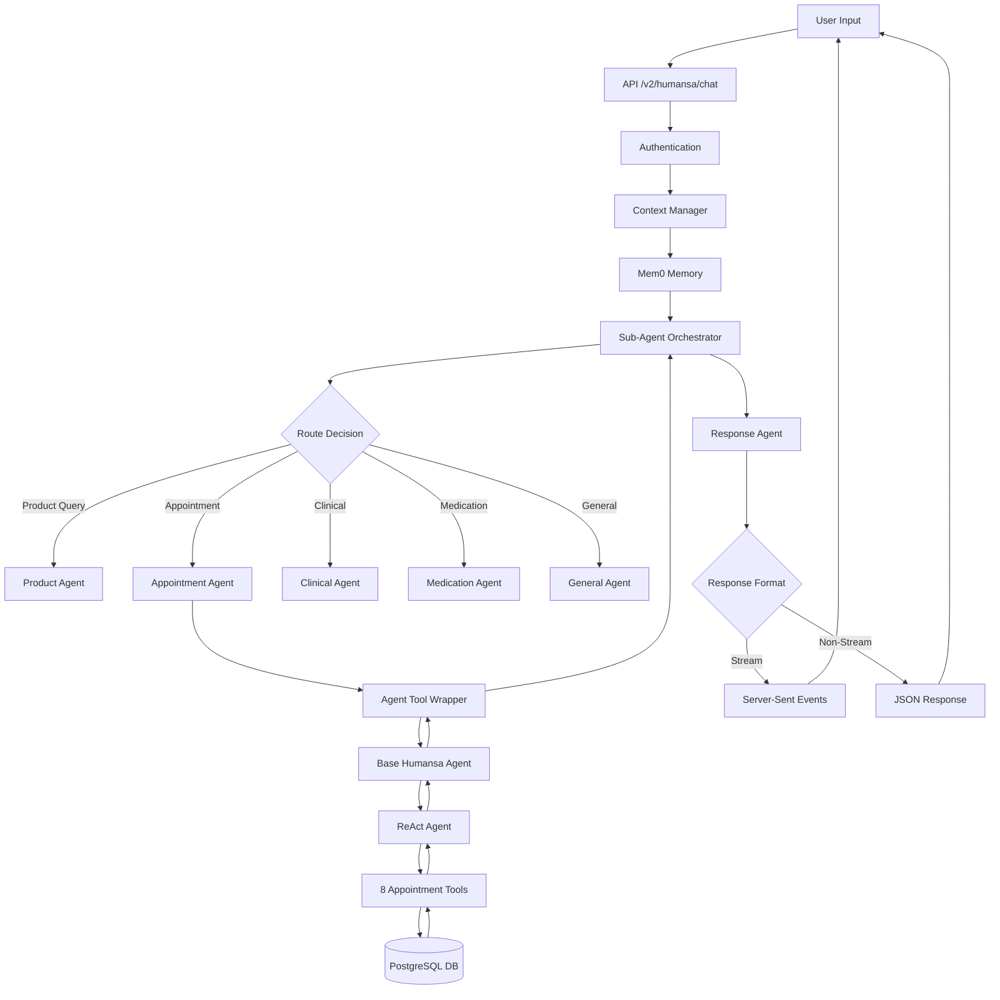

## Level 6: Database Schema
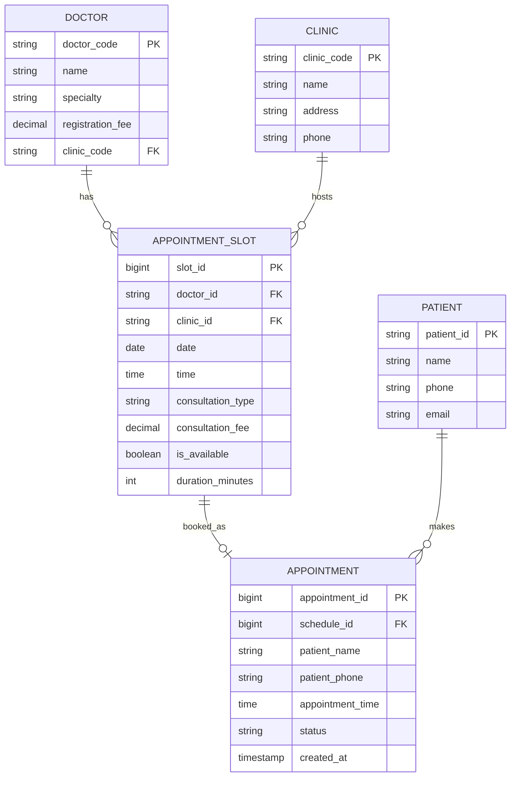

## Level 7: Tool Calling Sequence
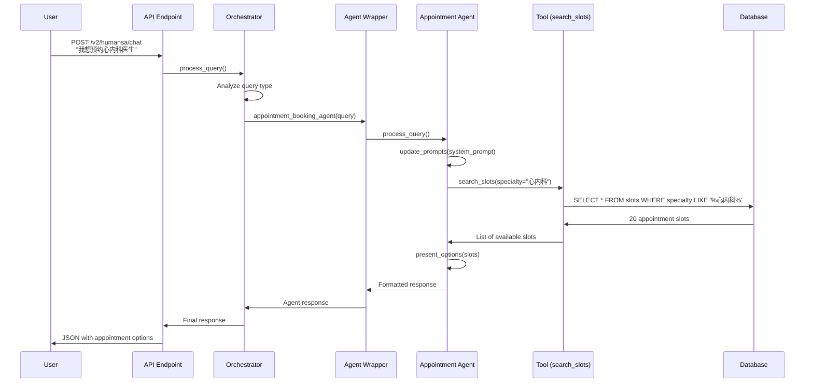

## Level 8: Memory Integration
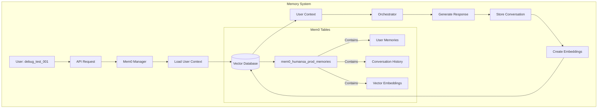

## Level 9: Agent Tool Wrapper Detail
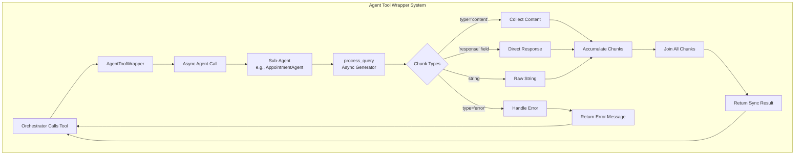

## Level 10: Complete System Architecture
```mermaid
graph TB
    subgraph "Client Layer"
        Web[Web Client]
        Mobile[Mobile App]
        API_Client[API Client]
    end
    
    subgraph "API Gateway"
        Gateway[Quart Server<br/>Port 6001/5001]
        Gateway --> Routes{Routes}
        Routes --> Chat[/v2/humansa/chat]
        Routes --> Appt[/v2/humansa/appointment/*]
        Routes --> Memory[/v2/humansa/memory/*]
        Routes --> Admin[/admin/*]
    end
    
    subgraph "Business Logic Layer"
        subgraph "Orchestration"
            MainOrch[Sub-Agent Orchestrator]
            ConsolOrch[Consolidated Orchestrator]
            TransOrch[Transparent Orchestrator]
        end
        
        subgraph "Sub-Agents"
            ProdAgent[Product Agent<br/>10 tools]
            ApptAgent[Appointment Agent<br/>8 tools]
            ClinAgent[Clinical Agent<br/>12 tools]
            MedAgent[Medication Agent<br/>6 tools]
            GenAgent[General Agent<br/>8 tools]
        end
        
        subgraph "Support Services"
            ContextMgr[Context Manager]
            MemoryMgr[Memory Manager]
            ResponseAgent[Response Agent]
            BrandProc[Brand Processor]
        end
    end
    
    subgraph "Data Layer"
        subgraph "PostgreSQL Databases"
            TestDB[(Test DB<br/>Port 5454)]
            ProdDB[(Prod DB<br/>Port 5432)]
            MemDB[(Memory DB)]
        end
        
        subgraph "External Services"
            Azure[Azure OpenAI<br/>GPT-4.1]
            OpenAI[OpenAI API<br/>GPT-4o-mini]
            WebSearch[Web Search API]
        end
    end
    
    subgraph "Infrastructure"
        Docker[Docker Containers]
        Logs[Logging System]
        Monitor[Monitoring]
        Config[Configuration<br/>DIGIT=2<br/>SUBAGENT=true]
    end
    
    %% Connections
    Web --> Gateway
    Mobile --> Gateway
    API_Client --> Gateway
    
    Chat --> MainOrch
    Appt --> ApptAgent
    Memory --> MemoryMgr
    
    MainOrch --> ProdAgent
    MainOrch --> ApptAgent
    MainOrch --> ClinAgent
    MainOrch --> MedAgent
    MainOrch --> GenAgent
    
    ApptAgent --> TestDB
    MemoryMgr --> MemDB
    
    MainOrch --> Azure
    MemoryMgr --> OpenAI
    
    ResponseAgent --> BrandProc
    BrandProc --> Gateway
```

## Level 11: Appointment Booking Flow State Machine
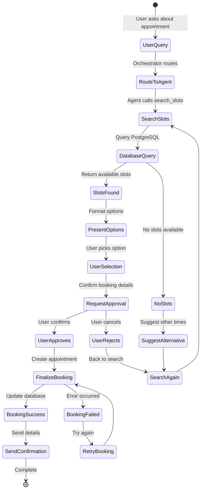

## Level 12: Dynamic Data Population
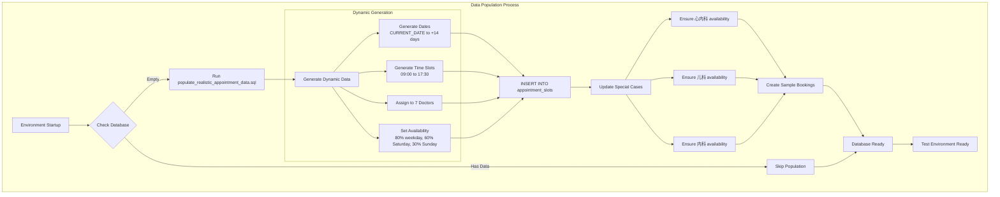

## Level 13: Error Handling and Retry Logic
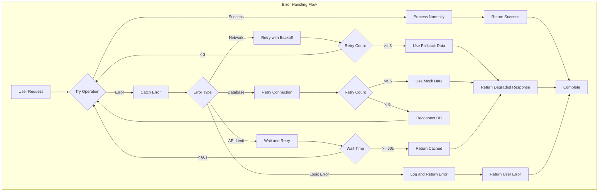

## Level 14: Performance Optimization
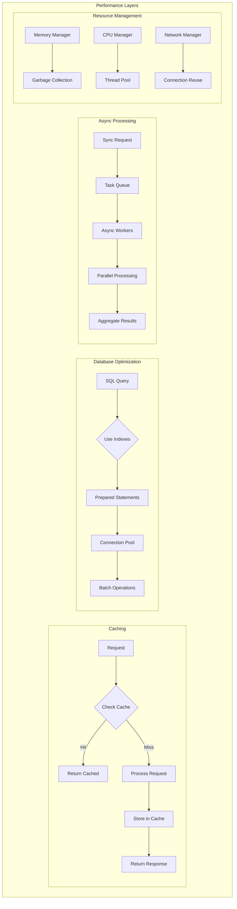

## Level 15: Security Architecture
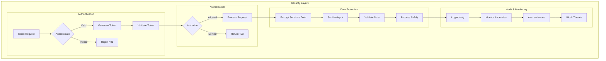