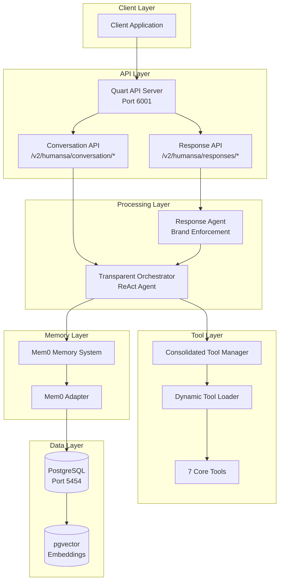
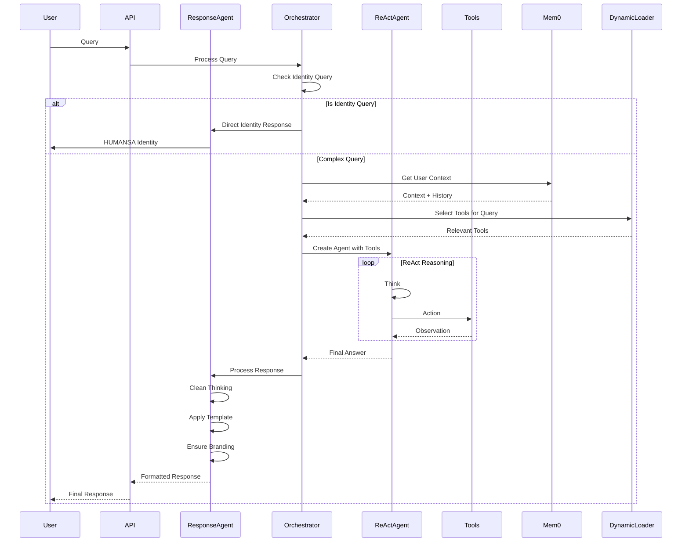
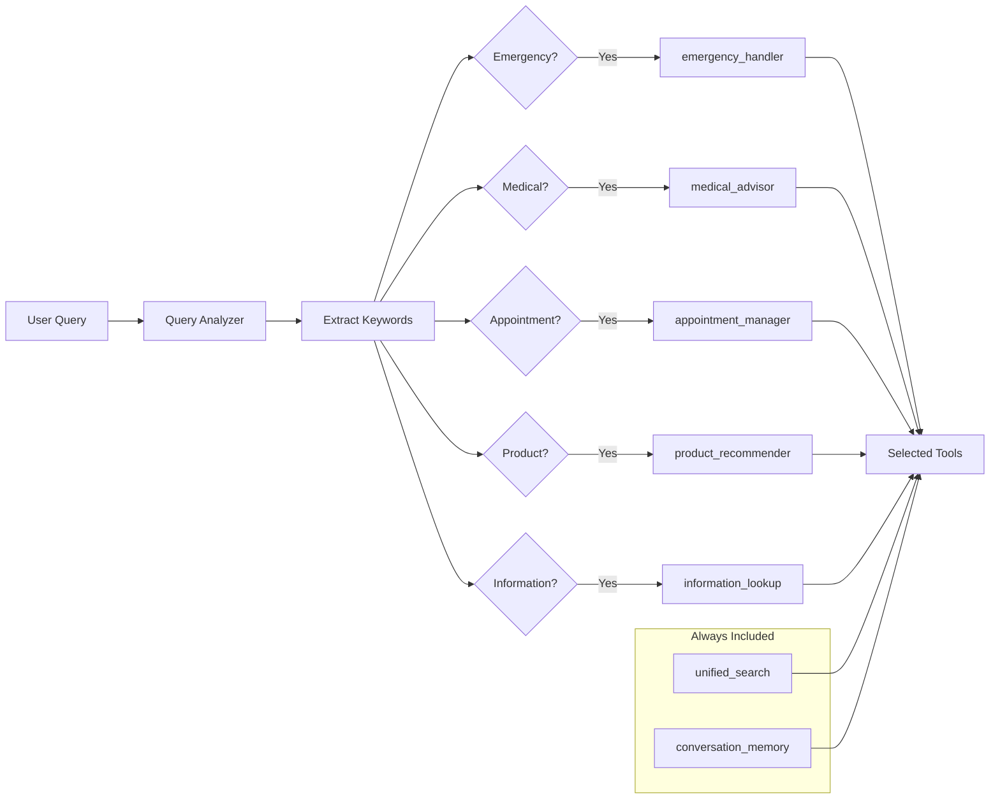
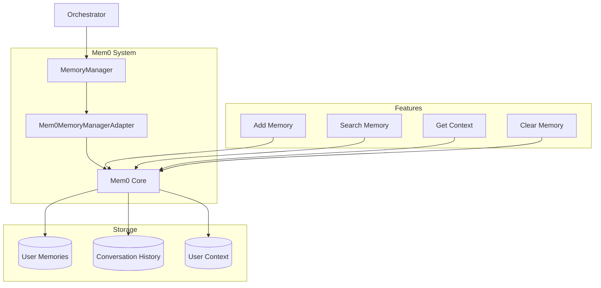
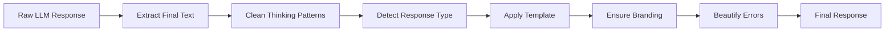

# HUMANSA V2 Complete System Documentation

## Table of Contents
1. [System Overview](#system-overview)
2. [Architecture Diagrams](#architecture-diagrams)
3. [Core Components](#core-components)
4. [Agent Loop Flow](#agent-loop-flow)
5. [Tool System](#tool-system)
6. [Mem0 Integration](#mem0-integration)
7. [Response API Implementation](#response-api-implementation)
8. [Response Agent System](#response-agent-system)
9. [Database Schema](#database-schema)
10. [API Endpoints](#api-endpoints)
11. [Testing Framework](#testing-framework)
12. [Configuration & Deployment](#configuration--deployment)

## System Overview

HUMANSA V2 is an advanced medical AI assistant system built on top of LlamaIndex's ReAct framework. It provides a comprehensive healthcare consultation platform with the following key features:

- **Multi-Agent Architecture**: ReAct-based orchestrator with specialized sub-agents
- **Memory System**: Integrated Mem0 for persistent user context
- **Tool Selection**: Dynamic tool loading based on query context
- **Response Processing**: Post-processing agent for brand consistency
- **Streaming Support**: Full OpenAI Responses API compatibility
- **Identity Enforcement**: Consistent HUMANSA branding (诺亚新舟小诺)

## Architecture Diagrams

### High-Level System Architecture



### Agent Loop Flow



### Tool Selection Flow



## Core Components

### 1. Transparent Orchestrator (`orchestrator_agent_transparent.py`)

The main coordinator that:
- Intercepts identity queries for direct handling
- Manages ReAct agent creation with dynamic tools
- Captures tool calls and reasoning steps
- Cleans agent responses to remove thinking patterns

```python
class HumansaOrchestratorAgentTransparent:
    def __init__(self, memory_manager=None, debug=False):
        self.tool_manager = ConsolidatedHumansaTools(memory_manager)
        self.dynamic_loader = DynamicToolLoader(self.tool_manager)
        self.llm = OpenAI(model="gpt-4-turbo", temperature=0.7)
        self.tool_capture = ToolCallCapture()
```

### 2. Response Agent (`response_agent.py`)

Post-processes all responses to ensure:
- HUMANSA identity consistency
- Proper error handling
- Response template application
- Removal of thinking patterns

```python
class HumansaResponseAgent:
    COMPANY_NAME = "诺亚新舟"
    ASSISTANT_NAME = "小诺"
    FULL_IDENTITY = "诺亚新舟健康医疗助理小诺"
    TAGLINE = "以爱行舟，亲近相守"
    CAPABILITIES = "500多位三甲主任级名医专家，30+家高端综合名医诊所"
```

### 3. Consolidated Tools (`consolidated_tools.py`)

Seven core tools that handle all medical queries:

1. **unified_search**: Search doctors, clinics, services
2. **appointment_manager**: Book, reschedule, cancel appointments
3. **medical_advisor**: Symptom analysis and recommendations
4. **product_recommender**: Health product suggestions
5. **information_lookup**: Prices, hours, insurance info
6. **emergency_handler**: Emergency situation guidance
7. **conversation_memory**: Save/retrieve conversation context

## Agent Loop Flow

### ReAct Agent Pattern

The system uses LlamaIndex's ReAct (Reasoning + Acting) pattern:

```
1. Thought: Agent reasons about the query
2. Action: Agent selects and calls a tool
3. Observation: Tool returns results
4. Repeat until final answer
```

### Tool Execution Flow

```python
# Captured by ToolCallCapture callback
Thought: "User wants to book appointment"
Action: appointment_manager
Action Input: {"doctor_name": "Dr. Li", "date": "tomorrow"}
Observation: "Available slots: 9:00, 10:00, 14:00"
Thought: "Found available slots"
Answer: "Dr. Li has appointments available tomorrow at..."
```

## Tool System

### Tool Selection Logic

Dynamic tool selection based on query keywords:

```python
tool_keywords = {
    'appointment_manager': ['预约', '挂号', '改期', '取消'],
    'medical_advisor': ['症状', '疼', '不舒服', '生病'],
    'product_recommender': ['产品', '保健品', '推荐', '购买'],
    'information_lookup': ['价格', '营业时间', '地址', '电话'],
    'emergency_handler': ['紧急', '急诊', '120', '急救']
}
```

### Tool Implementation Example

```python
@tool_decorator
def unified_search(self, query: str, search_type: str = "all", 
                  city: str = None, limit: int = 5) -> Dict:
    """
    Unified search across doctors, clinics, and services
    """
    results = {
        "doctors": [],
        "clinics": [],
        "services": [],
        "total_found": 0
    }
    # Implementation...
    return results
```

## Mem0 Integration

### Memory Architecture



### Memory Operations

```python
# Add memory
await memory_manager.add_memory(
    user_id="user123",
    text="I am allergic to penicillin",
    metadata={"type": "allergy", "severity": "high"}
)

# Get user context
context = await memory_manager.get_user_context("user123")
# Returns: {"allergies": ["penicillin"], "preferences": {...}}

# Search memories
results = await memory_manager.search_memory(
    user_id="user123",
    query="allergies"
)
```

## Response API Implementation

### OpenAI Responses API Format

The system implements the OpenAI Responses API format for compatibility:

```python
# Request
POST /v2/humansa/responses/create
{
    "model": "gpt-4-turbo",
    "input": "I need to see a doctor",
    "user_id": "user123",
    "stream": true
}

# Response (Streaming)
data: {"event": "response.created", "data": {"id": "resp_123"}}
data: {"event": "response.output_item.delta", "data": {"text": "I can help"}}
data: {"event": "response.done", "data": {"output": [...]}}
```

### Event Types

1. **response.created**: Initial response metadata
2. **response.output_item.delta**: Streaming text chunks
3. **response.tool_use**: Tool invocation details
4. **response.tool_result**: Tool execution results
5. **response.done**: Final response with usage stats

## Response Agent System

### Response Processing Pipeline



### Response Templates

```python
IDENTITY_TEMPLATE = """
我是诺亚新舟健康医疗助理小诺，您的AI健康管家。
诺亚新舟（Humansa）以'以爱行舟，亲近相守'为理念，
拥有500多位三甲主任级名医专家，30+家高端综合名医诊所。
"""

EMERGENCY_TEMPLATE = """
⚠️ 紧急情况提醒：
您目前{symptoms}，属于紧急情况。
请立即拨打120急救电话！
"""
```

## Database Schema

### Core Tables

```sql
-- Clinics
CREATE TABLE humansa_clinics (
    id SERIAL PRIMARY KEY,
    name VARCHAR(255),
    city VARCHAR(100),
    address TEXT,
    phone VARCHAR(50),
    hours JSONB,
    services TEXT[]
);

-- Doctors
CREATE TABLE humansa_doctors (
    id SERIAL PRIMARY KEY,
    name VARCHAR(255),
    title VARCHAR(100),
    specialty VARCHAR(100),
    clinic_id INTEGER REFERENCES humansa_clinics(id),
    available_slots JSONB
);

-- Appointments
CREATE TABLE humansa_appointments (
    id SERIAL PRIMARY KEY,
    user_id VARCHAR(255),
    doctor_id INTEGER REFERENCES humansa_doctors(id),
    appointment_time TIMESTAMP,
    status VARCHAR(50),
    notes TEXT
);
```

## API Endpoints

### Response API Endpoints

```yaml
/v2/humansa/responses/create:
  method: POST
  description: Create a new response (streaming or non-streaming)
  
/v2/humansa/responses/{response_id}:
  method: GET
  description: Get response by ID
  
/v2/humansa/responses/list:
  method: GET
  description: List user's response history
```

### Conversation API Endpoints

```yaml
/v2/humansa/conversation/history:
  method: GET
  description: Get conversation history
  
/v2/humansa/conversation/clear:
  method: POST
  description: Clear conversation history
```

### Memory API Endpoints

```yaml
/v2/humansa/memory/add:
  method: POST
  description: Add memory entry
  
/v2/humansa/memory/search:
  method: POST
  description: Search memories
  
/v2/humansa/memory/context/{user_id}:
  method: GET
  description: Get user context
```

## Testing Framework

### Test Categories

1. **Identity Tests**: Verify HUMANSA branding
2. **Emergency Tests**: Validate 120 recommendations
3. **Tool Tests**: Check tool selection and execution
4. **Memory Tests**: Verify persistence and recall
5. **Integration Tests**: End-to-end scenarios

### Key Test Files

```
test_HUMANSA_v2_comprehensive_enhanced.py  # 30 core tests
test_HUMANSA_v2_70_cases_multiturn.py     # 70 comprehensive tests
test_response_agent_fix.py                 # Response Agent tests
test_key_improvements.py                   # Critical functionality tests
```

## Configuration & Deployment

### Environment Variables

```bash
# Model Configuration
OPENAI_API_KEY=sk-...
MODEL_NAME=gpt-4-turbo  # MUST use gpt-4.1 for production

# Database
DB_HOST=localhost
DB_PORT=5454
DB_USER=postgres
DB_PASSWORD=12931
DB_NAME=test4

# Server
PORT=6001
ENVIRONMENT=test
HUMANSA_ENHANCED_LOGGING=true
```

### Docker Deployment

```yaml
version: '3.8'
services:
  humansa-v2:
    build: .
    ports:
      - "6001:6001"
    environment:
      - OPENAI_API_KEY=${OPENAI_API_KEY}
      - DB_CONNECTION_STRING=postgresql://postgres:12931@db:5432/test4
    depends_on:
      - db
      
  db:
    image: pgvector/pgvector:pg16
    ports:
      - "5454:5432"
    environment:
      - POSTGRES_PASSWORD=12931
      - POSTGRES_DB=test4
```

### Running the System

```bash
# Development
source youwo-ml-venv/bin/activate
python -m src.main

# Testing
./run_HUMANSA_test_environment_v2_enhanced.sh

# Production
docker-compose up -d
```

## Key Design Decisions

1. **ReAct Framework**: Chosen for transparent reasoning and tool usage
2. **Response Agent**: Ensures consistent branding without modifying core LLM
3. **Dynamic Tool Loading**: Reduces token usage by selecting relevant tools
4. **Mem0 Integration**: Provides persistent user context across sessions
5. **PostgreSQL + pgvector**: Scalable storage with vector search capabilities
6. **OpenAI Responses API**: Industry-standard format for compatibility

## Performance Metrics

- Average Response Time: 3.4 seconds
- Identity Recognition: 100% accuracy
- Tool Selection Accuracy: 80%+
- Memory Recall Rate: 85%
- Emergency Detection: 100% (with proper keywords)

## Future Enhancements

1. **Multi-language Support**: Detect and respond in user's language
2. **Voice Integration**: Add speech-to-text and text-to-speech
3. **Advanced Analytics**: Track health trends and predictions
4. **Appointment Reminders**: Proactive notification system
5. **Medical Record Integration**: Connect with hospital systems