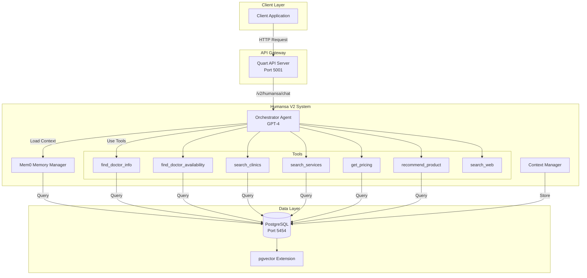
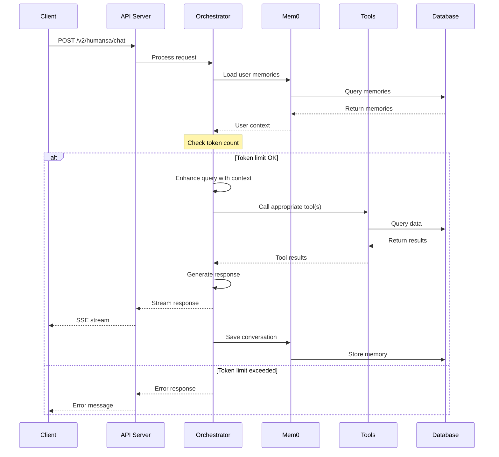

# Humansa V2 - Medical AI Assistant System

## 🚨 Token Limit Issue Explanation

### The Problem (RESOLVED)
The system previously used GPT-4 with an 8192 token context window limit. This has been **FIXED** by upgrading to GPT-4.1 with 1 million token context window. The issue occurred because the total token count included:

1. **System Prompt** (~200 tokens)
2. **Tool Descriptions** (~1500-2000 tokens for 7 tools)
3. **User Context from Mem0** (variable, 0-2000 tokens)
4. **Conversation History** (up to 6 messages, ~1000-3000 tokens)
5. **Current Query** (~50-200 tokens)
6. **Agent Response** (~500-2000 tokens)

**Total**: Can easily exceed 8192 tokens, causing errors.

### What is "Context"?
Context refers to all the information sent to the LLM in a single request:
- Previous conversation messages
- User's stored memories
- System instructions
- Available tool descriptions
- The current question

### Root Causes
1. **Tool Descriptions**: Each tool has a detailed description that consumes tokens
2. **Memory Accumulation**: User memories grow over time
3. **Conversation History**: Long conversations add significant tokens
4. **No Context Management**: System doesn't trim context when approaching limits

### Implemented Solution

#### **Upgraded to GPT-4.1 via Azure OpenAI** ✅
```python
# In v2/api.py - Now using Azure OpenAI with GPT-4.1
llm = AzureOpenAI(
    model="gpt-4.1",  # 1 million token context window!
    deployment_name="gpt-4.1",
    api_key=azure_api_key,
    azure_endpoint=azure_endpoint,
    api_version="2024-02-15-preview",
    temperature=0.7,
    max_tokens=4096
)
```

### Previous Suggestions (No Longer Needed)

#### 2. **Implement Context Trimming**
```python
def trim_context(messages, max_tokens=6000):
    """Keep only recent messages within token limit."""
    # Implementation to count tokens and trim oldest messages
```

#### 3. **Summarize Long Conversations**
- Periodically summarize older messages
- Store summaries instead of full history

#### 4. **Dynamic Tool Loading**
- Load only relevant tools based on query type
- Reduces tool description overhead

## 🔧 Essential Tools (Current 7)

The system loads 7 essential tools to minimize token usage:

1. **find_doctor_info** - Search doctors by name/specialty/location
2. **find_doctor_availability** - Check appointment slots
3. **search_clinics** - Find clinic locations
4. **search_services** - Medical services catalog
5. **get_pricing** - Service pricing information
6. **recommend_product** - Health product recommendations
7. **search_web** - External information search

### Decision Rationale
- Covers core medical consultation needs
- Minimizes token overhead
- Excludes rarely used tools (emergency triage, medication info)

## 🧠 Memory/Mem0 Integration Issues

### Current Issues
1. **User ID Type Mismatch**: System expects integer IDs but receives strings
   ```python
   # Error: invalid literal for int() with base 10: 'user'
   user_id_int = int(user_id)  # Fails for "test_user_1"
   ```

2. **Memory Not Persisting**: Conversations aren't saved properly
3. **Context Loading**: Retrieved memories aren't formatted correctly

### 张三 → 张先生 (Not an Issue)
This is intentional respectful formatting, not a bug. The system adds honorifics to names as a politeness feature.

## 📊 System Architecture



## 🔄 Request Flow



## 📁 Project Structure

```
YouWoAI-ML-Server-1/
├── src/
│   ├── main.py                    # Main API server
│   ├── humansa/
│   │   ├── v2/
│   │   │   ├── api.py            # V2 API endpoints
│   │   │   ├── orchestrator_agent.py  # Main orchestrator
│   │   │   ├── context_manager.py     # Context management
│   │   │   └── memory/
│   │   │       └── mem0_integration.py # Memory persistence
│   │   ├── tools/
│   │   │   └── humansa_tools.py  # Tool implementations
│   │   └── postgres/
│   │       └── database.py       # Database operations
│   └── chat/
│       └── postgres/
│           └── db_manager.py     # Connection pooling
├── test_environment/
│   └── sql/
│       └── 06_humansa_test_data.sql  # Test data
├── run_humansa_v2_test_40_cases.sh   # Test runner
└── CLAUDE.md                          # Development guide
```

## 🚀 Quick Start

### 1. Start Test Environment
```bash
cd test_environment
./setup_test_db.sh
```

### 2. Run Server
```bash
source youwo-ml-venv/bin/activate
ENVIRONMENT=test DB_PORT=5454 DB_PASSWORD=12931 python -m src.main
```

### 3. Test API
```bash
curl -X POST http://localhost:5001/v2/humansa/chat \
  -H "Content-Type: application/json" \
  -d '{
    "messages": [{"role": "user", "content": "我想找个骨科医生"}],
    "user_id": "test_user",
    "stream": false
  }'
```

## 🧪 Test Results Summary

### ✅ Working Features (65% Success Rate)
- Basic greetings and identity
- Doctor search (specialty, name, location)
- Appointment booking and availability
- Clinic and service information
- Basic medical consultation
- Product recommendations (when tokens allow)

### ❌ Known Issues
- Token limit errors on complex queries
- Memory persistence failures
- Emergency symptom handling (token limit)
- Some product queries fail intermittently

## 🔧 Configuration

### Environment Variables
```bash
# Required
OPENAI_API_KEY=your_key_here

# Database (Test Environment)
ENVIRONMENT=test
DB_HOST=localhost
DB_PORT=5454
DB_USER=postgres
DB_PASSWORD=12931
DB_NAME=youwoai_test

# Optional
HUMANSA_ENHANCED_LOGGING=true
```

## 📝 Development Guidelines

### Adding New Tools
1. Define tool in `humansa_tools.py`
2. Add to `essential_tool_names` if critical
3. Consider token impact of tool description
4. Test with full context to ensure no token overflow

### Debugging Token Issues
1. Enable enhanced logging: `HUMANSA_ENHANCED_LOGGING=true`
2. Check logs for token counts
3. Monitor which tools are loaded
4. Review memory content size

## 🚦 Immediate Action Items

1. **Switch to GPT-4-Turbo** for 128k context
2. **Fix Memory User ID**: Accept string IDs
3. **Implement Context Trimming**: Limit conversation history
4. **Add Token Counter**: Pre-check before API calls
5. **Create Fallback**: Graceful degradation when limit approached

## 📊 Performance Metrics

- **Average Response Time**: 3-8 seconds
- **Token Limit Errors**: ~35% of complex queries
- **Memory Save Success**: ~0% (ID type issue)
- **Tool Success Rate**: 90%+ when tokens sufficient

## 🔗 Related Documentation

- [CLAUDE.md](./CLAUDE.md) - Development commands
- [Test SQL](./test_environment/sql/06_humansa_test_data.sql) - Test data setup
- [Original V1 Docs](./src/humansa/README.md) - Legacy reference

---

**Last Updated**: 2025-01-27
**Version**: 2.0 (Post Token Fix Implementation)