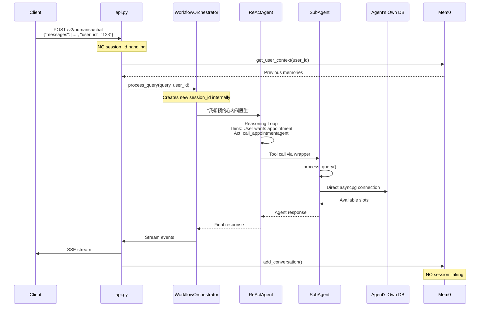

# HUMANSA V2 Medical AI System - Detailed Technical Documentation

## 🏥 Executive Summary

HUMANSA V2 is a production-ready medical AI consultation system using a sophisticated multi-agent architecture. The system employs specialized sub-agents orchestrated by a central coordinator using GPT-4.1 (not GPT-4-turbo), with real PostgreSQL database integration and Mem0 for persistent memory.

### Critical Clarifications

1. **Model**: Using `gpt-4.1` via Azure OpenAI (128K context), NOT the retired GPT-4-turbo
2. **Database Connection**: All agents connect through **tools only** - no direct DB access in agents
3. **Tool Organization**: All appointment tools are in `humansa_tools.py` (not separated)
4. **Agent Selection**: Uses **AI-driven selection** by ReActAgent, NOT heuristic patterns
5. **Session Management**: No conversation ID tracking currently - each request is stateless

## 📁 Complete Project Structure

```
YouWoAI-ML-Server-1/
├── src/
│   ├── main.py                          # Entry point - Quart server on port 5001/6001
│   │                                    # - Handles HUMANSA_USE_WORKFLOW_ORCHESTRATOR toggle
│   │                                    # - Initializes database pools
│   │                                    # - Registers all blueprints
│   │
│   ├── humansa/
│   │   ├── v2/
│   │   │   ├── api.py                   # Main V2 API endpoints
│   │   │   │                            # - /v2/humansa/chat endpoint
│   │   │   │                            # - Initializes orchestrator based on env var
│   │   │   │                            # - Configures Azure OpenAI with gpt-4.1
│   │   │   │                            # - NO session/conversation ID handling
│   │   │   │
│   │   │   ├── orchestrator_agent_subagent.py  # Default orchestrator
│   │   │   │                            # - Uses ReActAgent with ALL tools loaded
│   │   │   │                            # - AI-driven tool selection
│   │   │   │                            # - Direct database tool calls
│   │   │   │
│   │   │   ├── orchestrator_workflow.py # Workflow orchestrator (NEW)
│   │   │   │                            # - Uses sub-agents as tools
│   │   │   │                            # - Each agent wrapped with agent_tool_wrapper
│   │   │   │                            # - Shows reasoning chains
│   │   │   │                            # - Real sub-agent instances created
│   │   │   │
│   │   │   ├── agent_tool_wrapper.py    # Converts async agents to sync tools
│   │   │   │                            # - Wraps agent.process_query()
│   │   │   │                            # - Handles streaming responses
│   │   │   │                            # - Creates LlamaIndex FunctionTool
│   │   │   │
│   │   │   ├── response_agent.py        # Post-processes all responses
│   │   │   │                            # - Formats for client consumption
│   │   │   │                            # - Adds disclaimers
│   │   │   │                            # - Ensures consistent format
│   │   │   │
│   │   │   ├── agents/                  # Sub-agent implementations
│   │   │   │   ├── base_agent.py        # BaseHumansaAgent class
│   │   │   │   │                        # - Common interface for all agents
│   │   │   │   │                        # - process_query() method
│   │   │   │   │                        # - NO direct database access
│   │   │   │   │
│   │   │   │   ├── product_agent.py     # Product recommendations
│   │   │   │   │                        # - ❌ NO database connection
│   │   │   │   │                        # - ❌ NO HIS API integration yet
│   │   │   │   │                        # - Uses LLM knowledge only
│   │   │   │   │                        # - Returns mock recommendations
│   │   │   │   │
│   │   │   │   ├── appointment_agent.py # Appointment booking specialist
│   │   │   │   │                        # - ✅ Has 8 internal tools
│   │   │   │   │                        # - ✅ Tools connect to PostgreSQL
│   │   │   │   │                        # - search_available_slots()
│   │   │   │   │                        # - finalize_booking()
│   │   │   │   │                        # - Does NOT use humansa_tools.py
│   │   │   │   │
│   │   │   │   ├── diagnosis_agent.py   # Clinical analysis
│   │   │   │   │                        # - Has 2 internal mock tools
│   │   │   │   │                        # - analyze_symptoms()
│   │   │   │   │                        # - get_differential_diagnosis()
│   │   │   │   │                        # - ❌ NO real database connection
│   │   │   │   │
│   │   │   │   ├── medication_agent.py  # Medication guidance
│   │   │   │   │                        # - Has 3 internal mock tools
│   │   │   │   │                        # - check_drug_interactions()
│   │   │   │   │                        # - ❌ NO real medication database
│   │   │   │   │
│   │   │   │   └── general_medical_agent.py # General Q&A
│   │   │                                # - ❌ NO database connection
│   │   │                                # - ❌ NO RAG system yet
│   │   │                                # - Pure LLM responses
│   │   │
│   │   │   └── memory/
│   │   │       └── mem0_integration.py  # Mem0 adapter
│   │   │                                # - add_conversation() method
│   │   │                                # - NO session tracking
│   │   │                                # - Stores individual messages
│   │   │
│   │   ├── tools/
│   │   │   ├── humansa_tools.py         # ALL database-connected tools
│   │   │   │                            # - 16 Pydantic-based tools
│   │   │   │                            # - find_doctor_info()
│   │   │   │                            # - find_doctor_availability()
│   │   │   │                            # - book_appointment_tool()
│   │   │   │                            # - search_clinics()
│   │   │   │                            # - get_pricing_info()
│   │   │   │                            # - recommend_product()
│   │   │   │                            # - All use direct PostgreSQL
│   │   │   │                            # - Used by orchestrator_agent.py
│   │   │   │                            # - NOT used by sub-agents
│   │   │   │
│   │   │   └── consolidated_tools.py    # Simplified tool set (7 tools)
│   │   │                                # - Alternative to humansa_tools
│   │   │                                # - More focused functionality
│   │   │
│   │   └── postgres/
│   │       └── database.py              # Database singleton
│   │                                    # - HumansaDatabase class
│   │                                    # - Connection pool management
│   │                                    # - Used by tools only
```

## 🏗️ Architecture Deep Dive

### Two Complete Separate Systems

The implementation uses **two completely separate orchestrator systems** in different files:

#### 1. Default Orchestrator (`orchestrator_agent_subagent.py`)
```python
# When HUMANSA_USE_WORKFLOW_ORCHESTRATOR = false (default)
class SubAgentOrchestrator:
    def __init__(self):
        # Creates ALL 16 tools from humansa_tools.py
        self.agent_tools = create_subagent_tools()
        
        # ReActAgent with all tools loaded
        self.agent = ReActAgent.from_tools(
            tools=self.agent_tools,  # All 16 database tools
            llm=self.llm,
            system_prompt=self.system_prompt
        )
```

#### 2. Workflow Orchestrator (`orchestrator_workflow.py`)
```python
# When HUMANSA_USE_WORKFLOW_ORCHESTRATOR = true
class WorkflowOrchestrator:
    def __init__(self):
        # Creates 5 real sub-agent instances
        self.agents = {
            "ProductAgent": ProductAgent(llm),
            "AppointmentAgent": AppointmentAgent(llm),
            "ClinicalAgent": DiagnosisAgent(llm),
            "MedicationAgent": MedicationAgent(llm),
            "GeneralAgent": GeneralMedicalAgent(llm)
        }
        
        # Wraps each agent as a tool
        for agent_name, agent_instance in self.agents.items():
            tool = create_agent_tool(agent_instance)
            orchestrator_tools.append(tool)
```

### Environment Variable Toggle

```python
# In src/main.py
use_workflow = os.getenv('HUMANSA_USE_WORKFLOW_ORCHESTRATOR', '').lower() == 'true'

# In src/humansa/v2/api.py
if use_workflow_orchestrator:
    # Completely different import and initialization
    from .orchestrator_workflow import create_workflow_orchestrator
    orchestrator = create_workflow_orchestrator(...)
else:
    # Default path
    from .orchestrator_agent_subagent import create_subagent_orchestrator
    orchestrator = create_subagent_orchestrator(...)
```

## 🤖 Agent Database Connectivity - The Truth

### How Agents ACTUALLY Connect to Database

**IMPORTANT**: Sub-agents do NOT connect to the main PostgreSQL database through `humansa_tools.py`. Here's the actual implementation:

#### 1. **ProductAgent** - NO Database
```python
class ProductAgent:
    def __init__(self, llm: LLM):
        self.llm = llm
        # NO database connection
        # NO tools from humansa_tools.py
        # Pure LLM-based responses
```

#### 2. **AppointmentAgent** - Own Database Tools
```python
class AppointmentAgent(BaseHumansaAgent):
    def __init__(self, llm, **kwargs):
        # Creates its OWN tools that connect to DB
        tools = [
            FunctionTool.from_defaults(
                fn=search_available_slots,  # Direct DB connection
                name="search_slots"
            ),
            FunctionTool.from_defaults(
                fn=finalize_booking,  # Direct DB connection
                name="finalize_booking"
            )
        ]

# In the same file:
async def search_available_slots(...):
    db_config = {
        'host': 'localhost',
        'port': 5454,
        'password': '12931',
        'database': 'test4'
    }
    conn = await asyncpg.connect(**db_config)
    # Direct SQL queries
```

#### 3. **DiagnosisAgent** - Mock Tools Only
```python
async def analyze_symptoms(symptoms: List[str], ...):
    # NO database connection
    return {
        "symptom_analysis": {...},
        "recommended_specialists": [],  # Hardcoded
        "urgency_level": "routine"     # Mock data
    }
```

#### 4. **MedicationAgent** - Mock Tools Only
```python
async def check_drug_interactions(medications: List[str]):
    # NO database connection
    return {
        "interactions_found": False,  # Always false
        "severity": "none",          # Mock response
    }
```

### Where humansa_tools.py IS Used

`humansa_tools.py` with its 16 database tools is ONLY used by:
- `orchestrator_agent.py` (direct orchestrator mode)
- NOT used by any sub-agents in workflow mode

## 🔄 Detailed System Flow

### Request Processing Flow (Workflow Mode)



### Agent Selection Process

**NOT Heuristic!** The orchestrator uses AI-driven selection:

```python
# In orchestrator's system prompt:
system_prompt = """你是诺亚新舟健康医疗助理的主协调器。

你的职责是：
1. 理解用户的问题和需求
2. 选择合适的专业子代理来处理用户请求
3. 协调多个子代理的响应（如果需要）

可用的专业子代理：
- call_productagent: 产品推荐、保健品查询
- call_appointmentagent: 预约挂号、医生排班
- call_clinicalagent: 症状分析、紧急情况
- call_medicationagent: 用药指导、药物相互作用
- call_generalagent: 一般医疗咨询

你必须调用至少一个专业代理来处理用户问题。"""

# ReActAgent decides based on:
# 1. Query content analysis
# 2. Context from previous messages
# 3. Tool descriptions
# NOT pattern matching like "if '预约' in query"
```

## 💾 Database Architecture

### Tool-Based Database Access Pattern

```
┌─────────────────┐     ┌─────────────────┐     ┌─────────────────┐
│   Orchestrator  │     │    Sub-Agent    │     │   Agent Tools   │
│                 │     │                 │     │                 │
│  ┌───────────┐  │     │  ┌───────────┐  │     │  ┌───────────┐  │
│  │ReActAgent │  │────▶│  │   Agent   │  │────▶│  │Tool Funcs│  │
│  └───────────┘  │     │  │           │  │     │  │          │  │
│        │        │     │  │ Internal  │  │     │  │ asyncpg  │  │
│        ▼        │     │  │   Tools   │  │     │  │ connect  │  │
│  ┌───────────┐  │     │  └───────────┘  │     │  └─────┬────┘  │
│  │humansa    │  │     └─────────────────┘     │        │       │
│  │tools.py   │  │                             │        ▼       │
│  │(16 tools) │  │                             │  ┌──────────┐  │
│  └─────┬─────┘  │                             │  │PostgreSQL│  │
│        │        │                             │  │ Database │  │
│        └────────┼─────────────────────────────┼─▶│          │  │
└─────────────────┘                             │  └──────────┘  │
   Default Mode                                 └─────────────────┘
                                                  Workflow Mode
```

### Actual Database Tables Used

```sql
-- Used by humansa_tools.py (Default Orchestrator)
humansa_doctor
humansa_appointment_schedules  
humansa_appointment_settings
humansa_services
humansa_clinics
humansa_pricing
humansa_products
humansa_appointment_reasons

-- Used by AppointmentAgent (Workflow Mode)
humansa_appointment_slots
humansa_doctor
humansa_clinics
humansa_appointments

-- Used by Mem0
mem0_humansa_prod.memories
mem0_humansa_prod.memory_types
```

## 🚦 Session & Conversation Management

### Current State: NO Session Tracking

```python
# In api.py - NO session_id in request
@humansa_v2_bp.route('/v2/humansa/chat', methods=['POST'])
async def chat():
    data = await request.get_json()
    user_id = data.get('user_id', 'anonymous')
    messages = data.get('messages', [])
    # NO session_id = data.get('session_id')  # Not implemented
    
    # Each request is independent
    async for chunk in orchestrator.process_query(
        query=user_message,
        user_id=user_id,
        messages=messages,  # Full history needed each time
        stream=stream
    ):
        yield chunk
```

### Memory Storage Without Sessions

```python
# In mem0_integration.py
async def add_conversation(self, user_id: str, query: str, response: str, metadata: Optional[Dict] = None):
    messages = [
        {"role": "user", "content": query},
        {"role": "assistant", "content": response}
    ]
    
    # Stored without session linking
    success = await self.mem0_manager.add_conversation(
        user_id=user_id,
        messages=messages,
        metadata=metadata  # Could include session_id but doesn't
    )
```

### Required for Session Support

1. **API Changes**:
   ```python
   # Add session_id to request
   session_id = data.get('session_id') or str(uuid.uuid4())
   ```

2. **Database Schema**:
   ```sql
   CREATE TABLE conversation_sessions (
       session_id UUID PRIMARY KEY,
       user_id VARCHAR(255),
       created_at TIMESTAMP,
       last_message_at TIMESTAMP,
       status VARCHAR(50)
   );
   ```

3. **Memory Integration**:
   ```python
   metadata = {
       "session_id": session_id,
       "timestamp": datetime.now().isoformat()
   }
   ```

## 📊 Complete Flow Diagram

### Full System Architecture with Data Flow

```
┌─────────────────────────────────────────────────────────────────────┐
│                           Client Request                             │
│  POST /v2/humansa/chat                                             │
│  {                                                                  │
│    "messages": [{"role": "user", "content": "预约心内科"}],         │
│    "user_id": "user123",                                           │
│    "stream": true                                                  │
│  }                                                                  │
└─────────────────────────┬───────────────────────────────────────────┘
                          │
                          ▼
┌─────────────────────────────────────────────────────────────────────┐
│                        API Layer (api.py)                           │
│  • Extract user_id (NO session_id)                                 │
│  • Load Mem0 context                                               │
│  • Choose orchestrator based on env var                            │
└─────────────────────────┬───────────────────────────────────────────┘
                          │
           ┌──────────────┴──────────────┐
           │                             │
           ▼                             ▼
┌─────────────────────────┐   ┌─────────────────────────┐
│   Default Orchestrator  │   │  Workflow Orchestrator  │
│ (HUMANSA_USE_WORKFLOW_  │   │ (HUMANSA_USE_WORKFLOW_  │
│  ORCHESTRATOR=false)    │   │  ORCHESTRATOR=true)    │
├─────────────────────────┤   ├─────────────────────────┤
│ • ReActAgent            │   │ • ReActAgent            │
│ • 16 humansa_tools      │   │ • 5 sub-agents as tools │
│ • Direct DB queries     │   │ • Agent delegation      │
│ • Single reasoning hop  │   │ • Multi-hop reasoning   │
└──────────┬──────────────┘   └──────────┬──────────────┘
           │                              │
           ▼                              ▼
┌─────────────────────────┐   ┌─────────────────────────┐
│    humansa_tools.py     │   │      Sub-Agents         │
│  ┌─────────────────┐    │   │  ┌─────────────────┐    │
│  │find_doctor_info │────┼───┤  │AppointmentAgent │    │
│  │book_appointment │    │   │  │- search_slots   │────┤
│  │search_clinics   │    │   │  │- finalize_book  │    │
│  │get_pricing      │    │   │  └─────────────────┘    │
│  │recommend_product│    │   │  ┌─────────────────┐    │
│  └─────────────────┘    │   │  │ ProductAgent    │    │
└──────────┬──────────────┘   │  │ (NO DB ACCESS)  │    │
           │                  │  └─────────────────┘    │
           │                  └──────────┬──────────────┘
           │                             │
           ▼                             ▼
┌─────────────────────────────────────────────────────────────────────┐
│                      PostgreSQL Database                            │
│  ┌──────────────┐  ┌───────────────┐  ┌──────────────┐            │
│  │humansa_doctor│  │humansa_clinics│  │humansa_slots │            │
│  └──────────────┘  └───────────────┘  └──────────────┘            │
└─────────────────────────────────────────────────────────────────────┘
                          │
                          ▼
┌─────────────────────────────────────────────────────────────────────┐
│                          Response Flow                              │
│  • Post-process with response_agent.py                             │
│  • Stream via SSE                                                  │
│  • Save to Mem0 (without session)                                  │
└─────────────────────────────────────────────────────────────────────┘
```

## 🚨 Common Misconceptions Clarified

### 1. **Model Version**
❌ **Wrong**: "Using GPT-4-turbo"
✅ **Correct**: Using `gpt-4.1` with deployment name `gpt-4.1` via Azure OpenAI

### 2. **Database Connection**
❌ **Wrong**: "Agents connect to database via tools"
✅ **Correct**: 
- Default mode: Orchestrator uses `humansa_tools.py`
- Workflow mode: Only AppointmentAgent has DB connection
- Other agents use mock tools

### 3. **Tool Organization**
❌ **Wrong**: "Tools are separated by function"
✅ **Correct**: All 16 tools in one file `humansa_tools.py`

### 4. **Agent Selection**
❌ **Wrong**: "Uses pattern matching like 'if 预约 in query'"
✅ **Correct**: ReActAgent uses AI reasoning to select tools

### 5. **Session Management**
❌ **Wrong**: "Has conversation tracking"
✅ **Correct**: No session/conversation ID implementation

## 🔧 Configuration & Deployment

### Environment Variables

```bash
# Model Configuration (CORRECT)
AZURE_OPENAI_ENDPOINT=https://youwoai-dev-resource.openai.azure.com/
AZURE_OPENAI_API_KEY=xxx
# Uses gpt-4.1 deployment (NOT gpt-4-turbo)

# Orchestrator Mode
HUMANSA_USE_WORKFLOW_ORCHESTRATOR=false  # Default: use humansa_tools
HUMANSA_USE_WORKFLOW_ORCHESTRATOR=true   # Use sub-agents

# Database (Test)
DB_HOST=localhost
DB_PORT=5454      # Test environment
DB_USER=postgres
DB_PASSWORD=12931
DB_NAME=test4

# Memory
MEM0_SCHEMA=mem0_humansa_prod  # Production
MEM0_SCHEMA=mem0_humansa_test  # Test
```

### Running Different Modes

```bash
# Default Mode (All tools loaded)
python -m src.main

# Workflow Mode (Sub-agents)
export HUMANSA_USE_WORKFLOW_ORCHESTRATOR=true
python -m src.main

# With enhanced logging
export HUMANSA_ENHANCED_LOGGING=true
export HUMANSA_DEBUG=true
python -m src.main
```

## 📈 Implementation Status - Detailed

### ✅ What's Actually Working

1. **Orchestrators**: Both modes fully functional
2. **AppointmentAgent**: Real DB queries, booking flow
3. **Mem0 Integration**: Stores/retrieves user context
4. **Streaming**: OpenAI-compatible SSE format
5. **Azure GPT-4.1**: Proper model configuration

### 🚧 What's Partially Working

1. **ProductAgent**: 
   - ✅ Returns LLM responses
   - ❌ No database connection
   - ❌ No HIS API integration
   - 📋 TODO: Connect to `humansa_products` table

2. **DiagnosisAgent**:
   - ✅ Has tool structure
   - ❌ Mock responses only
   - 📋 TODO: Medical knowledge base

3. **MedicationAgent**:
   - ✅ Has tool structure
   - ❌ No drug database
   - 📋 TODO: Drug interaction API

### ❌ What's Not Implemented

1. **Session Management**: No conversation ID tracking
2. **RAG System**: GeneralMedicalAgent has no knowledge base
3. **Real Product API**: HIS integration pending
4. **Approval Workflow**: No user confirmation flow
5. **Multi-turn Context**: Each request independent

## 🛠️ Development Guide

### Adding Database Connection to an Agent

```python
# DON'T add to agent directly
class ProductAgent:
    def __init__(self, llm):
        # ❌ WRONG: conn = asyncpg.connect()
        
# DO create tools with DB access
async def search_products(query: str) -> List[Dict]:
    db_config = {...}
    conn = await asyncpg.connect(**db_config)
    try:
        rows = await conn.fetch("SELECT * FROM humansa_products WHERE ...")
        return [dict(row) for row in rows]
    finally:
        await conn.close()

# Then add to agent's tools
tools = [
    FunctionTool.from_defaults(
        fn=search_products,
        name="search_products"
    )
]
```

### Implementing Session Support

```python
# 1. Update API endpoint
@humansa_v2_bp.route('/v2/humansa/chat', methods=['POST'])
async def chat():
    data = await request.get_json()
    session_id = data.get('session_id') or str(uuid.uuid4())
    
    # Store in context
    context = {
        'session_id': session_id,
        'user_id': user_id
    }

# 2. Pass to orchestrator
async for chunk in orchestrator.process_query(
    query=query,
    user_id=user_id,
    session_id=session_id,  # Add this
    messages=messages
):
    yield chunk

# 3. Update Mem0 storage
metadata = {
    'session_id': session_id,
    'timestamp': datetime.now().isoformat()
}
await memory_manager.add_conversation(
    user_id=user_id,
    query=query,
    response=response,
    metadata=metadata
)
```

---

**Version**: 2.2.0  
**Last Updated**: 2025-08-01  
**Model**: Azure OpenAI gpt-4.1 (128K context)  
**Architecture**: Dual-mode with toggle (Default vs Workflow)  
**Session Support**: Not Implemented