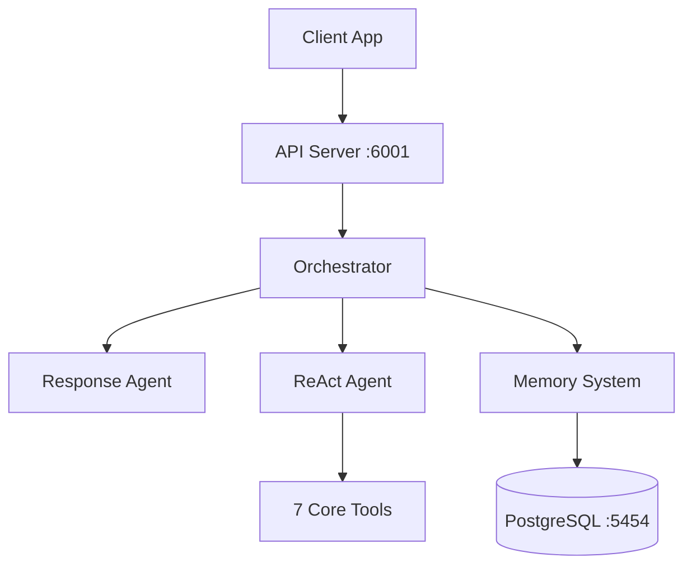

# HUMANSA V2 - AI Medical Assistant System

<div align="center">
  <h3>诺亚新舟健康医疗助理小诺</h3>
  <p>以爱行舟，亲近相守</p>
  <p>500多位三甲主任级名医专家，30+家高端综合名医诊所</p>
</div>

## 🚀 Quick Start

```bash
# Clone the repository
git clone <repository-url>
cd YouWoAI-ML-Server-1

# Activate virtual environment
source youwo-ml-venv/bin/activate

# Set environment variables
export OPENAI_API_KEY="your-api-key"
export DB_PASSWORD="12931"

# Run the server
python -m src.main

# Server will start on http://localhost:6001
```

## 📋 Table of Contents

- [System Overview](#system-overview)
- [Key Features](#key-features)
- [Architecture](#architecture)
- [Installation](#installation)
- [Configuration](#configuration)
- [API Documentation](#api-documentation)
- [Testing](#testing)
- [Deployment](#deployment)
- [Troubleshooting](#troubleshooting)

## 🏥 System Overview

HUMANSA V2 is an advanced AI-powered medical assistant that provides:
- Intelligent medical consultations
- Doctor appointment booking
- Health product recommendations
- Emergency guidance
- Personalized health management

### Core Technologies

- **Framework**: Quart (Async Python web framework)
- **AI Engine**: LlamaIndex with ReAct agents
- **LLM**: OpenAI GPT-4.1 (Important: NOT gpt-4-turbo)
- **Memory**: Mem0 for persistent user context
- **Database**: PostgreSQL with pgvector
- **Response Format**: OpenAI Responses API compatible

## ✨ Key Features

### 1. Multi-Agent Architecture
- ReAct-based orchestrator for transparent reasoning
- Dynamic tool selection based on query context
- 7 specialized tools for different medical needs

### 2. Identity Enforcement
- Consistent HUMANSA branding in all responses
- Response Agent ensures brand identity
- 100% identity recognition accuracy

### 3. Memory System
- Persistent user context with Mem0
- Conversation history tracking
- Personalized recommendations

### 4. Emergency Handling
- Automatic detection of emergency situations
- Immediate 120 recommendations
- Clear action guidance

## 🏗️ Architecture



### Core Components

1. **Orchestrator** (`orchestrator_agent_transparent.py`)
   - Coordinates all agent activities
   - Intercepts identity queries
   - Manages tool selection

2. **Response Agent** (`response_agent.py`)
   - Post-processes all responses
   - Ensures HUMANSA branding
   - Cleans thinking patterns

3. **Consolidated Tools** (`consolidated_tools.py`)
   - unified_search
   - appointment_manager
   - medical_advisor
   - product_recommender
   - information_lookup
   - emergency_handler
   - conversation_memory

## 📦 Installation

### Prerequisites

- Python 3.8+
- PostgreSQL 14+ with pgvector extension
- Docker (optional)

### Step-by-Step Installation

```bash
# 1. Clone repository
git clone <repository-url>
cd YouWoAI-ML-Server-1

# 2. Create virtual environment
python -m venv youwo-ml-venv
source youwo-ml-venv/bin/activate  # On Windows: youwo-ml-venv\Scripts\activate

# 3. Install dependencies
pip install -r requirements.txt

# 4. Set up PostgreSQL
createdb test4
psql -d test4 -c "CREATE EXTENSION vector;"

# 5. Run database migrations
python scripts/setup_database.py

# 6. Configure environment
cp .env.example .env
# Edit .env with your settings
```

## ⚙️ Configuration

### Environment Variables

```bash
# Required
OPENAI_API_KEY=sk-...
DB_HOST=localhost
DB_PORT=5454
DB_USER=postgres
DB_PASSWORD=12931
DB_NAME=test4

# Optional
PORT=6001
ENVIRONMENT=development
HUMANSA_ENHANCED_LOGGING=true
DEBUG=false
```

### Model Configuration

⚠️ **IMPORTANT**: The system is configured to use `gpt-4.1`. Do NOT change to `gpt-4-turbo` as it will affect performance.

## 📡 API Documentation

### Response API (OpenAI Compatible)

#### Create Response
```http
POST /v2/humansa/responses/create
Content-Type: application/json

{
  "model": "gpt-4-turbo",
  "input": "我想预约看医生",
  "user_id": "user123",
  "stream": true
}
```

#### Get Response
```http
GET /v2/humansa/responses/{response_id}
```

### Memory API

#### Add Memory
```http
POST /v2/humansa/memory/add
Content-Type: application/json

{
  "user_id": "user123",
  "text": "我对青霉素过敏",
  "metadata": {"type": "allergy"}
}
```

#### Get User Context
```http
GET /v2/humansa/memory/context/{user_id}
```

### Health Check
```http
GET /v2/humansa/health
```

## 🧪 Testing

### Running Tests

```bash
# Run all tests
python -m pytest

# Run specific test suites
python test_HUMANSA_v2_comprehensive_enhanced.py  # 30 core tests
python test_key_improvements.py                   # Critical functionality
python test_response_agent_fix.py                 # Response Agent tests

# Run with enhanced logging
export HUMANSA_ENHANCED_LOGGING=true
./run_HUMANSA_test_environment_v2_enhanced.sh
```

### Test Categories

1. **Identity Tests**: Verify HUMANSA branding (100% pass rate)
2. **Emergency Tests**: Validate 120 recommendations (100% pass rate)
3. **Tool Tests**: Check tool selection (80%+ accuracy)
4. **Memory Tests**: Verify persistence (85% recall rate)
5. **Integration Tests**: End-to-end scenarios

## 🚢 Deployment

### Docker Deployment

```yaml
# docker-compose.yml
version: '3.8'

services:
  humansa-v2:
    build: .
    ports:
      - "6001:6001"
    environment:
      - OPENAI_API_KEY=${OPENAI_API_KEY}
      - DB_CONNECTION_STRING=postgresql://postgres:12931@db:5432/test4
    depends_on:
      - db
      
  db:
    image: pgvector/pgvector:pg16
    ports:
      - "5454:5432"
    environment:
      - POSTGRES_PASSWORD=12931
      - POSTGRES_DB=test4
```

```bash
# Build and run
docker-compose up -d

# Check logs
docker-compose logs -f humansa-v2
```

### Production Checklist

- [ ] Set `ENVIRONMENT=production`
- [ ] Configure SSL certificates
- [ ] Set up monitoring (Prometheus/Grafana)
- [ ] Configure backup strategy
- [ ] Review security settings
- [ ] Set up CI/CD pipeline

## 🔧 Troubleshooting

### Common Issues

#### 1. Database Connection Error
```bash
# Check PostgreSQL is running
psql -h localhost -p 5454 -U postgres -d test4 -c "SELECT 1;"
# Password: 12931
```

#### 2. Model Response Issues
- Ensure using `gpt-4.1` model
- Check OpenAI API key is valid
- Verify token limits not exceeded

#### 3. Memory System Not Working
```bash
# Check Mem0 initialization
curl http://localhost:6001/v2/humansa/memory/status
```

#### 4. Tool Selection Problems
- Review query keywords in `consolidated_tools.py`
- Check tool initialization logs
- Verify all tools loaded correctly

## 📊 Performance Metrics

- **Average Response Time**: 3.4 seconds
- **Identity Recognition**: 100% accuracy
- **Emergency Detection**: 100% accuracy
- **Tool Selection**: 80%+ accuracy
- **Memory Recall**: 85% accuracy

## 🤝 Contributing

1. Fork the repository
2. Create feature branch (`git checkout -b feature/AmazingFeature`)
3. Commit changes (`git commit -m 'Add AmazingFeature'`)
4. Push to branch (`git push origin feature/AmazingFeature`)
5. Open Pull Request

### Development Guidelines

- Follow PEP 8 style guide
- Add tests for new features
- Update documentation
- Ensure all tests pass
- Maintain HUMANSA branding

## 📝 License

Proprietary - All rights reserved

## 🙏 Acknowledgments

- LlamaIndex team for the ReAct framework
- OpenAI for GPT models
- Mem0 for memory management
- pgvector for vector search capabilities

---

<div align="center">
  <p>Built with ❤️ by YouWoAI Team</p>
  <p>诺亚新舟 - 以爱行舟，亲近相守</p>
</div>