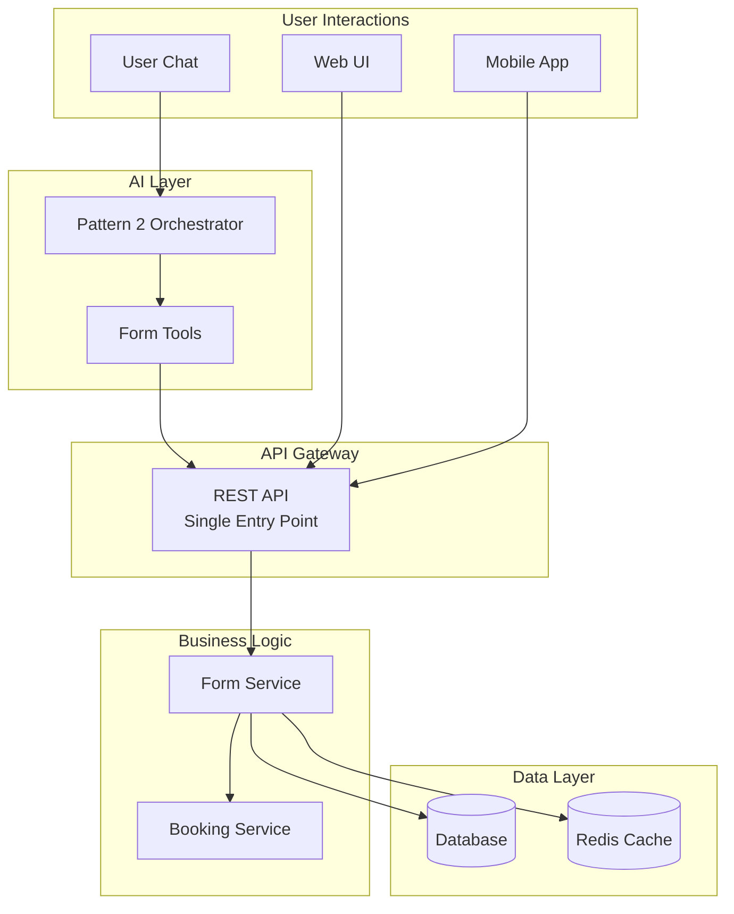
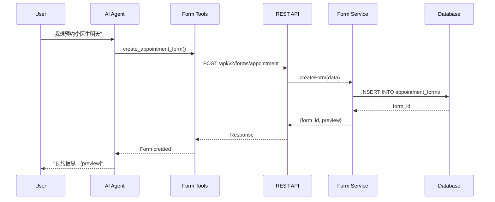
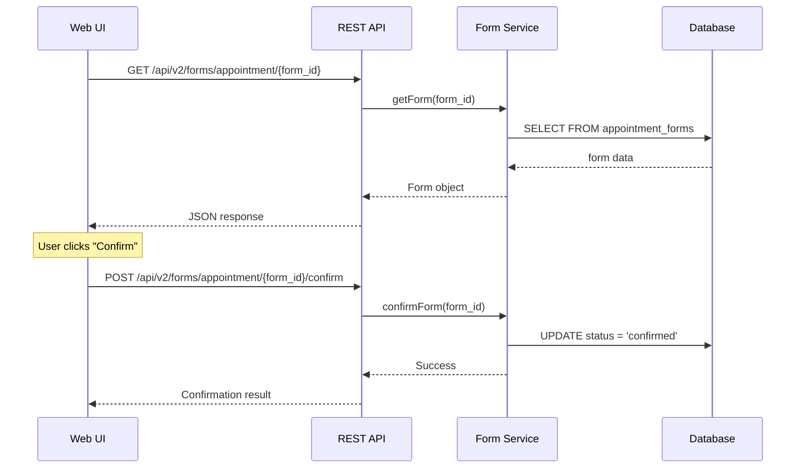
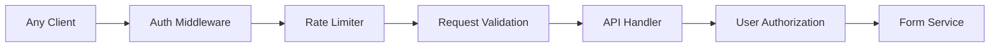

# REST API Architecture for Form System

## Overview

You're absolutely correct! The architecture is designed with **separation of concerns**:

1. **Form Tools** - Used by AI agents to interact with forms
2. **REST API** - The ONLY way to modify forms (single source of truth)
3. **Frontend/User** - Can directly call REST API for UI interactions

## Architecture Diagram



## How It Works

### 1. AI Agent Path (via Form Tools)



### 2. Direct UI Path (Bypassing AI)



## API Endpoints Explained

### Core Form Operations

| Endpoint | Method | Who Can Call | Purpose |
|----------|--------|--------------|---------|
| `/api/v2/forms/appointment` | POST | AI Tools, Frontend | Create new form |
| `/api/v2/forms/appointment/{id}` | GET | AI Tools, Frontend | Get form details |
| `/api/v2/forms/appointment/{id}` | PUT | AI Tools, Frontend | Update form fields |
| `/api/v2/forms/appointment/{id}/confirm` | POST | AI Tools, Frontend | Confirm & submit |
| `/api/v2/forms/appointment/{id}/cancel` | POST | AI Tools, Frontend | Cancel form |

### Why This Architecture?

1. **Single Source of Truth**: REST API is the ONLY way to modify forms
   - Ensures data consistency
   - Enables audit trails
   - Simplifies security

2. **Decoupling**: AI doesn't directly touch database
   - AI focuses on understanding intent
   - Business logic stays in service layer
   - Easy to swap AI providers

3. **Flexibility**: Multiple clients can use same API
   - Web UI for desktop users
   - Mobile app for on-the-go
   - AI chat for conversational booking
   - Third-party integrations

4. **Security**: Centralized access control
   - Authentication at API layer
   - Rate limiting per endpoint
   - User authorization checks

## Example: Complete Booking Flow

### Step 1: AI Creates Form
```python
# In Pattern 2 Orchestrator
result = await create_appointment_form(
    user_id="user_123",
    query="预约李医生明天上午"
)
# This calls: POST /api/v2/forms/appointment
```

### Step 2: User Gets Form Link
```
AI: 预约信息已创建，请确认：
    医生：李医生
    时间：明天上午9:00
    
    [确认预约] [修改信息]
    
    或访问: https://hospital.com/forms/abc123
```

### Step 3A: User Confirms via Chat
```
User: 确认
AI calls: POST /api/v2/forms/appointment/abc123/confirm
```

### Step 3B: User Confirms via Web
```javascript
// Frontend JavaScript
fetch('/api/v2/forms/appointment/abc123/confirm', {
    method: 'POST',
    headers: {
        'Authorization': 'Bearer ' + token
    }
})
```

## Implementation Details

### Form Tools (What AI Uses)
```python
# Simplified - wraps API calls
async def create_appointment_form(user_id, query):
    # Extract info from query
    data = extract_appointment_info(query)
    
    # Call REST API
    response = await http_client.post(
        "/api/v2/forms/appointment",
        json={
            "user_id": user_id,
            "form_data": data
        }
    )
    
    return response.json()
```

### REST API (The Gateway)
```python
@router.post("/appointment")
async def create_appointment_form(request: CreateFormRequest):
    # Validate request
    # Check permissions
    # Call service
    form = await form_service.create_form(
        user_id=request.user_id,
        data=request.form_data
    )
    # Return response
    return FormResponse(form)
```

### Form Service (Business Logic)
```python
class FormService:
    async def create_form(self, user_id, data):
        # Business logic
        # Validation
        # Create form object
        # Save to database
        # Send notifications
        # Return form
```

## Benefits of This Architecture

1. **AI Independence**: Frontend can work without AI
2. **API Reusability**: Same API for all clients  
3. **Testability**: Can test API without AI
4. **Scalability**: Can scale API separately
5. **Monitoring**: Single point to track all form operations
6. **Versioning**: Easy to version API endpoints

## Security Considerations



Every request goes through:
1. **Authentication**: Valid token?
2. **Rate Limiting**: Too many requests?
3. **Validation**: Valid request format?
4. **Authorization**: User owns this form?
5. **Business Logic**: Process request

## Summary

Yes, you understand correctly! The architecture is:

- **Form Tools** = AI's interface to forms (calls REST API)
- **REST API** = Single gateway for ALL form modifications
- **Direct Access** = UI can call REST API directly

This ensures:
- ✅ Clean separation of concerns
- ✅ Single source of truth
- ✅ Flexible client support
- ✅ Proper security boundaries
- ✅ Easy testing and monitoring

The form is indeed "segregated" - the AI creates and manages forms through tools, but the actual form data and operations are controlled by the REST API, which both AI tools and user interfaces can call.