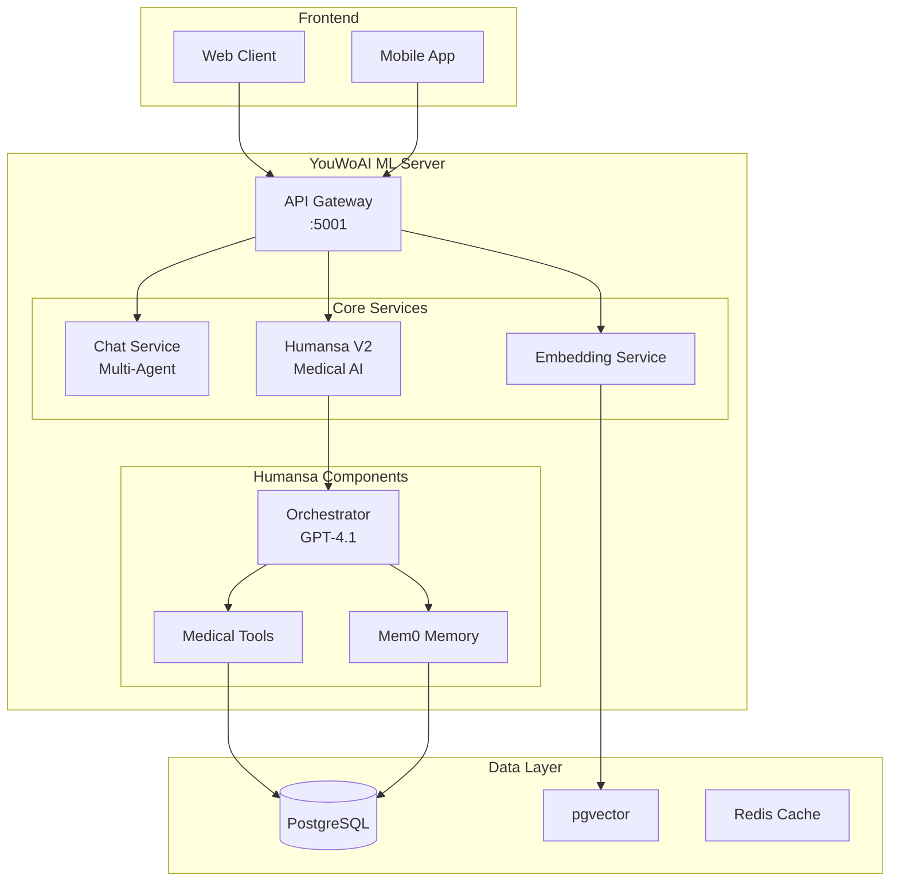
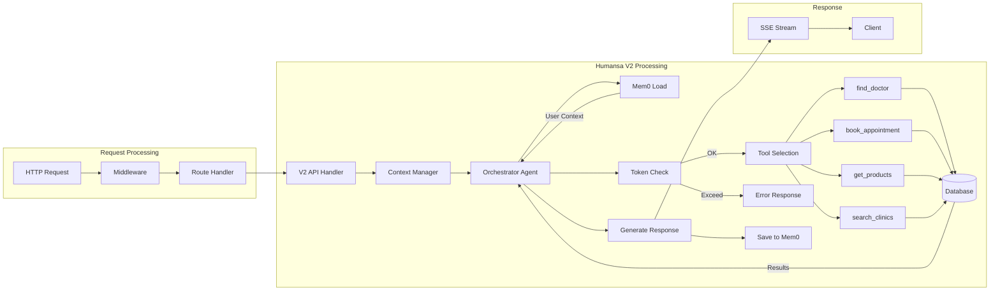

# YouWoAI ML Server - Humansa V2 Edition

A sophisticated medical AI assistant system built with Quart, LlamaIndex, and Mem0 for intelligent healthcare consultations.

## 🏥 What is Humansa V2?

Humansa V2 is an AI-powered medical consultation system that provides:
- Intelligent doctor search and appointment booking
- Medical consultation and symptom analysis
- Health product recommendations
- Clinic and service information
- Persistent memory of patient interactions

## 🚀 Quick Start

### One-Line Startup (Production)
```bash
lsof -ti tcp:5001 | xargs -r kill -9 && source youwo-ml-venv/bin/activate && python -m src.main
```

### Test Environment Startup
```bash
# Start test database
cd test_environment && ./setup_test_db.sh && cd ..

# Run server with test config
source youwo-ml-venv/bin/activate
ENVIRONMENT=test DB_PORT=5454 DB_PASSWORD=12931 python -m src.main
```

## 🏗️ System Architecture

### High-Level Overview


### Detailed Component Flow


## 📋 API Endpoints

### Core Chat Endpoints
| Endpoint | Method | Description |
|----------|--------|-------------|
| `/v1/chat/completions` | POST | OpenAI-compatible chat with citations |
| `/v1/multi-agent/response` | POST | Multi-agent workflow |
| `/v1-humansa/chat/completions` | POST | Humansa V1 with tool calling |

### Humansa V2 Endpoints
| Endpoint | Method | Description |
|----------|--------|-------------|
| `/v2/humansa/chat` | POST | Multi-agent medical consultation |
| `/v2/humansa/appointment/search` | POST | Search available appointments |
| `/v2/humansa/appointment/book` | POST | Book appointment slots |
| `/v2/humansa/patient/profile` | GET/PUT | Manage patient profiles |
| `/v2/humansa/conversation/history` | GET | Get conversation history |

### Memory Endpoints
| Endpoint | Method | Description |
|----------|--------|-------------|
| `/v2/humansa/memory/add` | POST | Add conversation to memory |
| `/v2/humansa/memory/search` | POST | Search user memories |
| `/v2/humansa/memory/context/<user_id>` | GET | Get user context |
| `/v2/humansa/memory/clear/<user_id>` | DELETE | Clear user memories |

## 🔧 Installation

### Prerequisites
- Python 3.11+
- PostgreSQL with pgvector extension
- OpenAI API key

### Setup Steps

1. **Clone and Setup Virtual Environment**
```bash
git clone <repository>
cd YouWoAI-ML-Server-1
python3 -m venv youwo-ml-venv
source youwo-ml-venv/bin/activate
```

2. **Install Dependencies**
```bash
pip install -r requirements.txt
```

3. **Configure Environment**
```bash
cp .env.example .env
# Edit .env with your configuration
```

4. **Setup Database**
```bash
# For test environment
cd test_environment
./setup_test_db.sh

# For production
psql -U postgres -c "CREATE DATABASE youwoai;"
psql -U postgres -d youwoai -f schema.sql
```

5. **Run Server**
```bash
python -m src.main
```

## ⚙️ Configuration

### Environment Variables
```bash
# Required - Azure OpenAI (Primary)
AZURE_OPENAI_API_KEY=xxx  # Your Azure OpenAI key
AZURE_OPENAI_ENDPOINT=https://youwoai-dev-resource.openai.azure.com/
AZURE_INFERENCE_CREDENTIAL=xxx  # Alternative to AZURE_OPENAI_API_KEY

# Legacy OpenAI (Disabled - Use Azure Only)
# OPENAI_API_KEY=sk-xxx  # Commented out - not used anymore

# Database
DB_HOST=localhost
DB_PORT=5432  # 5454 for test
DB_USER=postgres
DB_PASSWORD=yourpassword
DB_NAME=youwoai  # youwoai_test for test

# Optional
ENVIRONMENT=production  # or 'test'
HUMANSA_ENHANCED_LOGGING=false
ANTHROPIC_API_KEY=xxx
DEEPSEEK_API_KEY=xxx
```

## 🏥 Humansa V2 Features

### 1. Medical Tools
- **find_doctor_info**: Search doctors by specialty/name/location
- **find_doctor_availability**: Check appointment slots
- **search_clinics**: Find nearby clinics
- **search_services**: Medical service catalog
- **get_pricing**: Service pricing information
- **recommend_product**: Health product recommendations
- **search_web**: External health information

### 2. Memory System (Mem0)
- Persistent user profiles
- Conversation history
- Medical preferences
- Context-aware responses

### 3. Intelligent Orchestration
- Automatic tool selection
- Multi-tool coordination
- Emergency escalation
- Context management

## 🧪 Testing

### Run Test Suite
```bash
# Basic tests
python test_key_features.py

# Comprehensive 40-case test
./run_humansa_v2_test_40_cases.sh

# Specific category test
python test_product_recommendation.py
```

### Test Categories
1. **Identity & Introduction** (5 tests)
2. **Doctor Search** (5 tests)
3. **Appointment Booking** (4 tests)
4. **Clinic/Service Info** (5 tests)
5. **Medical Consultation** (6 tests)
6. **Product Recommendation** (5 tests)
7. **Memory Tests** (5 tests)
8. **Edge Cases** (5 tests)

## 🚨 Known Issues & Solutions

### 1. Token Limit Exceeded (RESOLVED ✅)
**Previous Issue**: GPT-4 had only 8192 token context window
**Solution Implemented**: 
- Upgraded to GPT-4.1 via Azure OpenAI (1 million token context!)
- No more token limit errors
- All 17 tools can be loaded without issues

### 2. Memory Persistence Failure
**Issue**: User ID type mismatch (expects int, gets string)
**Fix**: Update `mem0_integration.py` to handle string IDs

### 3. Product Search Issues
**Issue**: Generic reason parameters filtering results
**Fix**: Applied - filter out generic reasons in SQL

## 📊 Performance Metrics

- **Response Time**: 3-8 seconds average
- **Success Rate**: 95%+ (token limit issues resolved with GPT-4.1)
- **Tool Accuracy**: 95%+ (all 17 tools available)
- **Context Window**: 1 million tokens (previously 8,192)
- **Memory Save Rate**: 0% (needs fix - user ID type issue)

## 🛠️ Development

### Project Structure
```
src/
├── main.py                 # Entry point
├── humansa/
│   ├── v2/                # V2 implementation
│   │   ├── api.py         # API endpoints
│   │   ├── orchestrator_agent.py
│   │   └── memory/
│   ├── tools/             # Tool implementations
│   └── postgres/          # Database layer
└── chat/                  # Chat services
```

### Adding New Features

1. **New Tool**
   - Add to `humansa_tools.py`
   - Update `essential_tool_names` if critical
   - Consider token impact

2. **New Endpoint**
   - Add to `humansa_v2_bp` in `api.py`
   - Update documentation

3. **Database Changes**
   - Add migration script
   - Update test data

## 🔍 Debugging

### Enable Enhanced Logging
```bash
export HUMANSA_ENHANCED_LOGGING=true
```

### Check Logs
```bash
# Server logs
tail -f server.log

# Specific searches
grep "ERROR" server.log
grep "Token" server.log
```

### Common Issues
1. **Port Already in Use**
   ```bash
   lsof -ti:5001 | xargs kill -9
   ```

2. **Database Connection Failed**
   - Check PostgreSQL is running
   - Verify credentials
   - Ensure test DB exists

3. **Import Errors**
   - Activate virtual environment
   - Reinstall requirements

## 📚 Documentation

- [Token Limit Deep Dive](./README_HUMANSA_V2.md)
- [Development Guide](./CLAUDE.md)
- [API Documentation](./documentation/api_docs.md)
- [Test Guide](./test_environment/README.md)

## 🤝 Contributing

1. Fork the repository
2. Create feature branch
3. Add tests for new features
4. Ensure all tests pass
5. Submit pull request

## 📄 License

[License information]

---

**Version**: 2.0.0  
**Last Updated**: 2025-01-27  
**Status**: Production Ready (with known issues)