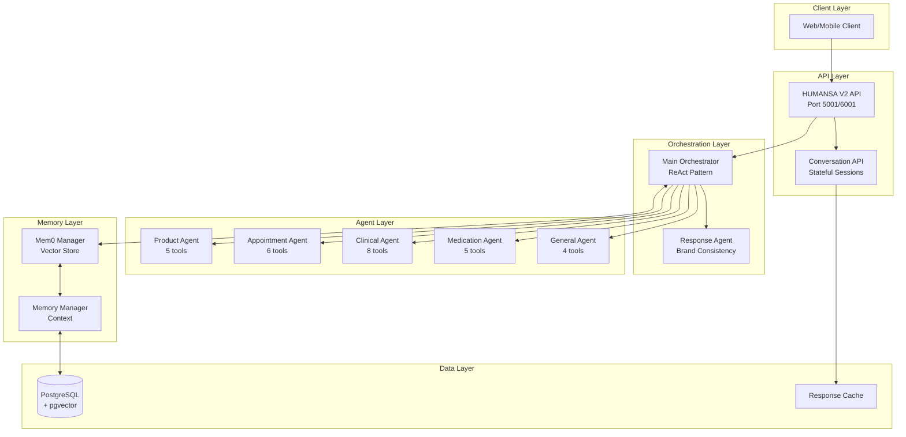
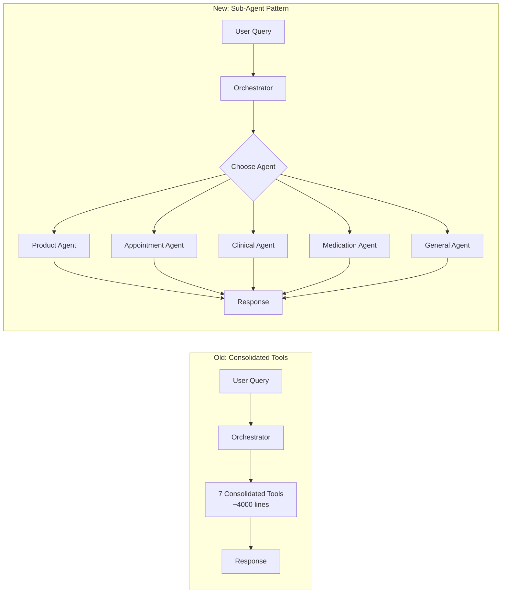
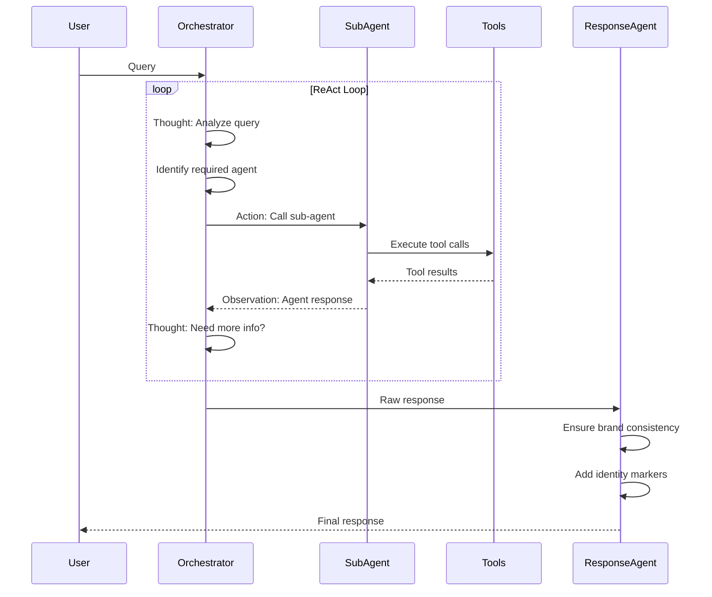
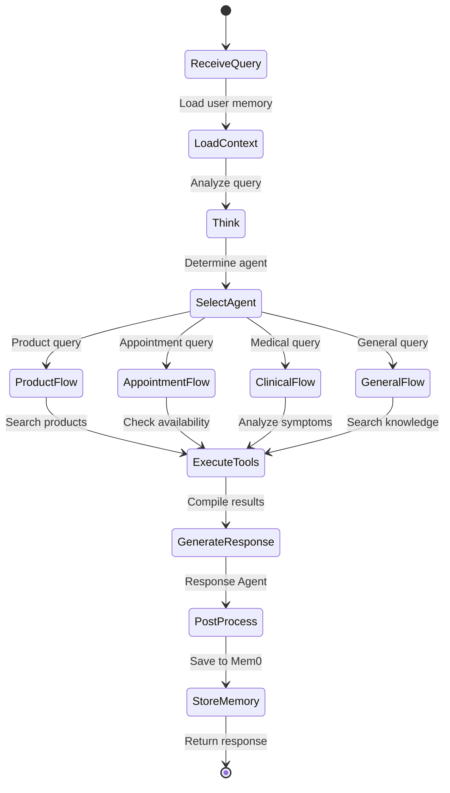
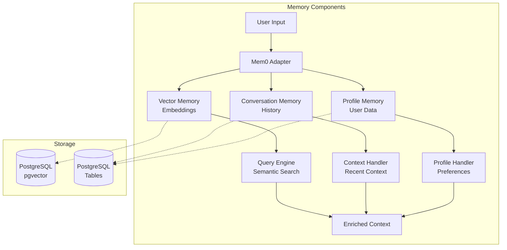
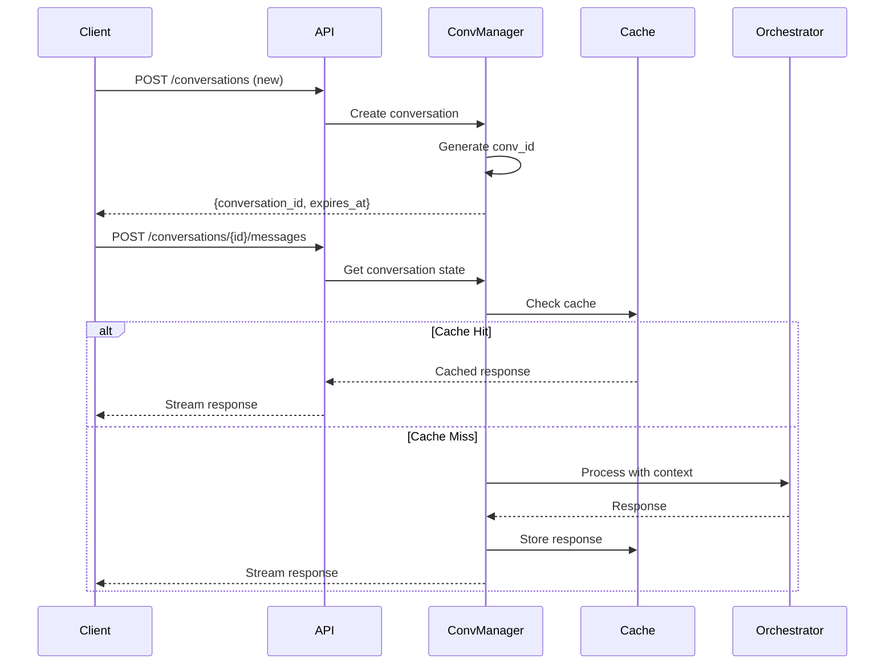

# HUMANSA V2 Complete System Documentation

## Table of Contents
1. [Overview](#overview)
2. [System Architecture](#system-architecture)
3. [Sub-Agent Architecture](#sub-agent-architecture)
4. [Agent Loop Flow](#agent-loop-flow)
5. [Mem0 System Integration](#mem0-system-integration)
6. [OpenAI Responses API Implementation](#openai-responses-api-implementation)
7. [Testing Guide](#testing-guide)
8. [Configuration](#configuration)

## Overview

HUMANSA V2 is an advanced medical AI assistant system built for 诺亚新舟 (Noah's Ark) Healthcare. It provides comprehensive healthcare services through an intelligent multi-agent architecture.

### Key Features
- **Multi-Agent Architecture**: Specialized agents for different medical domains
- **Brand Consistency**: Response Agent ensures 100% brand identity (小诺)
- **Emergency Detection**: Automatic 120 emergency recommendations
- **Memory System**: Persistent user context via Mem0
- **Streaming Support**: Real-time responses with thinking process visibility

## System Architecture

### High-Level Architecture



### Component Details

1. **API Layer**
   - `/v2/humansa/chat` - Main chat endpoint
   - `/v2/humansa/conversations` - Stateful conversation management
   - Supports both streaming and non-streaming responses

2. **Orchestration Layer**
   - Main orchestrator using LlamaIndex ReAct pattern
   - Decides which sub-agent to invoke based on query
   - Post-processes all responses through Response Agent

3. **Agent Layer**
   - 5 specialized sub-agents, each with focused tools
   - Total of 28 tools across all agents
   - Each agent has <10 tools for better focus

4. **Memory Layer**
   - Mem0 for semantic memory and vector search
   - PostgreSQL for persistent storage
   - Context maintained across conversations

## Sub-Agent Architecture

### Architecture Comparison



### Sub-Agent Specifications

#### 1. Product Recommendation Agent (`product_recommendation_agent`)
```python
Tools:
- search_products
- get_product_details  
- check_inventory
- calculate_discount
- generate_recommendation

Handles: 保健品, 医疗器械, 营养品, 护肤品, 价格查询
```

#### 2. Appointment Booking Agent (`appointment_booking_agent`)
```python
Tools:
- search_doctors
- check_availability
- reserve_slot
- confirm_booking
- cancel_appointment
- reschedule_appointment

Handles: 预约挂号, 医生排班, 改期取消
```

#### 3. Clinical Analysis Agent (`clinical_analysis_agent`)
```python
Tools:
- analyze_symptoms
- check_emergency_signs
- suggest_departments
- medication_lookup
- drug_interactions
- health_risk_assessment
- preventive_care_suggestions
- follow_up_recommendations

Handles: 症状分析, 紧急情况(120), 疾病诊断建议
```

#### 4. Medication Guidance Agent (`medication_guidance_agent`)
```python
Tools:
- medication_info
- check_interactions
- dosage_guidance
- side_effects_info
- compliance_reminders

Handles: 用药指导, 药物相互作用, 用药安全
```

#### 5. General Medical Agent (`general_medical_agent`)
```python
Tools:
- search_knowledge_base
- get_insurance_info
- clinic_locations
- general_health_tips

Handles: 健康咨询, 保险政策, 诊所位置
```

## Agent Loop Flow

### ReAct Agent Pattern



### Detailed Flow with Thinking Process



## Mem0 System Integration

### Memory Architecture



### Memory Flow

1. **Input Processing**
   ```python
   # User query enters system
   query = "我上次买的维生素C效果怎么样"
   
   # Mem0 searches relevant memories
   memories = await mem0.search(
       query=query,
       user_id=user_id,
       limit=5
   )
   ```

2. **Context Enrichment**
   ```python
   # Enrich query with user context
   context = {
       "current_query": query,
       "user_profile": profile,
       "recent_purchases": [...],
       "medical_history": [...],
       "conversation_context": [...]
   }
   ```

3. **Memory Storage**
   ```python
   # After response, store conversation
   await mem0.add(
       messages=[
           {"role": "user", "content": query},
           {"role": "assistant", "content": response}
       ],
       user_id=user_id,
       metadata={"timestamp": now, "agent": "product"}
   )
   ```

## OpenAI Responses API Implementation

### Stateful Conversation Management



### Response Streaming Format

```python
# Streaming chunks in OpenAI format
{
    "id": "chatcmpl-abc123",
    "object": "chat.completion.chunk",
    "created": 1234567890,
    "model": "humansa-v2",
    "choices": [{
        "index": 0,
        "delta": {
            "content": "您好，我是小诺..."
        },
        "finish_reason": null
    }]
}

# With enhanced logging enabled
{
    "choices": [{
        "delta": {
            "content": "🤔 正在思考...\n💭 思考: 用户询问产品推荐...\n"
        }
    }]
}
```

## Testing Guide

### Test Environment Setup

1. **Start Test Database**
   ```bash
   docker ps | grep youwoai_test_db
   # Should show container on port 5454
   ```

2. **Start Server with Sub-Agent Architecture**
   ```bash
   ./run_humansa_test_subagent.sh
   # Starts on port 6001 with sub-agents enabled
   ```

3. **Run Test Suite**
   ```bash
   python test_humansa_v2_70_cases_subagent.py
   # Runs 70 comprehensive test cases
   ```

### Test Categories

- **产品推荐** (10 tests): Product recommendations
- **预约挂号** (10 tests): Appointment booking
- **症状分析** (10 tests): Symptom analysis
- **紧急情况** (10 tests): Emergency detection
- **用药指导** (10 tests): Medication guidance
- **健康咨询** (10 tests): General health
- **保险政策** (10 tests): Insurance queries

### Success Criteria

- Overall success rate ≥ 80%
- Identity recognition = 100%
- Emergency detection = 100% for critical cases
- Average response time < 3 seconds

## Configuration

### Environment Variables

```bash
# Core Settings
ENVIRONMENT=test|production
HUMANSA_USE_SUBAGENT_ARCHITECTURE=true|false
HUMANSA_ENHANCED_LOGGING=true|false

# Azure OpenAI
AZURE_OPENAI_ENDPOINT=https://youwoai-dev-resource.openai.azure.com/
AZURE_OPENAI_API_KEY=your-key
AZURE_OPENAI_DEPLOYMENT=gpt-4.1

# Database
DB_HOST=localhost
DB_PORT=5454  # Test environment
DB_NAME=test4
DB_USER=postgres
DB_PASSWORD=12931  # Test environment

# Memory System
MEM0_API_KEY=your-mem0-key
```

### API Configuration

```python
# Initialize with sub-agent architecture
await initialize_v2_system(
    db_pool=pool,
    use_subagent_architecture=True  # Enable sub-agents
)

# Request with enhanced logging
{
    "messages": [...],
    "user_id": "user123",
    "stream": true,
    "debug": true  # Show agent thinking
}
```

### Performance Tuning

1. **Agent Selection**: Keyword-based routing with confidence scores
2. **Tool Timeout**: 30 seconds per tool call
3. **Max Iterations**: 10 ReAct loops maximum
4. **Response Cache**: 15-minute TTL for identical queries
5. **Memory Search**: Top 5 most relevant memories

## Deployment Notes

### Production Checklist

- [ ] Disable debug logging (`HUMANSA_ENHANCED_LOGGING=false`)
- [ ] Enable response caching
- [ ] Configure proper database connections
- [ ] Set up monitoring for agent performance
- [ ] Review and update agent prompts
- [ ] Test emergency detection thoroughly
- [ ] Verify Mem0 integration
- [ ] Load test with expected traffic

### Monitoring Metrics

- Agent selection accuracy
- Response time by agent
- Tool call success rate
- Memory retrieval relevance
- User satisfaction scores
- Emergency detection rate

## Troubleshooting

### Common Issues

1. **Agent Not Selected**
   - Check keyword matching in query
   - Verify agent tools are loaded
   - Review orchestrator prompt

2. **Slow Responses**
   - Check tool timeout settings
   - Monitor database query performance
   - Verify Mem0 vector search speed

3. **Missing Identity**
   - Ensure Response Agent is active
   - Check post-processing pipeline
   - Verify response cleaning logic

4. **Memory Not Loading**
   - Check Mem0 initialization
   - Verify user_id format (must be string)
   - Review memory search queries

---

Generated on: 2025-07-30
Version: 2.0 (Sub-Agent Architecture)