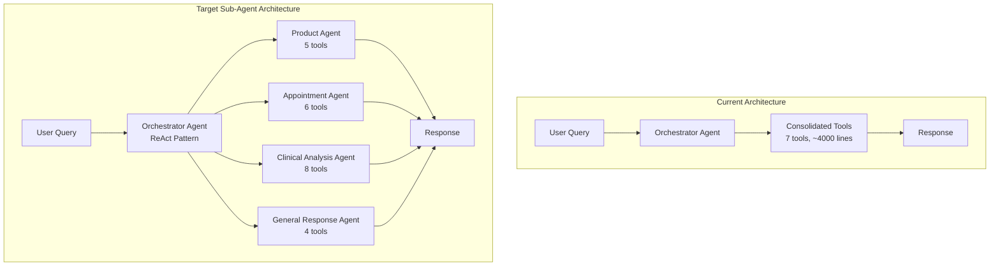

# HUMANSA V2 Sub-Agent Architecture Implementation Plan

## Overview

This document outlines the implementation plan for converting HUMANSA V2 from a consolidated tools approach to a multi-agent architecture where specialized sub-agents are used as tools by the main orchestrator agent.

## Current Architecture vs Target Architecture

### Current Architecture (Consolidated Tools)
- Single orchestrator agent with 7 consolidated tools
- Each tool handles multiple functionalities
- Direct tool invocation based on keyword matching
- ~4000 lines in consolidated_tools.py

### Target Architecture (Sub-Agent Pattern)
- Main orchestrator agent (ReAct pattern)
- 4 specialized sub-agents, each with <10 focused tools
- Sub-agents exposed as tools to the orchestrator
- Better separation of concerns and modularity

## Architecture Diagram



## Sub-Agent Specifications

### 1. Product Recommendation Agent
**Purpose**: Handle all product-related queries, recommendations, and health shopping guidance

**Tools** (5 tools):
1. `search_products` - Search product catalog
2. `get_product_details` - Get detailed product information
3. `check_inventory` - Check product availability
4. `calculate_discount` - Apply promotions and calculate prices
5. `generate_recommendation` - Create personalized product recommendations

**Capabilities**:
- Product search and filtering
- Price comparisons
- Bundle recommendations
- Inventory checking
- Promotion application

### 2. Appointment Booking Agent  
**Purpose**: Manage all appointment-related operations

**Tools** (6 tools):
1. `search_doctors` - Find doctors by specialty/location
2. `check_availability` - Check doctor schedules
3. `reserve_slot` - Reserve appointment slot
4. `confirm_booking` - Confirm appointment
5. `cancel_appointment` - Cancel existing appointment
6. `reschedule_appointment` - Change appointment time

**Capabilities**:
- Doctor search
- Schedule checking
- Appointment booking workflow
- Modification/cancellation
- Reminder setup

### 3. Clinical Analysis Agent
**Purpose**: Provide medical insights, symptom analysis, and emergency triage

**Tools** (8 tools):
1. `analyze_symptoms` - Symptom assessment
2. `check_emergency_signs` - Emergency detection
3. `suggest_departments` - Department recommendations
4. `medication_lookup` - Drug information
5. `drug_interactions` - Check drug interactions
6. `health_risk_assessment` - Evaluate health risks
7. `preventive_care_suggestions` - Preventive care advice
8. `follow_up_recommendations` - Post-visit guidance

**Capabilities**:
- Symptom analysis
- Emergency detection (120 recommendations)
- Department routing
- Medication guidance
- Risk assessment

### 4. General Response Agent
**Purpose**: Handle general queries, FAQs, and conversation flow

**Tools** (4 tools):
1. `search_knowledge_base` - Search medical knowledge
2. `get_insurance_info` - Insurance coverage details
3. `clinic_locations` - Find clinic locations
4. `general_health_tips` - Provide health advice

**Capabilities**:
- FAQ handling
- Insurance queries
- Location services
- General health education
- Conversation management

## Implementation Steps

### Phase 1: Create Sub-Agent Infrastructure
1. Create base agent class with common functionality
2. Implement agent registration and discovery system
3. Set up inter-agent communication protocol

### Phase 2: Implement Individual Sub-Agents
1. **Product Agent** (Week 1)
   - Extract product-related tools from consolidated_tools.py
   - Create ProductAgent class
   - Implement 5 focused tools
   - Add product-specific prompts

2. **Appointment Agent** (Week 1)
   - Extract appointment tools
   - Create AppointmentAgent class
   - Implement booking workflow
   - Add calendar integration

3. **Clinical Analysis Agent** (Week 2)
   - Extract medical analysis tools
   - Create ClinicalAnalysisAgent class
   - Implement symptom analyzer
   - Add emergency detection

4. **General Response Agent** (Week 2)
   - Extract general tools
   - Create GeneralResponseAgent class
   - Implement knowledge search
   - Add conversation handling

### Phase 3: Update Orchestrator
1. Modify orchestrator to use sub-agents as tools
2. Implement agent selection logic
3. Add context passing between agents
4. Update response aggregation

### Phase 4: Testing and Optimization
1. Run existing 70 test cases
2. Add sub-agent specific tests
3. Performance optimization
4. Memory usage analysis

## Technical Implementation Details

### Sub-Agent as Tool Pattern
```python
# Each sub-agent will be wrapped as a tool
class ProductAgentTool(BaseTool):
    def __init__(self, product_agent: ProductAgent):
        self.agent = product_agent
        
    @property
    def name(self) -> str:
        return "product_recommendation_agent"
        
    @property
    def description(self) -> str:
        return "专门处理产品推荐、健康商品查询、价格优惠等相关问题"
        
    async def _arun(self, query: str) -> str:
        return await self.agent.process_query(query)
```

### Orchestrator Integration
```python
class HumansaOrchestratorAgent:
    def __init__(self, llm, agents: List[BaseAgent]):
        # Convert agents to tools
        self.agent_tools = [
            create_agent_tool(agent) for agent in agents
        ]
        
        # Create main ReAct agent with sub-agents as tools
        self.main_agent = ReActAgent.from_tools(
            tools=self.agent_tools,
            llm=llm,
            verbose=True
        )
```

## Benefits of Sub-Agent Architecture

1. **Modularity**: Each agent is self-contained with its own tools
2. **Scalability**: Easy to add new specialized agents
3. **Maintainability**: Smaller, focused codebases
4. **Testability**: Each agent can be tested independently
5. **Performance**: Only load necessary agents
6. **Specialization**: Each agent can have domain-specific prompts and logic

## Migration Strategy

1. **Parallel Development**: Build sub-agents alongside existing system
2. **Feature Flag**: Use flag to switch between architectures
3. **Gradual Rollout**: Test with subset of queries first
4. **Rollback Plan**: Keep consolidated tools as fallback

## Success Metrics

1. **Functional**: All 70 test cases pass
2. **Performance**: Response time ≤ current system
3. **Accuracy**: Tool selection accuracy ≥ 90%
4. **Memory**: Memory usage reduced by 20%
5. **Code**: Each agent file < 500 lines

## Timeline

- Week 1: Infrastructure + Product/Appointment Agents
- Week 2: Clinical/General Agents + Orchestrator Update
- Week 3: Testing and Optimization
- Week 4: Documentation and Deployment

## Notes

- Existing agent classes found in `/src/humansa/v2/agents/` can be reused
- LlamaIndex Pattern 2 (agents as tools) is the recommended approach
- Response Agent post-processing remains unchanged
- Mem0 integration works at orchestrator level