````markdown
# YouWoAI Multi-Agent Modular Flow Diagram

```mermaid
graph TD
%% ===========================================
%% 🤖 YOUWOAI MULTI-AGENT V1 ARCHITECTURE
%% ===========================================
%% This diagram shows the new multi-agent workflow where specialized agents
%% handle different aspects of response generation autonomously.
%%
%% KEY ARCHITECTURAL CHANGES:
%% 1. AGENT AUTONOMY: Each agent is self-contained and can execute independently
%% 2. WORKFLOW ORCHESTRATION: Multi-agent orchestrator manages agent lifecycle
%% 3. PARALLEL EXECUTION: Context agents run in parallel for efficiency
%% 4. MODULAR DESIGN: Easy to add/remove agents without affecting others
%% 5. EXISTING INFRASTRUCTURE: Leverages all existing modular components
%% ===========================================

%% ===========================================
%% CLIENT REQUEST & ENDPOINT ENTRY
%% ===========================================
START["Client Request to /v1/multi-agent/response"] --> VALIDATE{Validate Request}
VALIDATE -->|Invalid| ERROR_RESP[Return Error Response]
VALIDATE -->|Valid| PARSE_REQUEST[Parse MultiAgentRequest]

PARSE_REQUEST --> ORCHESTRATOR_INIT[Initialize MultiAgentOrchestrator]
ORCHESTRATOR_INIT --> WORKFLOW_START[Start Multi-Agent Workflow]

%% ===========================================
%% PHASE 1: ROUTER AGENT (ALWAYS FIRST)
%% ===========================================
WORKFLOW_START --> ROUTER_AGENT["🧭 ROUTER AGENT<br/>📍 RouterAgent(BaseAgent)<br/>• ALWAYS executes first<br/>• Determines workflow path<br/>• Enables appropriate agents<br/>• Uses existing IntelligentRouter"]

ROUTER_AGENT --> ROUTER_EXECUTE[Execute Router Agent]
ROUTER_EXECUTE --> ROUTER_TRANSFORM[Query Transformation]
ROUTER_TRANSFORM --> ROUTER_DECISION[Router Decision Making]
ROUTER_DECISION --> ROUTER_ENABLE[Enable Appropriate Agents]

ROUTER_ENABLE --> AGENT_ENABLEMENT["Agent Enablement Logic<br/>• knowledge_base_* → RAGAgent<br/>• web_search → WebSearchAgent<br/>• attachments → AttachmentAgent<br/>• ALWAYS → ResponseAgent<br/>• enable_citations → CitationAgent"]

%% ===========================================
%% PHASE 2: PARALLEL CONTEXT AGENTS
%% ===========================================
AGENT_ENABLEMENT --> PARALLEL_AGENTS{Which Agents Enabled?}

PARALLEL_AGENTS --> RAG_AGENT_BRANCH[RAG Agent Branch]
PARALLEL_AGENTS --> WEB_AGENT_BRANCH[Web Search Agent Branch]
PARALLEL_AGENTS --> ATTACH_AGENT_BRANCH[Attachment Agent Branch]

%% RAG Agent Branch
RAG_AGENT_BRANCH --> RAG_AGENT["🧠 RAG AGENT<br/>📍 RAGAgent(BaseAgent)<br/>• Retrieves knowledge base context<br/>• Uses existing RAGProcessor<br/>• Supports split RAG (notes/conversations/mixed)"]

RAG_AGENT --> RAG_EXECUTE[Execute RAG Agent]
RAG_EXECUTE --> RAG_PROCESS[RAG Processing Flow]
RAG_PROCESS --> RAG_CONTEXT[RAG Context Result]

%% Web Search Agent Branch
WEB_AGENT_BRANCH --> WEB_AGENT["🌐 WEB SEARCH AGENT<br/>📍 WebSearchAgent(BaseAgent)<br/>• Performs web searches<br/>• Uses existing WebSearchProcessor<br/>• Handles caching"]

WEB_AGENT --> WEB_EXECUTE[Execute Web Search Agent]
WEB_EXECUTE --> WEB_PROCESS[Web Search Processing Flow]
WEB_PROCESS --> WEB_CONTEXT[Web Search Context Result]

%% Attachment Agent Branch
ATTACH_AGENT_BRANCH --> ATTACH_AGENT["📎 ATTACHMENT AGENT<br/>📍 AttachmentAgent(BaseAgent)<br/>• Processes file attachments<br/>• Uses existing FileAttachmentManager<br/>• Handles images, PDFs, etc."]

ATTACH_AGENT --> ATTACH_EXECUTE[Execute Attachment Agent]
ATTACH_EXECUTE --> ATTACH_PROCESS[Attachment Processing Flow]
ATTACH_PROCESS --> ATTACH_CONTEXT[Attachment Context Result]

%% ===========================================
%% PHASE 3: RESPONSE GENERATION AGENT
%% ===========================================
RAG_CONTEXT --> CONTEXT_READY[All Context Agents Complete]
WEB_CONTEXT --> CONTEXT_READY
ATTACH_CONTEXT --> CONTEXT_READY

CONTEXT_READY --> RESPONSE_AGENT["🎯 RESPONSE AGENT<br/>📍 ResponseAgent(BaseAgent)<br/>• Generates final response<br/>• Combines all contexts<br/>• Uses existing LLMProviderSelector<br/>• Handles system prompts"]

RESPONSE_AGENT --> RESPONSE_EXECUTE[Execute Response Agent]
RESPONSE_EXECUTE --> RESPONSE_CONTEXT[Build Combined Context]
RESPONSE_CONTEXT --> RESPONSE_MESSAGES[Prepare Messages]
RESPONSE_MESSAGES --> RESPONSE_LLM[Generate LLM Response]
RESPONSE_LLM --> RESPONSE_RESULT[Response Result]

%% ===========================================
%% PHASE 4: CITATION AGENT (OPTIONAL)
%% ===========================================
RESPONSE_RESULT --> CITATION_CHECK{Citations Enabled?}
CITATION_CHECK -->|Yes| CITATION_AGENT["📚 CITATION AGENT<br/>📍 CitationAgent(BaseAgent)<br/>• Adds citations to response<br/>• Uses existing CitationEngine<br/>• Processes all context sources"]

CITATION_AGENT --> CITATION_EXECUTE[Execute Citation Agent]
CITATION_EXECUTE --> CITATION_PROCESS[Citation Processing Flow]
CITATION_PROCESS --> CITATION_RESULT[Cited Response Result]

CITATION_CHECK -->|No| FINAL_RESPONSE[Final Response Assembly]
CITATION_RESULT --> FINAL_RESPONSE

%% ===========================================
%% FINAL RESPONSE ASSEMBLY
%% ===========================================
FINAL_RESPONSE --> RESPONSE_FORMAT[Format Multi-Agent Response]
RESPONSE_FORMAT --> RESPONSE_METADATA[Add Metadata & Usage Stats]
RESPONSE_METADATA --> END[Return to Client]

%% ===========================================
%% EXTERNAL EXISTING INFRASTRUCTURE
%% ===========================================
EXISTING_INFRA["🏗️ EXISTING INFRASTRUCTURE<br/>• IntelligentRouter<br/>• RAGProcessor<br/>• WebSearchProcessor<br/>• FileAttachmentManager<br/>• LLMProviderSelector<br/>• CitationEngine<br/>• QueryTransformer<br/>• SystemPromptManager"]

%% ===========================================
%% AGENT EXECUTION PATTERNS
%% ===========================================
AGENT_PATTERN["🔄 AGENT EXECUTION PATTERN<br/>• BaseAgent.execute() wrapper<br/>• Error handling & timing<br/>• Standardized result format<br/>• Async/await support<br/>• Context passing"]

%% ===========================================
%% STREAMING SUPPORT (FUTURE)
%% ===========================================
STREAMING_FUTURE["🌊 STREAMING SUPPORT (FUTURE)<br/>• Agent-level streaming<br/>• Progressive context updates<br/>• Real-time agent status<br/>• Incremental response building"]
```
````

## RAG Agent Detailed Flow

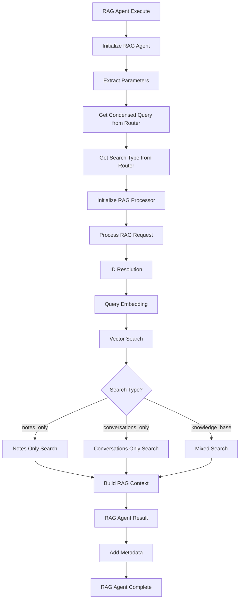

## Web Search Agent Detailed Flow

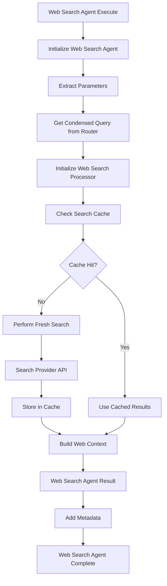

## Attachment Agent Detailed Flow

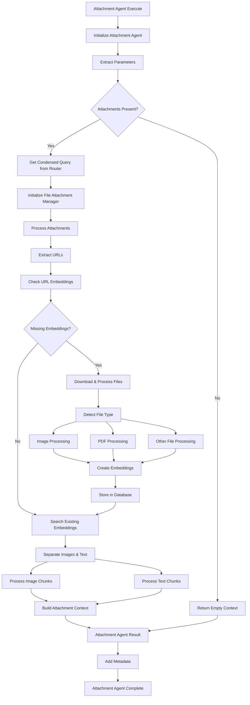

## Response Agent Detailed Flow

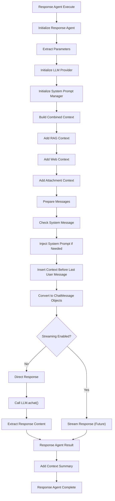

## Citation Agent Detailed Flow

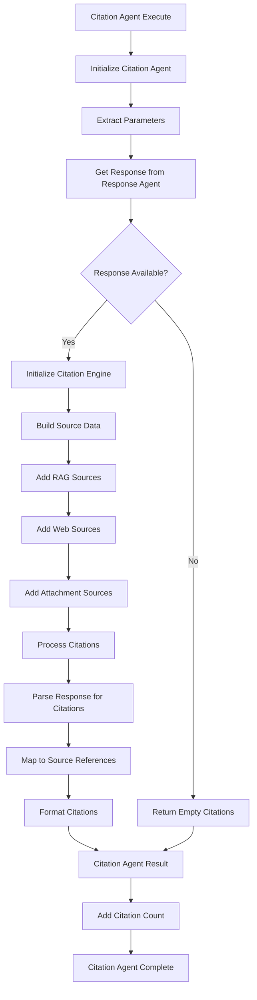

## Multi-Agent Orchestrator Flow

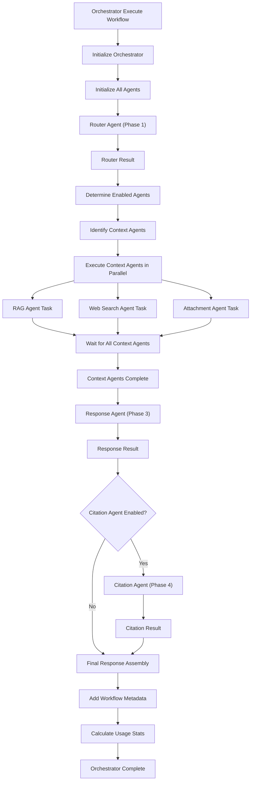

## Agent Base Class Pattern

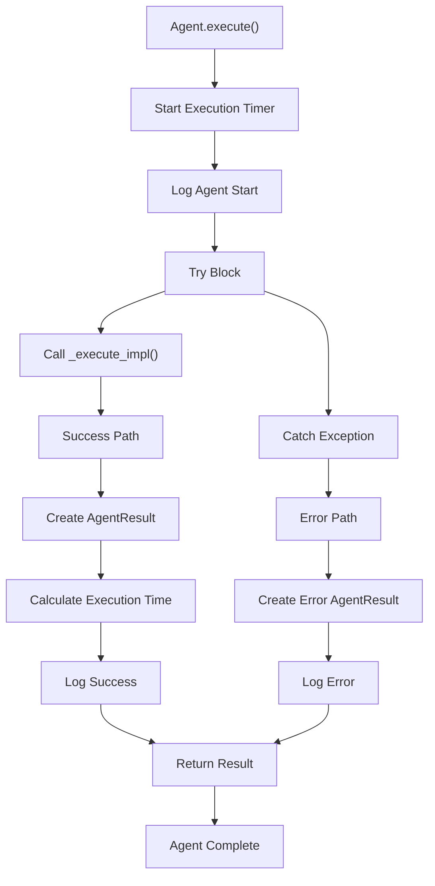

## Request/Response Data Flow

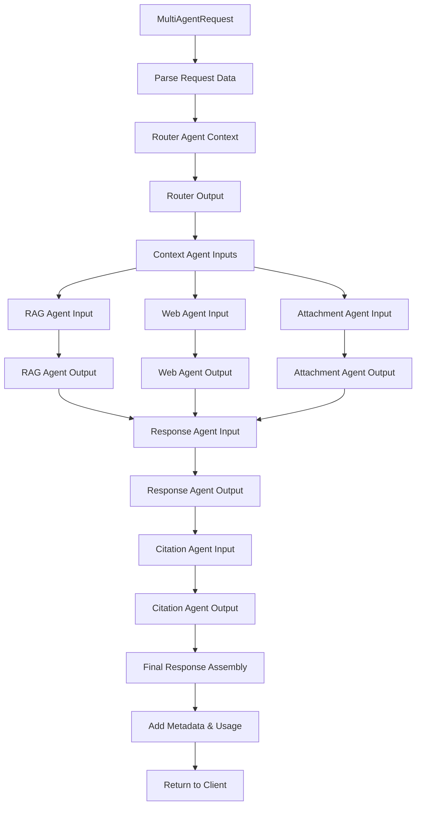

## Agent Communication & Context Passing

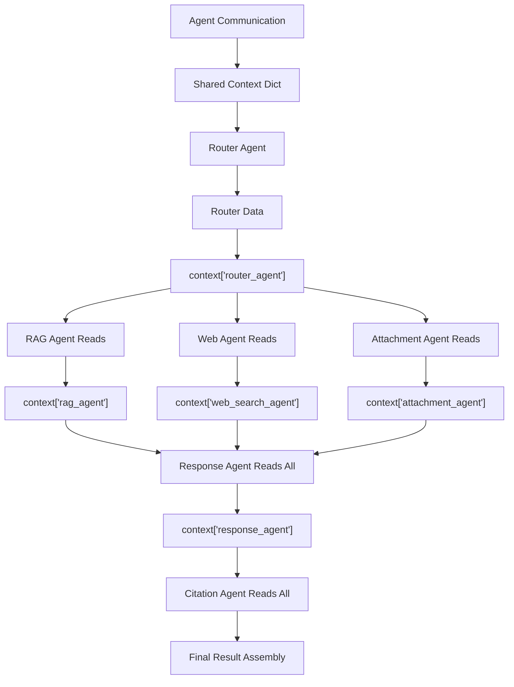

## Error Handling & Recovery

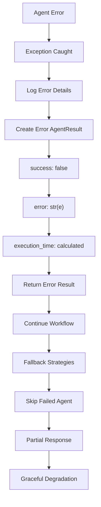

## Performance & Monitoring

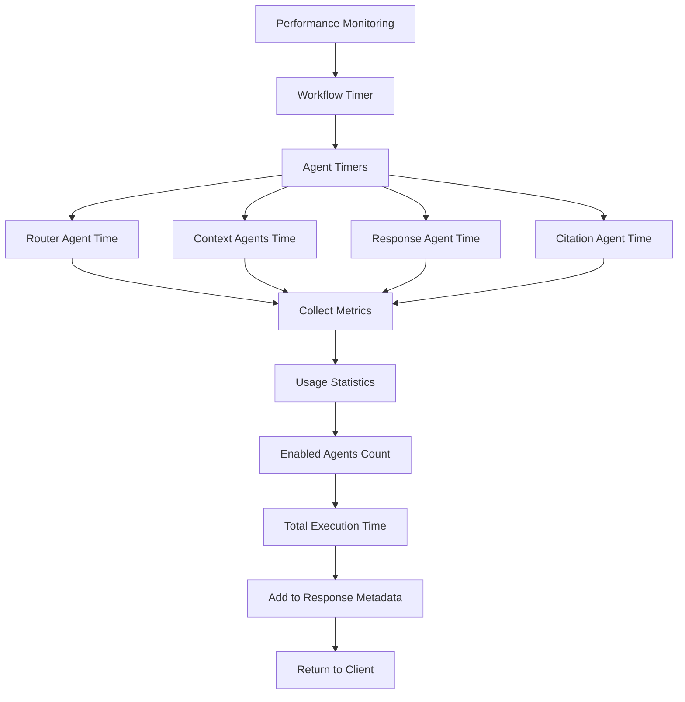

## Integration Points with Existing System

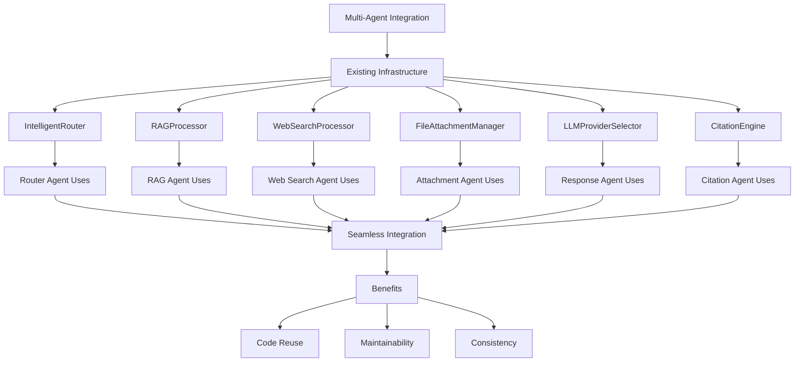

## Future Enhancements

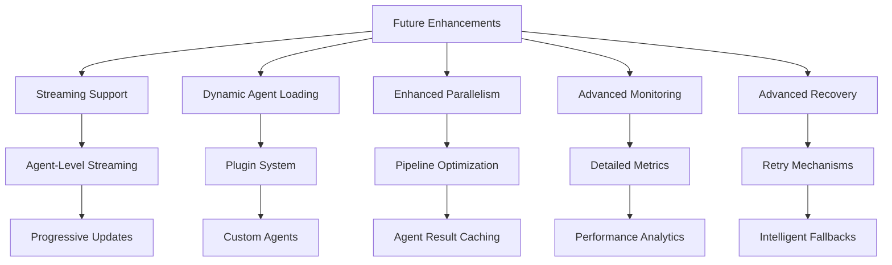

## Summary

This multi-agent architecture provides:

1. **Modular Design**: Each agent is self-contained and autonomous
2. **Parallel Execution**: Context agents run simultaneously for efficiency
3. **Flexible Workflow**: Easy to add/remove agents without breaking existing functionality
4. **Existing Infrastructure**: Leverages all current modular components
5. **Error Resilience**: Individual agent failures don't break the entire workflow
6. **Performance Monitoring**: Detailed timing and usage statistics
7. **Extensible**: Easy to add new agent types in the future

The system maintains backward compatibility while providing a more scalable and maintainable architecture for complex AI workflows.

```

```
