# Humansa V2 Implementation Architecture

## Overview

Humansa V2 is a multi-agent medical AI system with integrated memory capabilities using Mem0. This document provides a complete view from abstract architecture to concrete implementation details.

## Table of Contents
1. [High-Level Architecture](#high-level-architecture)
2. [Abstract System Design](#abstract-system-design)
3. [User ID Tracking](#user-id-tracking)
4. [Orchestrator Pattern](#orchestrator-pattern)
5. [Component Flow](#component-flow)
6. [Agent System](#agent-system)
7. [Memory Integration](#memory-integration)
8. [API Endpoints](#api-endpoints)
9. [Implementation Details](#implementation-details)

## High-Level Architecture

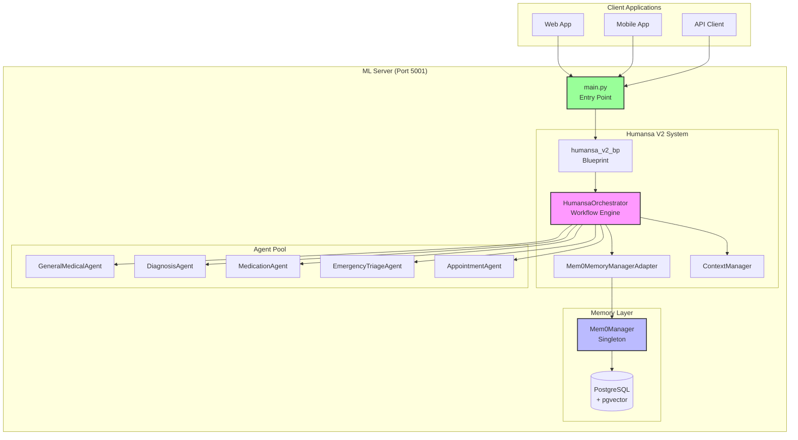

## Abstract System Design

### Conceptual Overview

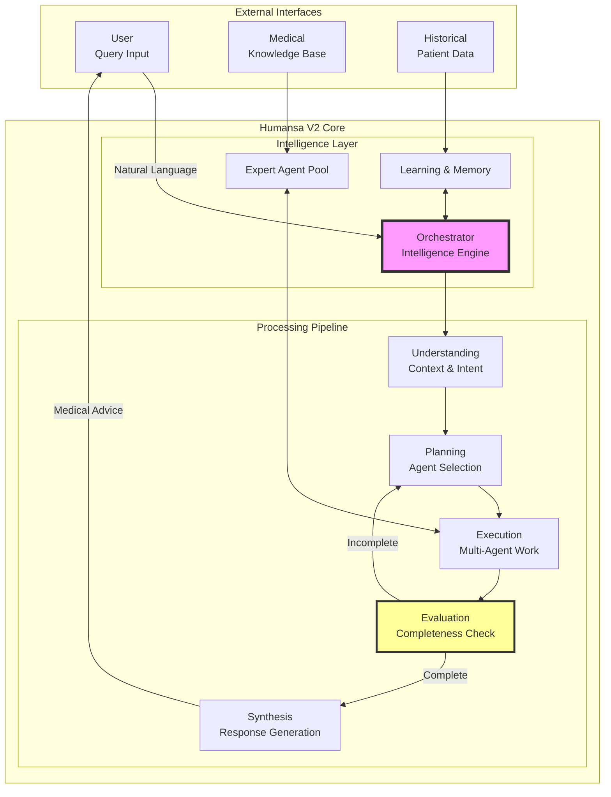

### Information Flow Architecture

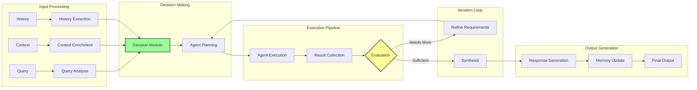

## User ID Tracking

### User ID Flow Through the System

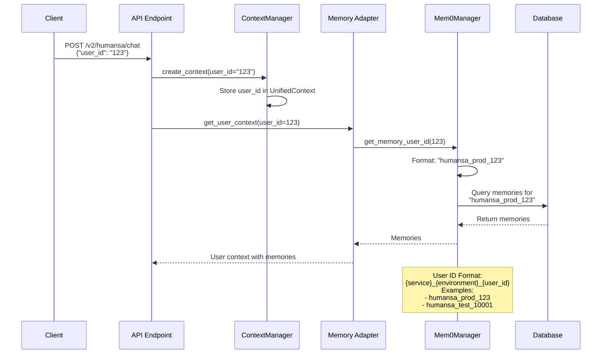

### User ID Components

1. **Client User ID**: Integer or string from client application
2. **Memory User ID**: Formatted string for Mem0 storage
3. **Format**: `{service}_{environment}_{user_id}`
   - `service`: Always "humansa" for medical system
   - `environment`: "prod", "test", or custom
   - `user_id`: Original user identifier

## Orchestrator Pattern

### Current Implementation (Simplified)

**Note**: The current implementation uses a basic single-pass workflow, not a true iterative orchestrator pattern.

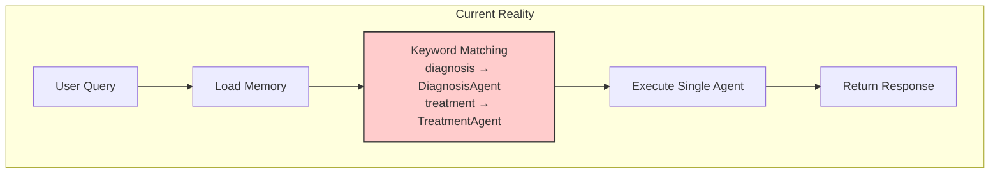

### Ideal Orchestrator Pattern

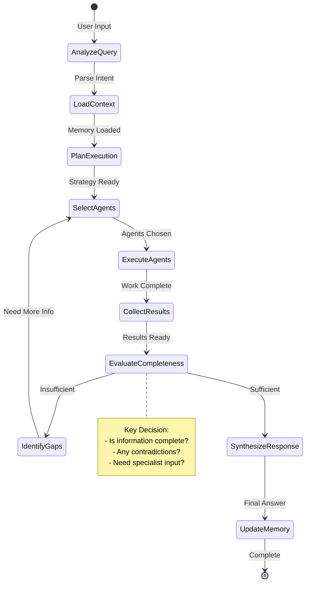

For detailed orchestrator analysis, see [HUMANSA_V2_ORCHESTRATOR_FLOW.md](./HUMANSA_V2_ORCHESTRATOR_FLOW.md)

## Component Flow

### Request Processing Flow

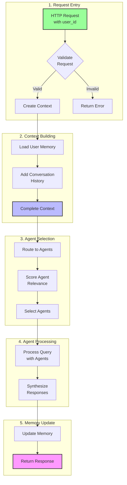

## Agent System

### Agent Architecture

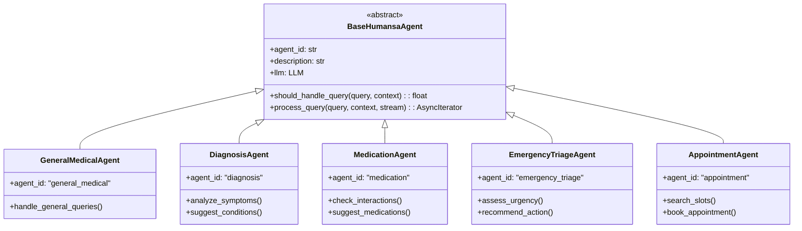

### Agent Selection Logic

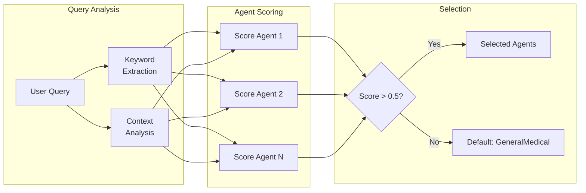

## Memory Integration

### Mem0 Integration Architecture

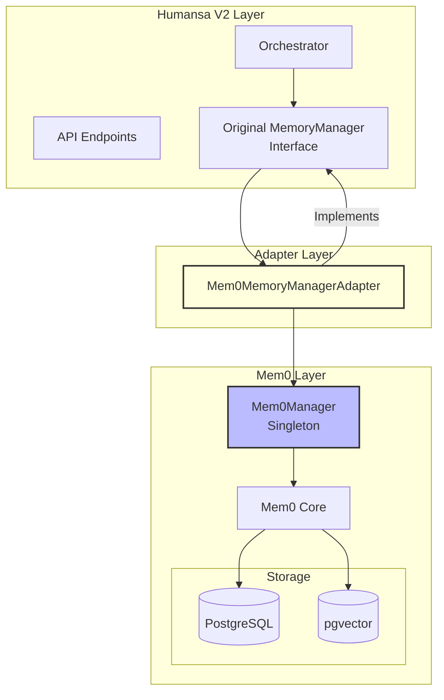

### Memory Operations

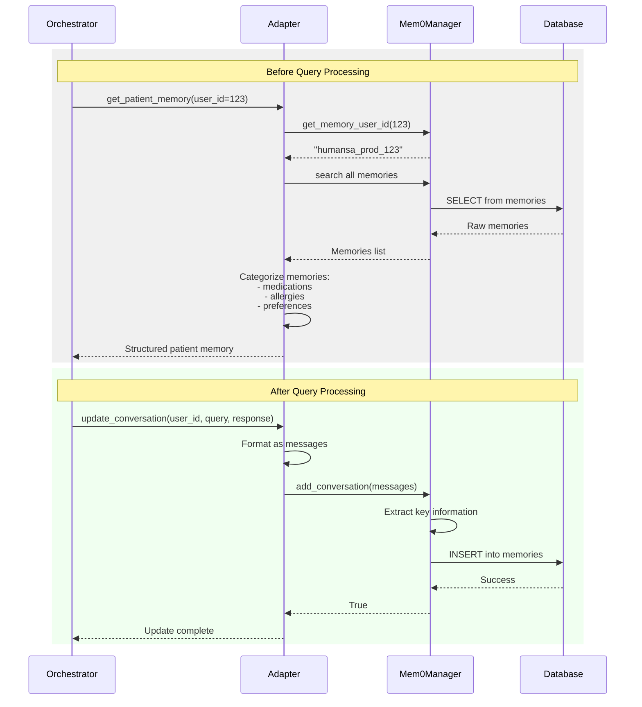

## API Endpoints

### Endpoint Hierarchy

```mermaid
graph TD
    subgraph "Main Routes"
        ROOT[/]
        V2[/v2/humansa]
    end
    
    subgraph "Chat Endpoints"
        CHAT[/chat<br/>Main conversation endpoint]
    end
    
    subgraph "Memory Endpoints"
        MEM[/memory]
        ADD[/add<br/>POST: Add conversation]
        SEARCH[/search<br/>POST: Search memories]
        CTX[/context/{user_id}<br/>GET: Get user context]
        STATUS[/status<br/>GET: Mem0 status]
        CLEAR[/clear/{user_id}<br/>DELETE: Clear memories]
    end
    
    subgraph "Other Endpoints"
        APPT[/appointment]
        APPTS[/search<br/>POST: Search slots]
        APPTB[/book<br/>POST: Book slot]
        
        PROF[/patient/profile<br/>GET/PUT: Profile ops]
        HIST[/conversation/history<br/>GET: Get history]
    end
    
    ROOT --> V2
    V2 --> CHAT
    V2 --> MEM
    MEM --> ADD
    MEM --> SEARCH
    MEM --> CTX
    MEM --> STATUS
    MEM --> CLEAR
    
    V2 --> APPT
    APPT --> APPTS
    APPT --> APPTB
    
    V2 --> PROF
    V2 --> HIST
```

## Implementation Details

### File Structure

```
src/
├── main.py                          # Entry point, registers blueprints
├── humansa/
│   ├── v2/
│   │   ├── __init__.py             # Exports blueprints
│   │   ├── api.py                  # V2 API endpoints
│   │   ├── context_manager.py      # UnifiedContext management
│   │   ├── memory/
│   │   │   ├── memory_manager.py   # Original interface
│   │   │   └── mem0_integration.py # Mem0 adapter
│   │   ├── workflows/
│   │   │   └── orchestrator.py     # Main workflow engine
│   │   └── agents/
│   │       ├── base_agent.py       # BaseHumansaAgent
│   │       ├── general_medical.py  # General queries
│   │       ├── diagnosis.py        # Symptom analysis
│   │       ├── medication.py       # Drug management
│   │       ├── emergency_triage.py # Urgency assessment
│   │       └── appointment.py      # Scheduling
│   └── memory/
│       ├── __init__.py
│       ├── mem0_manager.py         # Mem0 singleton
│       └── api.py                  # Memory API endpoints
```

### Initialization Sequence

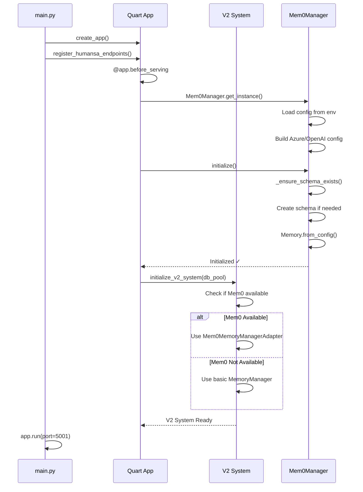

### Key Classes and Methods

1. **Mem0Manager** (`/src/humansa/memory/mem0_manager.py`)
   - `get_memory_user_id(user_id)`: Formats user ID for storage
   - `add_conversation(user_id, messages)`: Stores conversations
   - `search_memories(user_id, query)`: Semantic search
   - `get_user_context(user_id)`: Retrieves all user data

2. **Mem0MemoryManagerAdapter** (`/src/humansa/v2/memory/mem0_integration.py`)
   - Implements original MemoryManager interface
   - Bridges V2 system with Mem0
   - Categorizes memories into medical contexts

3. **HumansaOrchestrator** (`/src/humansa/v2/workflows/orchestrator.py`)
   - Routes queries to appropriate agents
   - Manages agent execution flow
   - Updates memory after processing

4. **UnifiedContext** (`/src/humansa/v2/context_manager.py`)
   - Carries user_id throughout workflow
   - Maintains conversation state
   - Holds agent results

## Testing

See [HUMANSA_V2_TESTING.md](./HUMANSA_V2_TESTING.md) for detailed test documentation.

## OpenAI Responses API Integration

### Overview

HUMANSA V2 now implements the OpenAI Responses API format, providing full transparency into the AI's reasoning process and tool usage. This ensures users can see exactly how the AI arrives at its conclusions.

### Response API Architecture

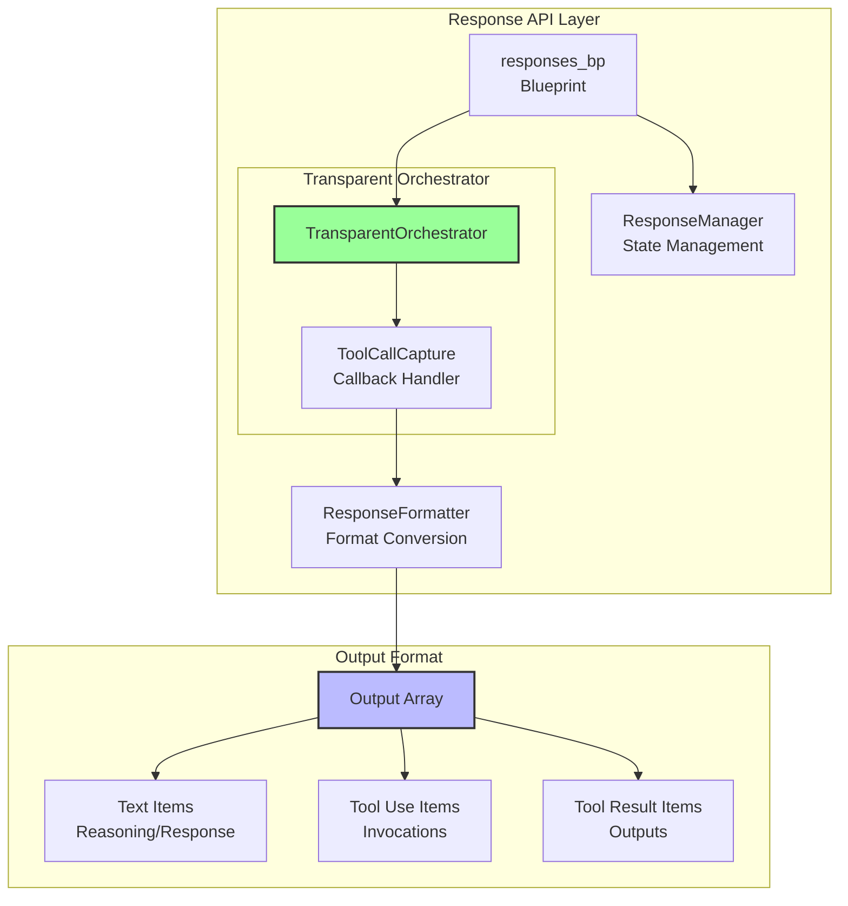

### Response Format

Each response contains a complete reasoning chain in the `output` array:

```json
{
  "id": "resp_abc123",
  "object": "response", 
  "created": 1234567890,
  "model": "gpt-4-turbo",
  "output": [
    {
      "type": "text",
      "text": "Let me search for neurology doctors..."
    },
    {
      "type": "tool_use",
      "tool_use": {
        "id": "tool_0",
        "name": "unified_search",
        "input": {"query": "神经内科医生"}
      }
    },
    {
      "type": "tool_result",
      "tool_result": {
        "tool_use_id": "tool_0",
        "output": "Found Dr. Zhang Wei..."
      }
    },
    {
      "type": "text",
      "text": "Based on my search, Dr. Zhang Wei is..."
    }
  ],
  "usage": {
    "total_tokens": 350,
    "reasoning_tokens": 150,
    "tool_tokens": 100
  }
}
```

### Event-Based Streaming

When streaming is enabled, responses use OpenAI's event format:

- `response.created` - Signals response start
- `response.output_item.delta` - Streams text chunks  
- `response.output_item.done` - Completes each output item
- `response.done` - Final event with complete response

### API Endpoints

```mermaid
graph TD
    subgraph "Response API Endpoints"
        CREATE[/v2/humansa/responses/create<br/>POST: Create response]
        STREAM[/v2/humansa/responses/stream<br/>POST: Stream response]
        GET[/v2/humansa/responses/{id}<br/>GET: Get response]
        TREE[/v2/humansa/responses/conversations/{id}/tree<br/>GET: Get conversation tree]
    end
    
    subgraph "Features"
        FORK[Response Forking<br/>Explore alternatives]
        CHAIN[Response Chaining<br/>Continue conversations]
        TRANS[Full Transparency<br/>Tool visibility]
    end
    
    CREATE --> FORK
    CREATE --> CHAIN
    CREATE --> TRANS
    STREAM --> TRANS
```

For detailed Response API documentation, see [RESPONSES_API_FORMAT.md](./RESPONSES_API_FORMAT.md)