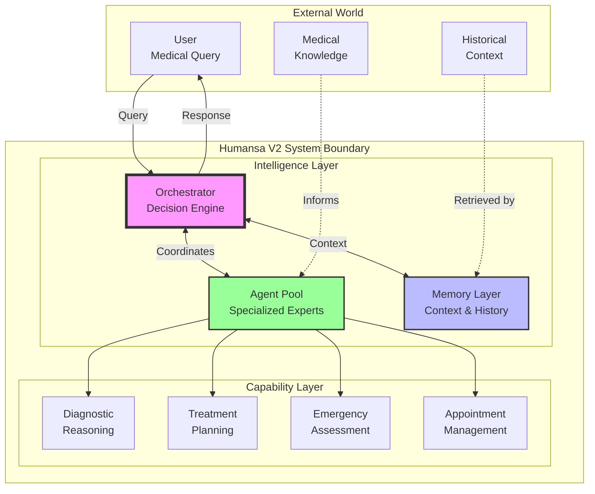
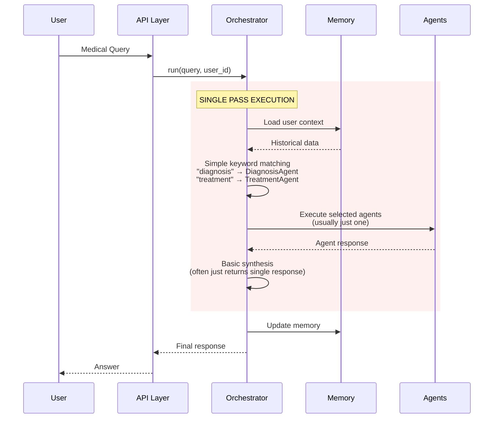
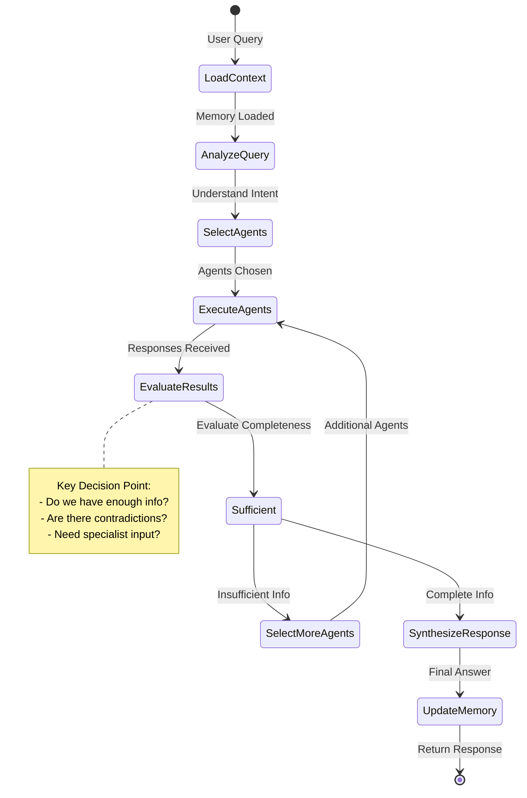
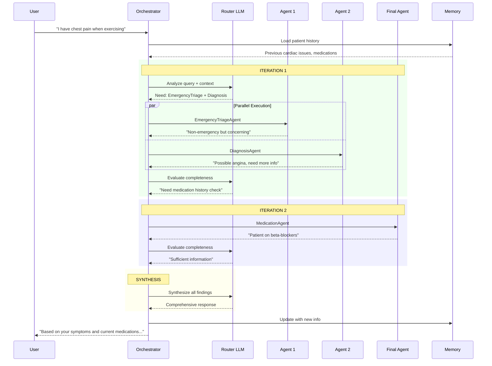
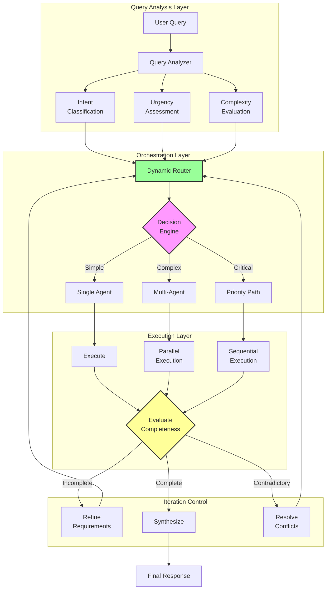
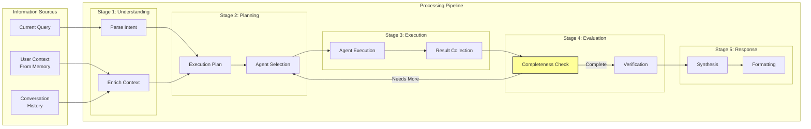
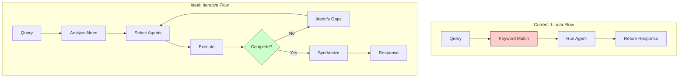

# Humansa V2 Orchestrator Flow Documentation

## Executive Summary

The Humansa V2 system uses a workflow orchestrator pattern, but the current implementation is **simplified** and does not implement a true iterative orchestrator pattern. This document shows:
1. The current actual flow (basic single-pass)
2. What a proper orchestrator pattern should be
3. High-level conceptual architecture

## High-Level Conceptual Architecture

### Abstract System Overview



## Current Implementation Flow (Actual)

### What Actually Happens Now



### Current Code Reality

```python
# What the code actually does:
async def _select_agents(self, query: str, context: Dict[str, Any]) -> List[str]:
    # TODO: Implement proper LLM-based agent selection
    # For now, return a simple selection based on keywords
    selected = []
    query_lower = query.lower()
    
    if any(word in query_lower for word in ["diagnose", "diagnosis", "symptoms"]):
        selected.append("DiagnosisAgent")
    if any(word in query_lower for word in ["treatment", "medication", "therapy"]):
        selected.append("TreatmentAgent")
    
    return selected or ["GeneralMedicalAgent"]
```

**Current Limitations:**
- ❌ No iterative refinement
- ❌ No LLM-based agent selection
- ❌ No evaluation of completeness
- ❌ No re-routing based on agent results
- ❌ Simple keyword-based routing

## Proper Orchestrator Pattern (Ideal)

### How It Should Work



### Ideal Orchestrator Flow



## Conceptual Flow Diagram

### Multi-Level Decision Making



## Information Flow Architecture

### How Information Should Flow Through the System



## Comparison: Current vs Ideal

### Current Implementation Issues

| Aspect | Current Implementation | Ideal Implementation |
|--------|----------------------|---------------------|
| **Agent Selection** | Keyword matching | LLM-based reasoning |
| **Iteration** | Single pass | Multiple iterations until complete |
| **Completeness Check** | None | Evaluates if sufficient info gathered |
| **Conflict Resolution** | None | Handles contradictory information |
| **Learning** | Basic memory storage | Learns from outcomes |
| **Parallelization** | Sequential only | True parallel execution |
| **Context Awareness** | Basic memory load | Dynamic context enrichment |

### Workflow Comparison



## Testing the Current Implementation

### Test Case 1: Simple Query
```bash
curl -X POST http://localhost:5001/v2/humansa/chat \
  -H "Content-Type: application/json" \
  -d '{
    "user_id": 123,
    "messages": [{"role": "user", "content": "What are symptoms of diabetes?"}],
    "stream": false
  }'

# Expected: Single agent (DiagnosisAgent or GeneralMedical)
# Actual: Likely fails due to orchestrator initialization issues
```

### Test Case 2: Complex Query (Should Use Multiple Agents)
```bash
curl -X POST http://localhost:5001/v2/humansa/chat \
  -H "Content-Type: application/json" \
  -d '{
    "user_id": 123,
    "messages": [{"role": "user", "content": "I have diabetes symptoms and need treatment options plus appointment scheduling"}],
    "stream": false
  }'

# Expected in ideal: DiagnosisAgent → MedicationAgent → AppointmentAgent
# Actual: Probably only triggers one agent based on first keyword match
```

### Test Case 3: Iterative Refinement (Not Supported)
```bash
# This SHOULD trigger multiple rounds but won't in current implementation
curl -X POST http://localhost:5001/v2/humansa/chat \
  -H "Content-Type: application/json" \
  -d '{
    "user_id": 123,
    "messages": [{"role": "user", "content": "I have vague symptoms - tired, thirsty, blurry vision sometimes"}],
    "stream": false
  }'

# Ideal: GeneralAgent → "Need more info" → DiagnosisAgent → "Possible diabetes" → Further tests
# Actual: Single agent response without follow-up
```

## Recommendations for True Orchestrator Pattern

### 1. Implement Iterative Loop
```python
async def orchestrate(self, query: str, user_id: str, max_iterations: int = 5):
    context = await self.load_context(user_id)
    results = []
    
    for iteration in range(max_iterations):
        # Analyze what we know and what we need
        analysis = await self.analyze_completeness(query, context, results)
        
        if analysis.is_complete:
            break
            
        # Select agents based on gaps
        agents = await self.select_agents_for_gaps(analysis.gaps)
        
        # Execute and collect results
        new_results = await self.execute_agents(agents, context)
        results.extend(new_results)
        
        # Update context with findings
        context = self.update_context(context, new_results)
    
    # Synthesize all results
    return await self.synthesize_response(results, context)
```

### 2. Add Completeness Evaluation
```python
async def analyze_completeness(self, query, context, results):
    prompt = f"""
    Query: {query}
    Context: {context}
    Results so far: {results}
    
    Evaluate:
    1. Do we have enough information to answer the query?
    2. What critical information is missing?
    3. Are there any contradictions to resolve?
    4. What additional agents could provide missing info?
    """
    
    return await self.llm.analyze(prompt)
```

### 3. Implement Dynamic Agent Selection
```python
async def select_agents_for_gaps(self, gaps):
    # Use LLM to map information gaps to specific agents
    # Consider agent capabilities and dependencies
    # Return ordered list of agents to execute
```

## Conclusion

The current Humansa V2 "orchestrator" is more of a simple router than a true orchestrator. It lacks:
- Iterative refinement
- Completeness evaluation  
- Dynamic agent selection
- Conflict resolution
- True parallel execution

To achieve the intended orchestrator pattern, significant refactoring is needed to implement the iterative loop, evaluation logic, and dynamic routing capabilities shown in the ideal flow diagrams above.