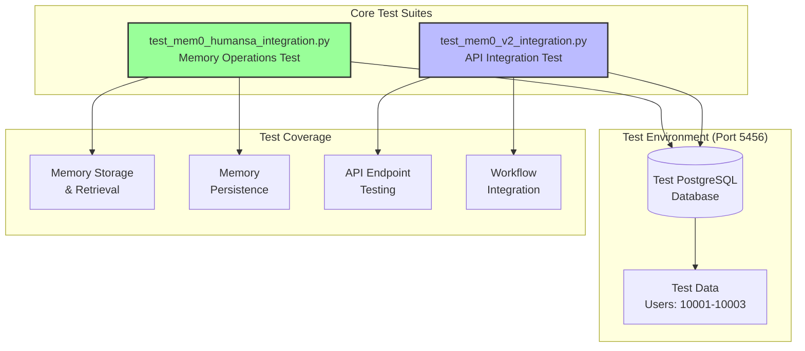
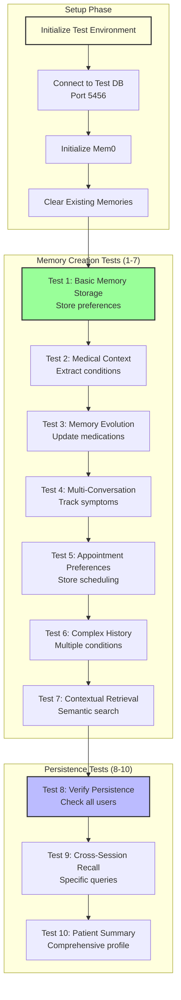
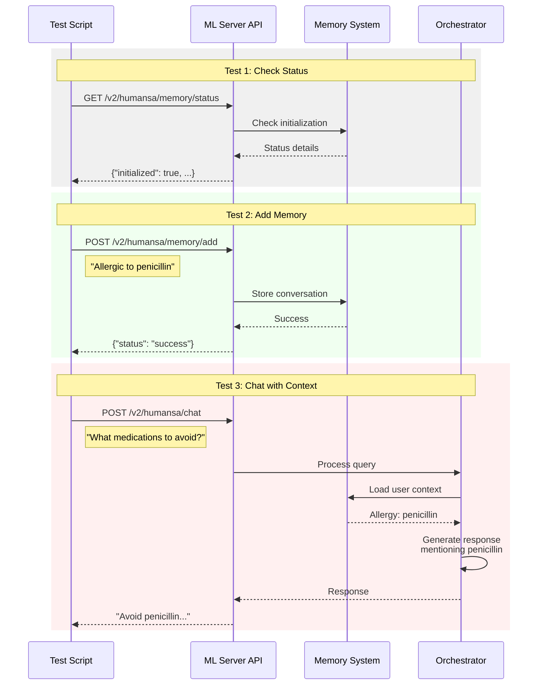
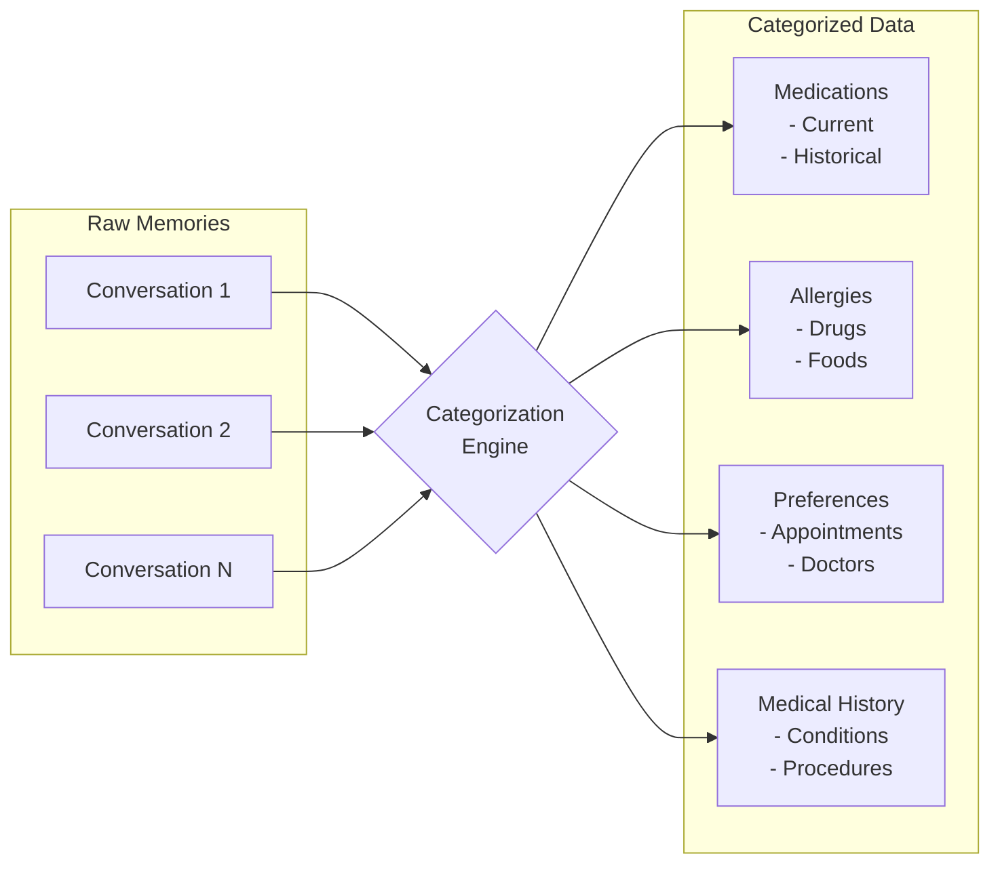

# Humansa V2 Testing Documentation

## Overview

This document describes the two core test suites for Humansa V2 with Mem0 integration. These tests validate memory persistence, multi-agent workflows, and the complete user experience.

## Test Architecture



## Test Suite 1: Mem0 Integration Tests

**File**: `test_mem0_humansa_integration.py`

### Purpose
Comprehensive testing of Mem0 memory operations including storage, retrieval, categorization, and persistence.

### Test Users
- **User 10001**: Clean slate user (no prior history)
- **User 10002**: Diabetes patient with medication history
- **User 10003**: Complex patient with multiple conditions

### Test Flow



### Test Cases Detail

#### Test 1: Basic Memory Storage
```python
# Input
messages = [
    {"role": "user", "content": "I prefer morning appointments around 9 AM"},
    {"role": "assistant", "content": "I've noted your preference..."}
]

# Verification
- Memory is stored successfully
- Preference is retrievable
- User context includes the preference
```

#### Test 2: Medical Context Extraction
```python
# Input
"I have type 2 diabetes and take metformin daily"
"I'm also allergic to penicillin"

# Verification
- Condition: diabetes extracted
- Medication: metformin identified
- Allergy: penicillin recorded
```

#### Test 3: Memory Update and Evolution
```python
# Scenario
1. Initial: "Taking metformin"
2. Update: "Changed to insulin"

# Verification
- Both medications in history
- Current medication is insulin
- Historical context preserved
```

#### Test 4-7: Advanced Scenarios
- Multi-conversation tracking
- Appointment preferences
- Complex medical histories
- Semantic search capabilities

#### Test 8-10: Persistence Validation
- Memories persist across sessions
- Specific recall works correctly
- Comprehensive summaries generated

### Expected Output Structure
```json
{
  "timestamp": "20250725_120000",
  "summary": {
    "total": 10,
    "passed": 10,
    "failed": 0,
    "success_rate": "100.0%"
  },
  "results": [
    {
      "test": "Basic Memory Storage",
      "status": "PASSED",
      "memories_stored": 1
    }
  ]
}
```

## Test Suite 2: V2 API Integration Tests

**File**: `test_mem0_v2_integration.py`

### Purpose
Validate that Mem0 is properly integrated into the V2 API workflow and memory context influences responses.

### Test Flow



### API Tests Detail

#### 1. Memory Status Check
```bash
GET /v2/humansa/memory/status

Expected Response:
{
  "initialized": true,
  "environment": "mem0_test_memories",
  "connectivity": "healthy",
  "features": ["semantic_search", "memory_extraction", ...]
}
```

#### 2. Memory Addition
```bash
POST /v2/humansa/memory/add
{
  "user_id": 10001,
  "messages": [
    {"role": "user", "content": "I'm allergic to penicillin"},
    {"role": "assistant", "content": "Noted your penicillin allergy"}
  ]
}
```

#### 3. Context-Aware Chat
```bash
POST /v2/humansa/chat
{
  "user_id": 10001,
  "messages": [
    {"role": "user", "content": "What medications should I avoid?"}
  ]
}

Expected: Response mentions penicillin allergy
```

#### 4. Memory Search
```bash
POST /v2/humansa/memory/search
{
  "user_id": 10001,
  "query": "allergies medications"
}
```

#### 5. User Context Retrieval
```bash
GET /v2/humansa/memory/context/10001

Expected: Structured context with categorized memories
```

#### 6. Persistence Verification
Second chat to verify memories persist and influence responses.

## Running the Tests

### Option 1: Full Environment + Tests
```bash
# Starts environment and runs all tests automatically
./run_humansa_test_with_mem0.sh
```

### Option 2: Manual Test Execution
```bash
# 1. Start test environment
./run_humansa_test_environment.sh

# 2. Wait for services
sleep 10

# 3. Run memory tests
python test_mem0_humansa_integration.py

# 4. Run API tests
python test_mem0_v2_integration.py
```

### Option 3: Quick API Test
```bash
# Check if memory is working
curl -X POST http://localhost:5001/v2/humansa/memory/add \
  -H "Content-Type: application/json" \
  -d '{
    "user_id": 123,
    "messages": [
      {"role": "user", "content": "I have a peanut allergy"},
      {"role": "assistant", "content": "Noted your peanut allergy"}
    ]
  }'

# Test if context is used
curl -X POST http://localhost:5001/v2/humansa/chat \
  -H "Content-Type: application/json" \
  -d '{
    "user_id": 123,
    "messages": [
      {"role": "user", "content": "Can I eat this granola bar?"}
    ],
    "stream": false
  }'
```

## Test Data Structure

### Memory Categories


## Success Criteria

### Memory Tests (Suite 1)
- ✅ All 10 test cases pass
- ✅ Memories persist across test runs
- ✅ Semantic search returns relevant results
- ✅ Patient summaries are comprehensive

### API Tests (Suite 2)
- ✅ Mem0 status shows initialized
- ✅ Memories can be added via API
- ✅ Chat responses use memory context
- ✅ Search returns relevant memories
- ✅ Context includes categorized data

## Common Issues and Solutions

### Issue: Mem0 Not Initialized
```
Error: "Mem0 is not initialized"
```
**Solution**: 
- Check environment variables (OPENAI_API_KEY or AZURE_OPENAI_*)
- Verify database connection
- Restart ML server

### Issue: Memories Not Persisting
```
Symptom: Test 8 fails, no memories found
```
**Solution**:
- Check schema exists: `mem0_test`
- Verify pgvector extension enabled
- Check database permissions

### Issue: Context Not Used in Chat
```
Symptom: Chat doesn't mention stored information
```
**Solution**:
- Verify Mem0MemoryManagerAdapter is being used
- Check orchestrator loads context before processing
- Ensure user_id format is correct

## Test Outputs

### Console Output Example
```
=================================================
Humansa Test Environment with Mem0 Testing
=================================================

Step 1: Starting Humansa test environment...
✓ Test database running on port 5456

Step 2: Checking ML server health...
✓ ML Server is healthy

Step 3: Verifying database connectivity...
✓ Database is accessible

Step 4: Checking Mem0 schema...
✓ Mem0 test schema exists

Step 5: Setting up Python environment...
✓ Virtual environment activated

Step 6: Running Mem0 integration tests...
Test 1: Basic Memory Storage
✓ Test passed: Stored 1 memories

[... more tests ...]

TEST SUMMARY REPORT
==================
Total Tests: 10
Passed: 10
Failed: 0
Success Rate: 100.0%
```

### JSON Report Structure
```json
{
  "timestamp": "20250725_150000",
  "environment": {
    "db_port": 5456,
    "ml_server_port": 5001,
    "test_users": [10001, 10002, 10003]
  },
  "test_results": {
    "memory_tests": {
      "total": 10,
      "passed": 10,
      "failed": 0
    },
    "api_tests": {
      "total": 6,
      "passed": 6,
      "failed": 0
    }
  }
}
```

## Best Practices

1. **Always Clear Test Data**: Run clear_test_memories() before tests
2. **Use Test Users**: Stick to 10001-10003 for consistency
3. **Check Logs**: ML server logs show Mem0 initialization status
4. **Verify Environment**: Ensure test DB is on port 5456
5. **Mock for CI/CD**: Use MockMemory class when Azure keys unavailable