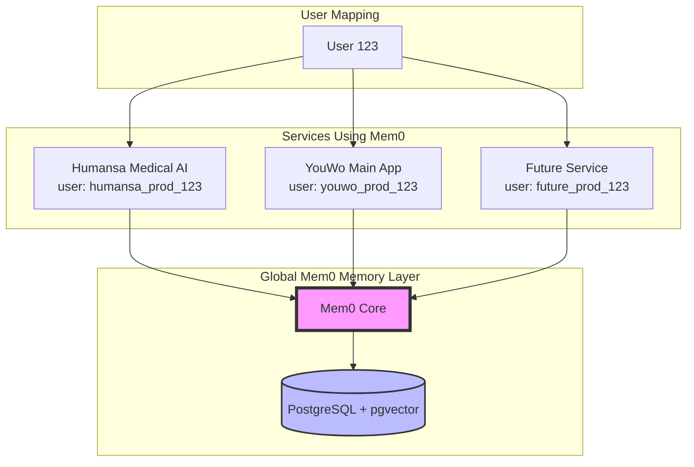
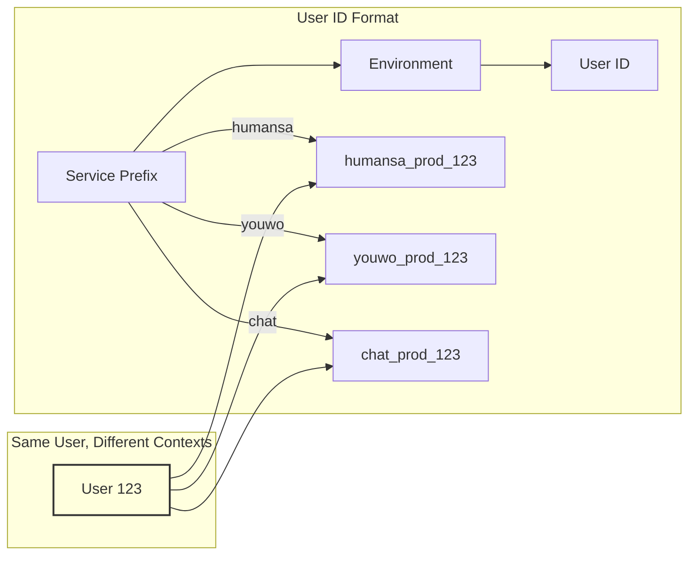
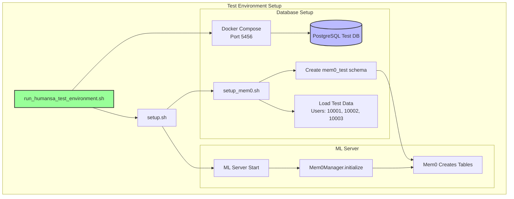
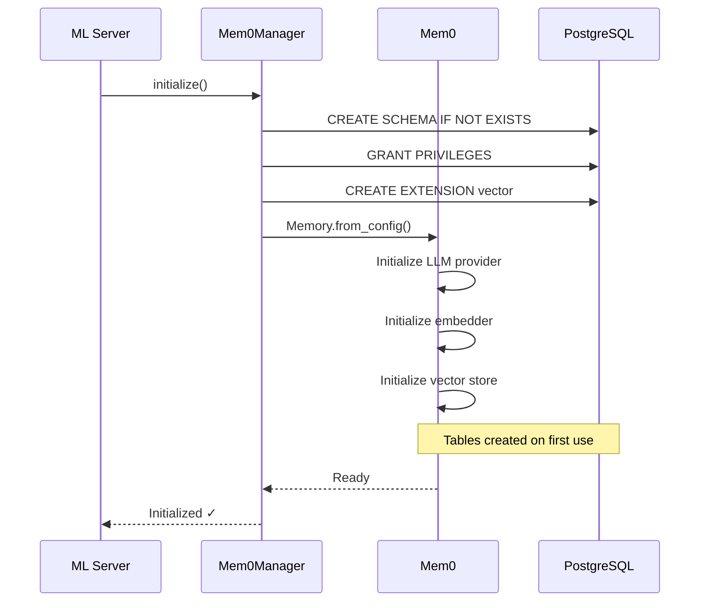
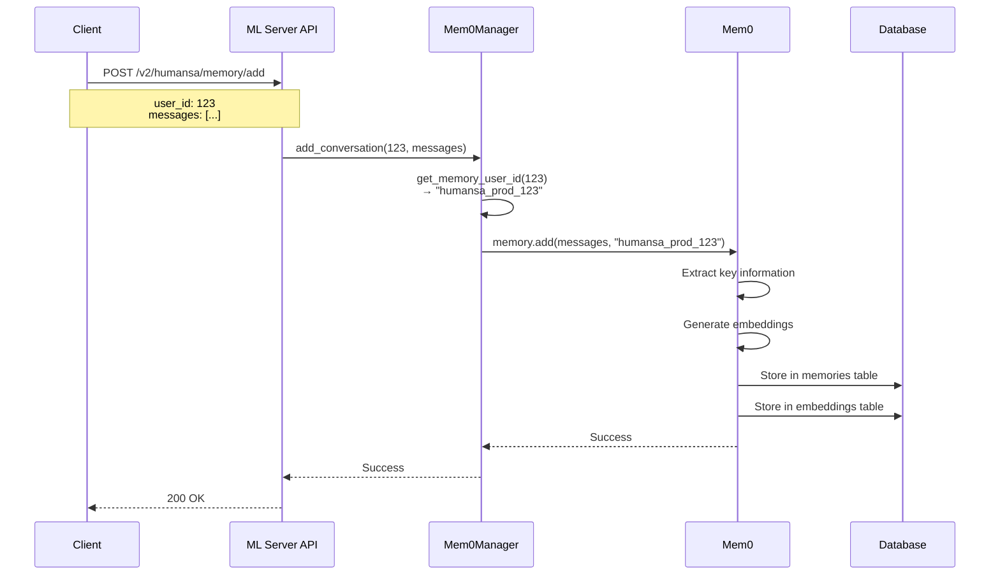
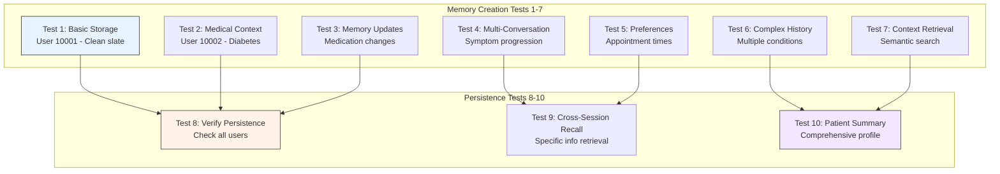
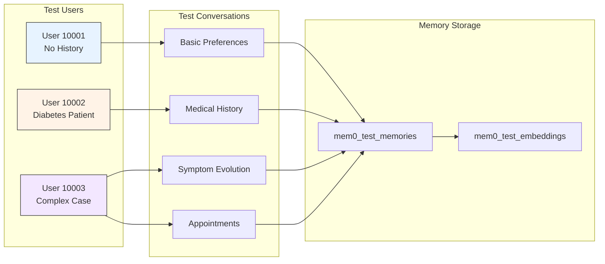
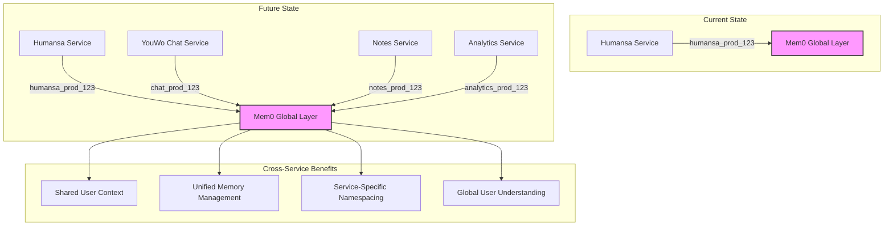
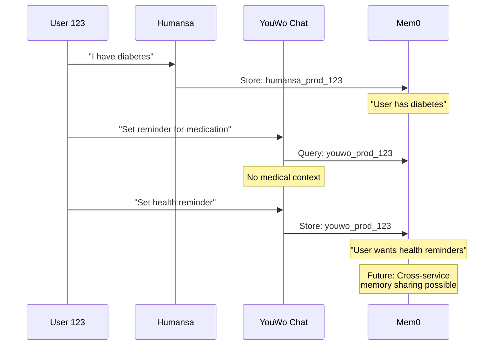

# Mem0 Architecture Overview - Global Memory Layer

## Executive Summary

Mem0 is a **global, shareable memory service** that can be used across multiple applications and services. It tracks memories by user ID, making it perfect for multi-service architectures where different services need to access the same user memories.

## High-Level Architecture



## User ID Strategy



## Test Environment Architecture



## Mem0 Initialization Flow



## Memory Operations Flow



## Test Environment Detailed Flow

```mermaid
graph TB
    subgraph "1. Environment Setup"
        A[./run_humansa_test_environment.sh] --> B{Docker Running?}
        B -->|No| C[Start Docker]
        B -->|Yes| D[docker-compose up -d]
        D --> E[PostgreSQL on 5456]
    end
    
    subgraph "2. Database Preparation"
        E --> F[Wait for DB Ready]
        F --> G[Run setup_humansa_test_db.sql]
        G --> H[Run setup_mem0_test.sql]
        H --> I[Create Test Users<br/>10001, 10002, 10003]
    end
    
    subgraph "3. Mem0 Setup"
        I --> J[setup_mem0.sh]
        J --> K[CREATE SCHEMA mem0_test]
        J --> L[pip install mem0ai]
        K --> M[Schema Ready]
        L --> N[Package Installed]
    end
    
    subgraph "4. ML Server Start"
        M --> O[Start ML Server]
        N --> O
        O --> P[Mem0Manager.initialize()]
        P --> Q{First Run?}
        Q -->|Yes| R[Mem0 Creates Tables]
        Q -->|No| S[Use Existing Tables]
    end
    
    subgraph "5. Run Tests"
        R --> T[Run 10 Test Cases]
        S --> T
        T --> U[Test Results]
    end
    
    style A fill:#9f9,stroke:#333,stroke-width:2px
    style E fill:#bbf,stroke:#333,stroke-width:2px
    style U fill:#f9f,stroke:#333,stroke-width:2px
```

## Test Cases Overview



## Test Data Flow



## Production vs Test Environment

```mermaid
graph TB
    subgraph "Production Environment"
        P1[ML Server Starts]
        P2[Check Environment: prod]
        P3[Schema: mem0_humansa_prod]
        P4[Auto-create on first use]
        P5[Real Azure OpenAI]
        
        P1 --> P2 --> P3 --> P4 --> P5
    end
    
    subgraph "Test Environment"
        T1[run_humansa_test_environment.sh]
        T2[Check Environment: test]
        T3[Schema: mem0_test]
        T4[Pre-created with test data]
        T5[Mock or Test API Keys]
        
        T1 --> T2 --> T3 --> T4 --> T5
    end
    
    style P1 fill:#9f9,stroke:#333
    style T1 fill:#99f,stroke:#333
```



## Global Usage Pattern



## Key Concepts

### 1. **Global Memory Service**
- One Mem0 instance serves all services
- Each service uses prefixed user IDs
- Memories are isolated by prefix but shareable if needed

### 2. **User ID Namespacing**
```
Format: {service}_{environment}_{user_id}

Examples:
- humansa_prod_123     (Humansa production)
- humansa_test_10001   (Humansa test)
- youwo_prod_123       (YouWo main app)
- chat_prod_123        (Chat service)
```

### 3. **Test Environment Isolation**
- Separate schema: `mem0_test`
- Test users: 10001, 10002, 10003
- Pre-loaded test scenarios
- No impact on production data

### 4. **Scalability**
- Add new services without modifying Mem0
- Each service manages its own namespace
- Optional cross-service memory sharing

## Benefits of This Architecture

1. **Service Independence**: Each service can evolve independently
2. **Memory Persistence**: User memories persist across sessions
3. **Cross-Service Intelligence**: Future capability to share insights
4. **Easy Testing**: Isolated test environment with realistic data
5. **Zero Migration Overhead**: Mem0 self-manages schema

## Example: Multi-Service User Journey



This architecture ensures that Mem0 serves as a true **global memory layer** that can grow with your platform while maintaining service isolation and user privacy.