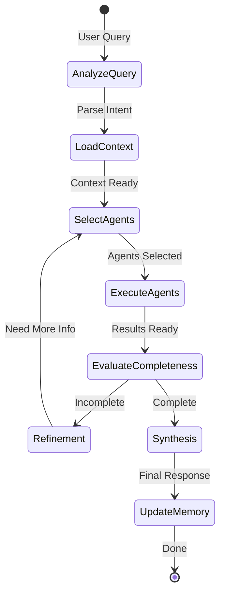

# Humansa V2 Orchestrator Implementation Plan

## Overview

This document outlines the implementation of a proper iterative orchestrator pattern for Humansa V2, based on LlamaIndex workflow best practices.

## Key Concepts from LlamaIndex

### 1. Event-Driven Architecture
- Workflows are event-driven using Python asyncio
- Steps are triggered by Events and emit Events
- Supports parallel execution and complex control flow

### 2. Core Workflow Patterns
- **@step decorator**: Marks workflow steps with type-checked inputs/outputs
- **Context**: Session-specific storage for sharing state between steps
- **Event streaming**: Manual event dispatch using `ctx.send_event()`
- **Iterative loops**: Steps can trigger themselves or others multiple times

### 3. Multi-Agent Patterns
1. **AgentWorkflow** - Built-in agent coordination
2. **Orchestrator Pattern** - Central orchestrator choosing sub-agents
3. **Custom Planner** - LLM-based planning with structured output

## Improved Orchestrator Design

### Architecture Overview



### Key Components

#### 1. Query Analysis Step
```python
@step
async def analyze_query(self, ctx: Context, ev: StartEvent) -> QueryAnalysisEvent:
    # Analyze query intent, complexity, required capabilities
    # Load user context from memory
    # Store in workflow context
```

#### 2. Agent Selection Step
```python
@step
async def select_agents(
    self, 
    ctx: Context, 
    ev: Union[QueryAnalysisEvent, RefinementEvent]
) -> AgentSelectionEvent:
    # Dynamic agent selection based on:
    # - Query requirements
    # - Information gaps
    # - Previously used agents
```

#### 3. Agent Execution Step
```python
@step
async def execute_agents(
    self,
    ctx: Context,
    ev: AgentSelectionEvent
) -> List[AgentExecutionEvent]:
    # Parallel execution of selected agents
    # Extract structured information from responses
    # Send events for each agent result
```

#### 4. Completeness Evaluation Step
```python
@step
async def evaluate_completeness(
    self,
    ctx: Context,
    ev: CompletenessEvaluationEvent
) -> Union[RefinementEvent, SynthesisEvent]:
    # Use LLM to evaluate:
    # - Information completeness
    # - Contradictions
    # - Missing critical data
    # Decide whether to iterate or synthesize
```

#### 5. Synthesis Step
```python
@step
async def synthesize_response(
    self,
    ctx: Context,
    ev: SynthesisEvent
) -> StopEvent:
    # Combine all agent responses
    # Resolve contradictions
    # Generate coherent final response
    # Update memory
```

## Event Types

### Core Events
- `QueryAnalysisEvent`: Initial analysis results
- `AgentSelectionEvent`: Selected agents for iteration
- `AgentExecutionEvent`: Individual agent results
- `CompletenessEvaluationEvent`: Completeness check
- `RefinementEvent`: Request for more information
- `SynthesisEvent`: Final synthesis trigger

## Implementation Status

### ✅ Completed
1. Created `orchestrator_improved.py` with full implementation
2. Implements all LlamaIndex best practices:
   - Event-driven architecture
   - Iterative refinement loop
   - Dynamic agent selection
   - Parallel agent execution
   - Completeness evaluation
   - Context management

### 🔄 Integration Steps Needed
1. Replace current orchestrator in `api.py`
2. Update agent base class for better scoring
3. Add proper LLM configuration
4. Test with real agents

### Key Improvements Over Current
| Feature | Current | Improved |
|---------|---------|----------|
| Agent Selection | Keyword matching | LLM-based dynamic selection |
| Iterations | Single pass | Up to 5 iterations |
| Completeness Check | None | LLM evaluation |
| Parallel Execution | Sequential | True parallel |
| Information Extraction | Basic | Structured extraction |
| Contradiction Handling | None | Detection and resolution |

## Usage Example

```python
# Initialize improved orchestrator
orchestrator = ImprovedHumansaOrchestrator(
    agents=agents,
    router_llm=llm,
    memory_manager=memory_manager,
    max_iterations=5,
    completeness_threshold=0.85
)

# Run workflow
result = await orchestrator.run(
    query="I have chest pain when exercising",
    user_id="123"
)

# Result includes:
# - Final synthesized response
# - Number of iterations used
# - Agents consulted
# - Confidence level
```

## Testing Strategy

1. **Unit Tests**: Test each step independently
2. **Integration Tests**: Full workflow with mock agents
3. **Completeness Tests**: Verify iteration stops when complete
4. **Edge Cases**: Max iterations, no agents available, etc.

## Migration Path

1. Keep current orchestrator as fallback
2. Add feature flag for new orchestrator
3. Gradually migrate endpoints
4. Monitor performance and accuracy
5. Remove old orchestrator once stable

## Performance Considerations

- Parallel agent execution reduces latency
- Caching agent results within iteration
- Early termination on high confidence
- Configurable max iterations
- Async throughout for non-blocking execution

## Conclusion

The improved orchestrator implements a true iterative multi-agent pattern following LlamaIndex best practices. It provides dynamic agent selection, completeness evaluation, and sophisticated response synthesis - addressing all limitations of the current simple routing approach.