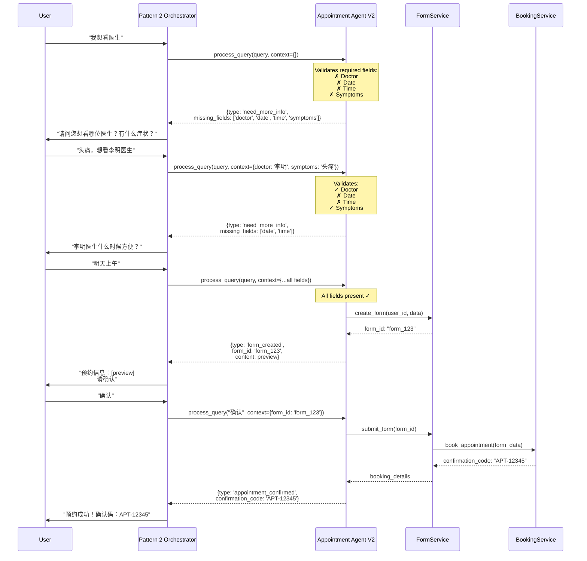
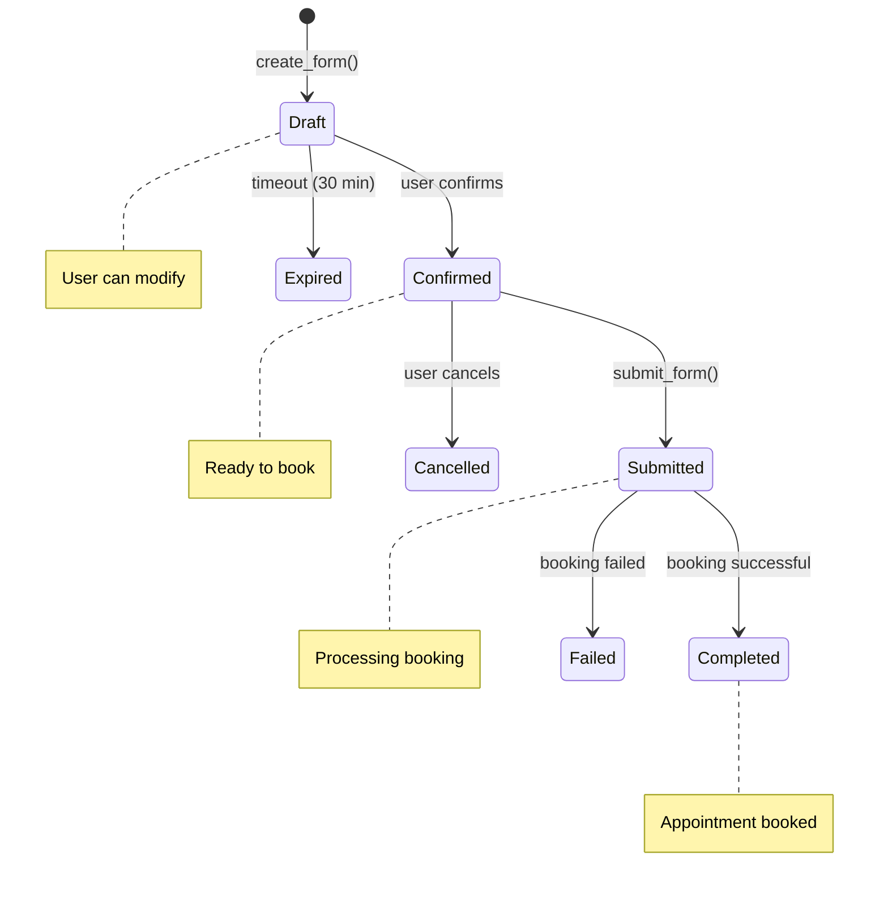

# Humansa Appointment Form System Documentation

## Overview

The Humansa appointment form system implements a sophisticated pattern where the **Appointment Agent validates information** and tells the orchestrator what's missing, rather than the orchestrator trying to validate. This creates a clean separation of concerns and natural conversation flow.

## Architecture Components

### 1. **Pattern 2 Orchestrator** (`orchestrator_pattern2_fixed.py`)
- Manages conversation flow
- Calls appointment agent when appointment intent detected
- Accumulates context across conversation turns
- Responds naturally based on agent feedback

### 2. **Appointment Agent V2** (`appointment_agent_v2.py`)
- Validates required appointment information
- Manages form lifecycle (creation, updates, confirmation)
- Returns structured responses to orchestrator
- Maintains user ownership via user_id

### 3. **Form Service** (`form_service.py`)
- In-memory storage for forms (ready for database)
- CRUD operations for appointment forms
- Status management (draft → confirmed → submitted → completed)
- Expiration handling for abandoned forms

### 4. **Form Tools** (`form_tools.py`)
- Async functions for form operations
- Integration with FormFillingAgent for NLP extraction
- Mock booking service for testing
- RESTful API endpoints

### 5. **Form Registry** (`form_registry.py`)
- Records completed appointments for history
- Provides user appointment analytics
- Tracks booking confirmations and cancellations
- Enables follow-up appointment detection
- Exports user appointment history

## Core Flow Diagram



## Key Design Principles

### 1. **Agent-Driven Validation**
The appointment agent owns all validation logic:
```python
class AppointmentAgentV2:
    def __init__(self):
        self.required_fields = {
            'doctor': {'prompt': '请问您想看哪位医生？'},
            'date': {'prompt': '您想什么时候就诊？'},
            'time': {'prompt': '您想上午还是下午就诊？'},
            'symptoms': {'prompt': '请描述您的症状'}
        }
```

### 2. **Structured Response Types**
The agent returns specific response types the orchestrator understands:
- `need_more_info` - Missing required fields
- `form_created` - Form ready for confirmation
- `form_updated` - Form modified successfully
- `appointment_confirmed` - Booking completed
- `appointment_cancelled` - User cancelled
- `error` - Something went wrong

### 3. **Context Accumulation**
The orchestrator accumulates information across conversation turns:
```python
# Turn 1
User: "我想看医生"
Context: {}
Agent: need_more_info [doctor, date, time, symptoms]

# Turn 2  
User: "头痛"
Context: {symptoms: "头痛"}
Agent: need_more_info [doctor, date, time]

# Turn 3
User: "李明医生，明天上午"
Context: {symptoms: "头痛", doctor: "李明医生", date: "明天", time: "上午"}
Agent: form_created
```

### 4. **Form Lifecycle Management**



## Implementation Details

### Appointment Agent V2 Structure

```python
async def process_query(self, query: str, context: Dict, user_id: str) -> Dict:
    # 1. Check for active form
    form_id = context.get('active_form_id')
    
    if form_id:
        # Handle existing form operations
        return await self._handle_existing_form(form_id, query, user_id, context)
    else:
        # Try to create new appointment
        return await self._handle_new_appointment(query, context, user_id)

async def _handle_new_appointment(self, query: str, context: Dict, user_id: str) -> Dict:
    # Extract information
    info = self._extract_info(query, context)
    
    # Validate
    validation = self._validate_info(info)
    
    if not validation['is_complete']:
        return self._create_need_info_response(info, validation['missing'])
    
    # Create form
    form_result = await create_appointment_form(user_id, query, info)
    
    return {
        'type': 'form_created',
        'form_id': form_result['form_id'],
        'content': form_result['preview'],
        'instructions': '请确认以上预约信息'
    }
```

### Orchestrator Integration

```python
# In Pattern 2 orchestrator
async def call_appointment_agent(request: str) -> str:
    context = {
        'active_form_id': self._current_state.get('active_form_id'),
        # Include accumulated context
        **self._current_state.get('appointment_context', {})
    }
    
    agent = AppointmentAgentV2()
    async for result in agent.process_query(request, context, user_id):
        if result['type'] == 'need_more_info':
            # Update state with what we have
            self._current_state['appointment_context'] = result.get('current_info', {})
            return result['content']  # Natural language prompt
            
        elif result['type'] == 'form_created':
            # Store form_id for future operations
            self._current_state['active_form_id'] = result['form_id']
            return f"{result['content']}\n\n{result['instructions']}"
            
        elif result['type'] == 'appointment_confirmed':
            # Clear appointment state
            self._current_state['active_form_id'] = None
            return result['content']
```

### Form Data Model

```python
@dataclass
class AppointmentForm:
    form_id: str
    user_id: str
    status: FormStatus  # draft, confirmed, submitted, completed, failed, cancelled
    
    # Patient information
    patient_name: Optional[str]
    patient_phone: Optional[str]
    patient_id_number: Optional[str]
    
    # Appointment details
    doctor_name: Optional[str]
    doctor_id: Optional[str]
    department: Optional[str]
    appointment_date: Optional[str]
    appointment_time: Optional[str]
    appointment_type: Optional[str]  # 初诊/复诊
    
    # Medical information
    symptoms: Optional[str]
    medical_history: Optional[str]
    allergies: Optional[str]
    current_medications: Optional[str]
    
    # Metadata
    created_at: datetime
    updated_at: datetime
    expires_at: Optional[datetime]
    
    # Booking result
    booking_id: Optional[str]
    confirmation_code: Optional[str]
    booking_details: Optional[Dict[str, Any]]
```

## API Endpoints

The form system exposes REST endpoints for external integration:

```python
POST /api/v2/forms/appointment
  Create new appointment form
  
GET /api/v2/forms/appointment/{form_id}
  Get form details
  
PUT /api/v2/forms/appointment/{form_id}
  Update form fields
  
POST /api/v2/forms/appointment/{form_id}/confirm
  Confirm and submit form for booking
  
DELETE /api/v2/forms/appointment/{form_id}
  Cancel form
```

## Testing Strategy

### Unit Tests
```python
# Test appointment agent validation
async def test_missing_all_info():
    agent = AppointmentAgentV2()
    result = await agent.process_query("我想看医生", {}, "user1")
    assert result['type'] == 'need_more_info'
    assert len(result['missing_fields']) == 4

# Test progressive info collection
async def test_partial_info():
    agent = AppointmentAgentV2()
    context = {'doctor': '李明医生', 'symptoms': '头痛'}
    result = await agent.process_query("明天", context, "user1")
    assert result['type'] == 'need_more_info'
    assert 'time' in result['missing_fields']
```

### Integration Tests
```python
# Test full appointment flow
async def test_complete_appointment_flow():
    # Step 1: Initial request
    response = await orchestrator.process_query("我想看医生", user_id="test")
    assert "请问您想看哪位医生" in response
    
    # Step 2: Provide doctor and symptoms
    response = await orchestrator.process_query("李明医生，头痛", user_id="test")
    assert "什么时候" in response
    
    # Step 3: Provide date/time
    response = await orchestrator.process_query("明天上午", user_id="test")
    assert "请确认" in response
    assert "form_" in orchestrator.state.get('active_form_id')
    
    # Step 4: Confirm
    response = await orchestrator.process_query("确认", user_id="test")
    assert "预约成功" in response
    assert "APT-" in response
```

## Best Practices

### 1. **Let Agents Be Experts**
- Appointment agent knows appointment requirements
- Orchestrator knows conversation management
- Neither needs to understand the other's internals

### 2. **Progressive Information Collection**
- Don't ask for everything at once
- Build context naturally through conversation
- Use agent feedback to guide questions

### 3. **Clear Status Communication**
- Agent returns structured status
- Orchestrator interprets status naturally
- User sees conversational responses

### 4. **Robust Error Handling**
- Handle network failures gracefully
- Provide meaningful error messages
- Allow retry and recovery

### 5. **User Ownership**
- Forms belong to users via user_id
- Users can only access their own forms
- Support multiple active forms per user

## Form Registry and History

The system maintains a complete registry of all appointments:

### Registry Features

1. **Appointment History**
   ```python
   # Get user's appointment history
   appointments = await form_registry.get_user_appointment_history(
       user_id="user123",
       limit=10,
       include_cancelled=False
   )
   ```

2. **Upcoming Appointments**
   ```python
   # Get appointments in next 7 days
   upcoming = await form_registry.get_upcoming_appointments(
       user_id="user123",
       days_ahead=7
   )
   ```

3. **Analytics**
   ```python
   # Get user analytics
   analytics = await form_registry.get_analytics(user_id="user123")
   # Returns: total appointments, completion rate, department distribution, etc.
   ```

4. **Export History**
   ```python
   # Export complete history
   export_data = form_registry.export_user_history(user_id="user123")
   ```

### API Endpoints

```
GET  /api/v2/appointments/history?user_id=xxx
GET  /api/v2/appointments/upcoming?user_id=xxx
GET  /api/v2/appointments/{booking_id}
POST /api/v2/appointments/{booking_id}/cancel
GET  /api/v2/appointments/analytics?user_id=xxx
GET  /api/v2/appointments/export?user_id=xxx
```

## Future Enhancements

### 1. **Multi-Language Support**
- Extract language detection to agent
- Localize validation messages
- Support multiple date/time formats

### 2. **Smart Scheduling**
- Check doctor availability in real-time
- Suggest alternative time slots
- Handle scheduling conflicts

### 3. **Integration with Hospital Systems**
- Real doctor database lookup
- Live availability checking
- Direct booking into HIS

### 4. **Advanced Features**
- Recurring appointments
- Family member booking
- Appointment reminders
- Rescheduling support

### 5. **Registry Enhancements**
- Migrate to persistent database storage
- Add appointment rating/feedback
- Generate appointment reports
- Integrate with notification system

## Troubleshooting

### Common Issues

1. **"Form not found" errors**
   - Check form hasn't expired (30 min default)
   - Verify user_id matches
   - Ensure form_id is passed in context

2. **Validation loops**
   - Agent should accumulate context
   - Don't clear context between calls
   - Check field extraction logic

3. **Booking failures**
   - Verify mock booking service is running
   - Check form has all required fields
   - Ensure status transitions are correct

## Summary

The Humansa appointment form system demonstrates a clean architecture where:
- **Agents validate** - Not orchestrators
- **Context accumulates** - Information builds naturally
- **Forms have lifecycle** - Clear status transitions
- **Users own data** - Proper access control
- **APIs are RESTful** - Easy integration

This pattern can be extended to other form-based workflows like:
- Patient registration
- Insurance claims
- Medical history updates
- Prescription requests

The key is maintaining the separation where domain agents own validation and business logic, while orchestrators manage conversation flow.