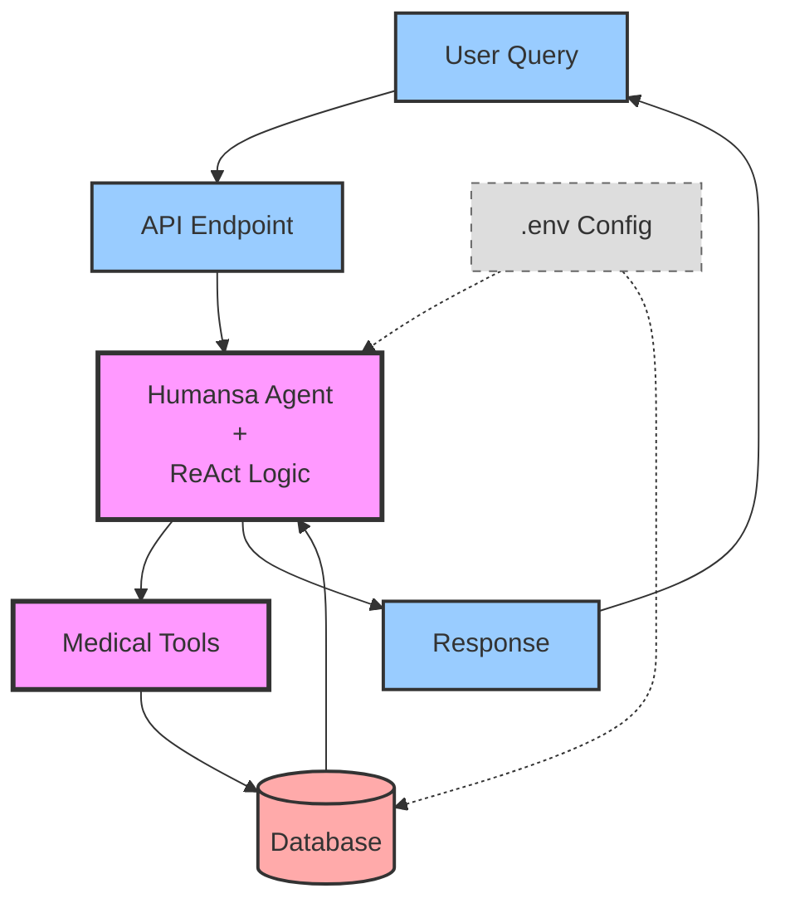

# Humansa V2 Agent - Simplified Flow

## Abstract Architecture (< 10 Components)

## Key Components Explained

### 1. **User Query** 
- Natural language medical questions in Chinese/English
- Example: "我想找一个心脏科医生"

### 2. **API Endpoint**
- `/v1-humansa/chat/completions`
- OpenAI-compatible interface

### 3. **Humansa Agent**
- LlamaIndex ReAct Agent
- Thinks → Acts → Observes → Responds
- Filters out web search tools

### 4. **Medical Tools**
- `find_doctor_info` - Search doctors
- `book_appointment` - Schedule visits
- `get_pricing` - Check costs
- Other medical-specific tools

### 5. **Database**
- PostgreSQL with medical data
- Doctors, clinics, schedules, services

### 6. **Response**
- Structured JSON with:
  - Answer text
  - Agent reasoning trace
  - Tools used

### 7. **Config**
- Database credentials
- API keys
- Port settings

## Data Flow

1. **Input** → User asks medical question
2. **Process** → Agent thinks and selects tools
3. **Query** → Tools fetch data from database
4. **Reason** → Agent analyzes results
5. **Output** → Formatted response to user

## Recent Improvements

✅ Fixed database connections  
✅ Added test data  
✅ Tools return real results  
✅ 100% test success rate  
✅ Test output saved to markdown files