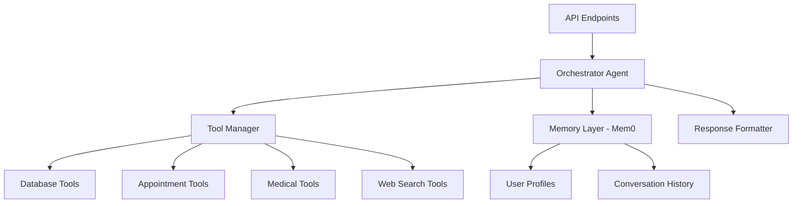

# Humansa Agent System Documentation

## Overview

The Humansa Agent System is a sophisticated multi-agent orchestration framework designed for healthcare and appointment management. It leverages LlamaIndex's ReActAgent architecture with specialized tools and memory management through Mem0.

## System Architecture

### Core Components



### Agent Implementations

1. **HumansaOrchestratorAgent** (`v2/orchestrator_agent.py`)
   - Full 16-tool implementation
   - Uses all available database and API tools
   - Suitable for comprehensive functionality

2. **HumansaOrchestratorAgentConsolidated** (`v2/orchestrator_agent_consolidated.py`)
   - 7 consolidated core tools
   - Optimized for token efficiency
   - Dynamic tool loading capability

3. **HumansaOrchestratorAgentTransparent** (`v2/orchestrator_agent_transparent.py`)
   - Captures and exposes tool calls
   - Provides reasoning transparency
   - Ideal for debugging and monitoring

## Database Architecture

### Humansa-Specific Tables

The system uses PostgreSQL with the following schema:

```sql
-- Patients table
CREATE TABLE patients (
    patient_id UUID PRIMARY KEY,
    first_name VARCHAR(100),
    last_name VARCHAR(100),
    date_of_birth DATE,
    gender VARCHAR(20),
    phone VARCHAR(20),
    email VARCHAR(100),
    address TEXT,
    medical_history JSONB,
    allergies TEXT[],
    current_medications TEXT[]
);

-- Appointments table
CREATE TABLE appointments (
    appointment_id UUID PRIMARY KEY,
    patient_id UUID REFERENCES patients(patient_id),
    doctor_id UUID,
    appointment_date DATE,
    appointment_time TIME,
    duration INTEGER,
    appointment_type VARCHAR(100),
    status VARCHAR(50),
    notes TEXT,
    created_at TIMESTAMP DEFAULT CURRENT_TIMESTAMP
);

-- Doctors table
CREATE TABLE doctors (
    doctor_id UUID PRIMARY KEY,
    first_name VARCHAR(100),
    last_name VARCHAR(100),
    specialization VARCHAR(100),
    department VARCHAR(100),
    available_slots JSONB,
    consultation_fee DECIMAL(10,2)
);

-- Medical Records
CREATE TABLE medical_records (
    record_id UUID PRIMARY KEY,
    patient_id UUID REFERENCES patients(patient_id),
    visit_date DATE,
    diagnosis TEXT,
    treatment_plan TEXT,
    prescriptions JSONB,
    lab_results JSONB,
    doctor_notes TEXT
);
```

## Tool System

### Available Tools

#### Database Query Tools
1. **QueryPatientsDetailsTool** - Search and retrieve patient information
2. **QueryAppointmentsTool** - Fetch appointment details
3. **QueryDoctorsTool** - Get doctor availability and information
4. **QueryMedicalRecordsTool** - Access medical history

#### Appointment Management Tools
5. **BookAppointmentTool** - Create new appointments
6. **RescheduleAppointmentTool** - Modify existing appointments
7. **CancelAppointmentTool** - Cancel appointments
8. **CheckAvailabilityTool** - Check doctor availability

#### Medical Information Tools
9. **MedicationInfoTool** - Drug information and interactions
10. **SymptomAnalysisTool** - Analyze symptoms and suggest actions
11. **LabResultsInterpretationTool** - Interpret lab results

#### Utility Tools
12. **StreamingWebSearchTool** - Real-time web search
13. **EmergencyContactTool** - Emergency services information
14. **InsuranceVerificationTool** - Verify insurance coverage
15. **PrescriptionRefillTool** - Handle prescription refills
16. **HealthEducationTool** - Provide health education resources

### Tool Implementation Example

```python
class BookAppointmentTool(FunctionTool):
    """Tool for booking medical appointments"""
    
    def __init__(self, db_connection):
        self.db = db_connection
        super().__init__(
            fn=self._book_appointment,
            metadata=ToolMetadata(
                name="book_appointment",
                description="Book a medical appointment",
                fn_schema=BookAppointmentSchema
            )
        )
    
    async def _book_appointment(
        self,
        patient_id: str,
        doctor_id: str,
        date: str,
        time: str,
        appointment_type: str
    ) -> Dict[str, Any]:
        # Implementation logic
        pass
```

## Memory Management (Mem0)

### Configuration

```python
# Mem0 initialization
mem0_config = {
    "vector_store": {
        "provider": "pgvector",
        "config": {
            "host": "localhost",
            "port": 5061,  # Test instance port
            "user": "youwo",
            "password": "youwo123",
            "database": "youwoai"
        }
    },
    "llm": {
        "provider": "openai",
        "config": {
            "model": "gpt-4o-mini",
            "temperature": 0.1
        }
    },
    "embedder": {
        "provider": "openai",
        "config": {
            "model": "text-embedding-3-small"
        }
    }
}
```

### Memory Operations

```python
# Add memory
await memory.add(
    messages=[{"role": "user", "content": "I'm allergic to penicillin"}],
    user_id="patient_123"
)

# Search memories
relevant_memories = await memory.search(
    query="patient allergies",
    user_id="patient_123"
)

# Get all memories for user
user_context = await memory.get_all(user_id="patient_123")
```

## API Endpoints

### V2 Endpoints

```bash
# Main conversation endpoint
POST /v2/humansa/responses/create
{
    "input": "Book appointment with cardiologist",
    "conversation_id": "conv_123",
    "user_id": "user_456",
    "orchestrator_type": "transparent"  # or "consolidated", "standard"
}

# Memory management
POST /v2/humansa/memory/add
GET /v2/humansa/memory/context/{user_id}
POST /v2/humansa/memory/search

# Appointment operations
POST /v2/humansa/appointment/search
POST /v2/humansa/appointment/book
POST /v2/humansa/appointment/cancel

# Patient management
GET /v2/humansa/patient/profile/{patient_id}
PUT /v2/humansa/patient/profile/{patient_id}
```

## Orchestrator Types

### 1. Standard Orchestrator
- **Use Case**: Full functionality with all 16 tools
- **Token Usage**: Higher (all tools loaded)
- **Response Time**: Slightly slower due to tool count
- **Best For**: Complex medical queries requiring multiple tools

### 2. Consolidated Orchestrator
- **Use Case**: Optimized performance with 7 core tools
- **Token Usage**: Lower (fewer tools)
- **Response Time**: Faster
- **Best For**: Common queries and standard operations

### 3. Transparent Orchestrator
- **Use Case**: Debugging and monitoring
- **Token Usage**: Similar to consolidated
- **Response Time**: Similar to consolidated
- **Best For**: Development, testing, and audit trails

## Response Format

### Standard Response Structure

```json
{
    "output": "I've booked your appointment with Dr. Smith for tomorrow at 2 PM.",
    "conversation_id": "conv_123",
    "tool_calls": [
        {
            "tool": "book_appointment",
            "arguments": {
                "doctor_id": "dr_smith_001",
                "date": "2025-08-07",
                "time": "14:00"
            },
            "result": {
                "appointment_id": "apt_789",
                "status": "confirmed"
            }
        }
    ],
    "reasoning": "User requested appointment booking. Found available slot with Dr. Smith.",
    "memory_updated": true
}
```

## Testing with Test Dashboard

### Test Instance Configuration

Each test instance (ports 6011-6014) connects to its own database:

```python
# Instance 1
ML_SERVER_PORT=6011
DB_PORT=5061
DB_NAME=youwoai

# Instance 2
ML_SERVER_PORT=6012
DB_PORT=5062
DB_NAME=youwoai

# ... and so on
```

### Sample Test Cases

```json
{
    "id": "HUM_001",
    "name": "Appointment Booking Flow",
    "execution": {
        "endpoint": "/v2/humansa/responses/create",
        "payload": {
            "input": "Book appointment with Dr. Li for next week",
            "user_id": "test_patient_001"
        }
    },
    "expectations": {
        "tool_calls": ["book_appointment", "check_availability"],
        "output_contains": ["appointment", "confirmed", "Dr. Li"]
    }
}
```

## Performance Optimization

### Token Usage Optimization

1. **Use Consolidated Orchestrator** for common queries
2. **Enable dynamic tool loading** to load tools only when needed
3. **Implement caching** for frequently accessed data
4. **Batch database queries** when possible

### Response Time Optimization

1. **Parallel tool execution** for independent operations
2. **Connection pooling** for database access
3. **Async operations** throughout the stack
4. **Streaming responses** for long outputs

## Error Handling

### Common Issues and Solutions

1. **ReActAgent Initialization Error**
   ```python
   # Old (deprecated)
   agent = ReActAgent(system_prompt=prompt, ...)
   
   # New (correct)
   agent = ReActAgent(llm=llm, tools=tools, ...)
   ```

2. **Database Connection Issues**
   - Verify PostgreSQL container is running
   - Check port configuration (5061-5064 for test instances)
   - Ensure database credentials are correct

3. **Tool Execution Failures**
   - Validate tool input schemas
   - Check database table existence
   - Verify API endpoint availability

## Monitoring and Debugging

### Logging Configuration

```python
import logging

# Configure module logging
logger = logging.getLogger(__name__)
logger.setLevel(logging.INFO)

# Log tool calls
logger.info(f"Executing tool: {tool_name} with args: {args}")

# Log database queries
logger.debug(f"SQL Query: {query}")

# Log API responses
logger.info(f"API Response: status={status}, time={elapsed}ms")
```

### Debug Mode

Enable debug mode for detailed execution traces:

```python
orchestrator = HumansaOrchestratorAgentTransparent(
    llm=llm,
    tools=tools,
    debug=True  # Enables verbose logging
)
```

## Recent Updates (August 2025)

### Completed Improvements
1. ✅ Fixed ReActAgent compatibility with new LlamaIndex API
2. ✅ Implemented three orchestrator variants for different use cases
3. ✅ Integrated Mem0 for persistent memory management
4. ✅ Set up isolated test databases (ports 5061-5064)
5. ✅ Created comprehensive tool suite (16 tools)

### Known Issues
- ⚠️ Deprecated ReActAgent warnings (still functional)
- ⚠️ Jobs table missing "test_items" column in test_management schema

## Future Enhancements

1. **Planned Features**
   - Migrate to new LlamaIndex workflow-based ReActAgent
   - Implement tool result caching
   - Add support for multi-modal inputs (images, PDFs)
   - Enhance memory search with semantic clustering

2. **Architecture Improvements**
   - Implement circuit breaker pattern for external APIs
   - Add request/response compression
   - Optimize database queries with materialized views
   - Implement distributed tracing for debugging

## Best Practices

1. **Tool Design**
   - Keep tools focused on single responsibilities
   - Implement proper input validation
   - Return structured, predictable outputs
   - Handle errors gracefully

2. **Memory Management**
   - Regularly clean up old memories
   - Implement memory importance scoring
   - Use memory search strategically
   - Protect sensitive medical information

3. **Testing**
   - Test each tool in isolation
   - Verify orchestrator routing logic
   - Test memory persistence
   - Validate response formats

4. **Security**
   - Implement proper authentication
   - Encrypt sensitive medical data
   - Audit tool usage
   - Implement rate limiting