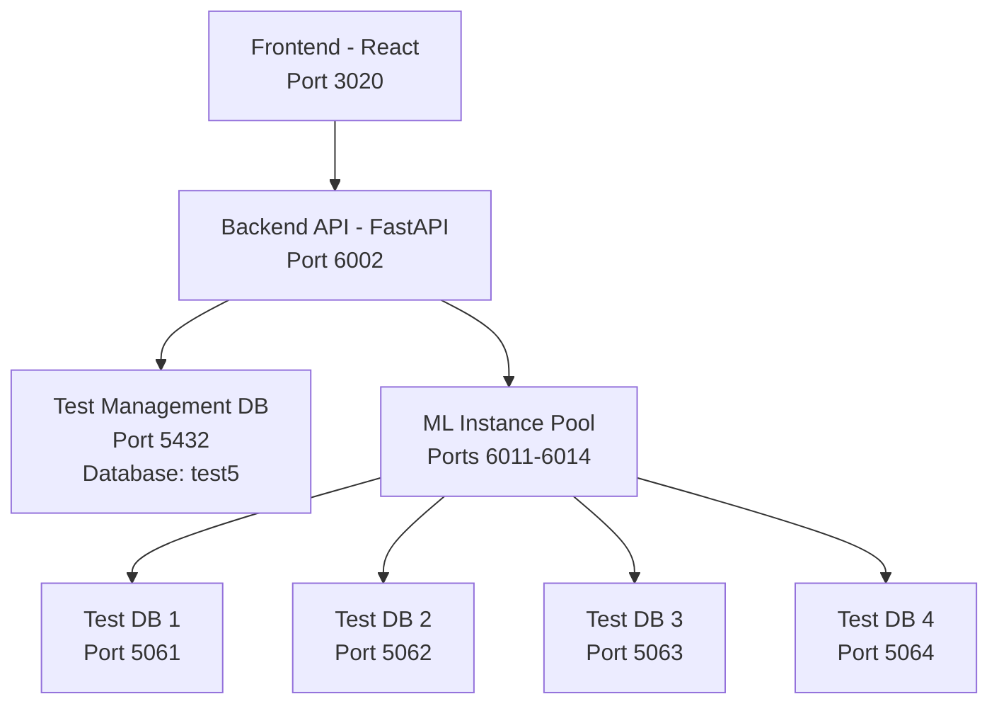
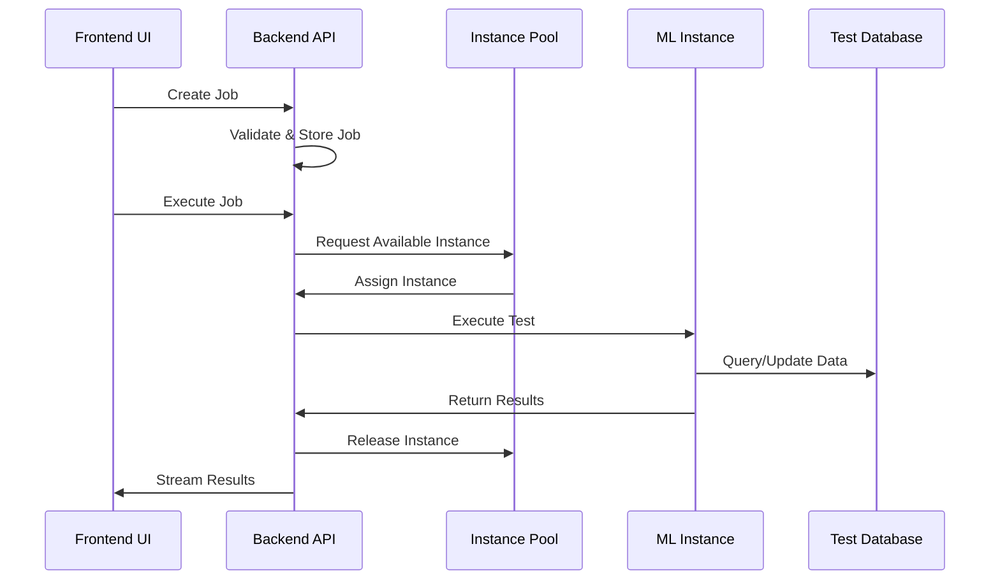

# Test Dashboard System Documentation

## Overview

The Test Dashboard is a comprehensive web-based testing framework for the ML Server, providing centralized test execution, monitoring, and analysis capabilities. It manages multiple ML server instances and their corresponding test databases to enable parallel test execution.

## Architecture

### System Components



### Port Configuration

| Component | Port | Description |
|-----------|------|-------------|
| Frontend | 3020 | React dashboard UI |
| Backend API | 6002 | FastAPI server |
| ML Instances | 6011-6014 | 4 ML server instances |
| Test Databases | 5061-5064 | PostgreSQL containers |
| Management DB | 5432 | Main test_management schema |

## Database Architecture

### Two-Tier Database System

1. **Management Database (Port 5432)**
   - Database: `test${DIGIT}` (e.g., test5)
   - Schema: `test_management`
   - Purpose: Stores test definitions, job configurations, execution results
   - Tables:
     - `jobs` - Test job definitions
     - `runs` - Test execution runs
     - `results` - Individual test results
     - `logs` - Test execution logs
     - `instances` - ML server instance status

2. **Test Instance Databases (Ports 5061-5064)**
   - Database: `youwoai`
   - Purpose: Isolated Humansa application data for each test instance
   - Tables: All Humansa application tables (patients, appointments, etc.)
   - Each instance gets its own PostgreSQL container for complete isolation

## Multi-Instance Support

### Instance Pool Management

The system manages a pool of ML server instances for parallel test execution:

```python
# Instance configuration
INSTANCES = [
    {"id": 1, "port": 6011, "db_port": 5061},
    {"id": 2, "port": 6012, "db_port": 5062},
    {"id": 3, "port": 6013, "db_port": 5063},
    {"id": 4, "port": 6014, "db_port": 5064},
]
```

### Instance States

- **Available**: Ready to accept test execution
- **Busy**: Currently executing a test
- **Error**: Instance has encountered an error
- **Offline**: Instance is not responding

## Test Execution Flow



## Docker Infrastructure

### Test Database Containers

```yaml
# docker-compose.test-instances.yml
services:
  test-db-1:
    image: pgvector/pgvector:pg15
    container_name: humansa_test_db_1
    ports:
      - "5061:5432"
    environment:
      POSTGRES_USER: youwo
      POSTGRES_PASSWORD: youwo123
      POSTGRES_DB: youwoai
```

### Container Management

```bash
# Start all test databases
cd test_dashboard
docker-compose -f docker-compose.test-instances.yml up -d

# Check container status
docker ps | grep humansa_test_db

# Stop containers
docker-compose -f docker-compose.test-instances.yml down
```

## Launch Process

### Using the Launch Script

```bash
# Standard launch with 4 instances
./launch_dashboard.sh

# The script performs:
1. Cleans up existing processes
2. Starts 4 ML server instances (6011-6014)
3. Starts backend API (6002)
4. Starts frontend (3020)
5. Syncs instances with backend
6. Monitors logs
```

### Manual Launch

```bash
# 1. Start test databases
docker-compose -f docker-compose.test-instances.yml up -d

# 2. Start ML instances
for i in 1 2 3 4; do
    DB_PORT=$((5060 + i)) \
    ML_SERVER_PORT=$((6010 + i)) \
    python src/main.py &
done

# 3. Start backend
cd test_dashboard/backend
uvicorn main:app --port 6002

# 4. Start frontend
cd test_dashboard/frontend
npm start
```

## Test Format

### Test Definition Structure

```json
{
  "id": "TEST_001",
  "name": "Appointment Booking Test",
  "suite": "appointment",
  "type": "single",
  "priority": 5,
  "tags": ["appointment", "booking"],
  "execution": {
    "endpoint": "/v2/humansa/responses/create",
    "method": "POST",
    "payload": {
      "input": "Book appointment with Dr. Li",
      "conversation_id": "test-conv-1",
      "user_id": "test-user-1"
    }
  },
  "expectations": {
    "response": {
      "output_contains": ["appointment", "Dr. Li"],
      "status_code": 200
    },
    "tool_calls": {
      "expected": ["book_appointment"],
      "min_count": 1
    }
  }
}
```

## API Endpoints

### Job Management

```bash
# Create job
POST /api/jobs
{
  "name": "Test Suite Run",
  "tests": [
    {"test_id": "TEST_001"},
    {"test_id": "TEST_002"}
  ],
  "config": {
    "execution_mode": "parallel",
    "timeout_per_test": 30
  }
}

# Execute job
POST /api/jobs/{job_id}/execute

# Get job status
GET /api/jobs/{job_id}

# List all jobs
GET /api/jobs
```

### Test Management

```bash
# List available tests
GET /api/tests

# Get test details
GET /api/tests/{test_id}

# Upload test definition
POST /api/tests/upload
```

### Instance Management

```bash
# Get instance status
GET /api/instances/status

# Sync instances
POST /api/instances/sync

# Reset instance
POST /api/instances/{instance_id}/reset
```

## Database Schema

### Test Management Tables

```sql
-- Jobs table
CREATE TABLE test_management.jobs (
    id UUID PRIMARY KEY,
    name VARCHAR(200) NOT NULL,
    description TEXT,
    status VARCHAR(50),
    config JSONB,
    created_at TIMESTAMP DEFAULT CURRENT_TIMESTAMP,
    updated_at TIMESTAMP DEFAULT CURRENT_TIMESTAMP
);

-- Runs table
CREATE TABLE test_management.runs (
    id UUID PRIMARY KEY,
    job_id UUID REFERENCES test_management.jobs(id),
    status VARCHAR(50),
    started_at TIMESTAMP,
    completed_at TIMESTAMP,
    summary JSONB
);

-- Results table
CREATE TABLE test_management.results (
    id SERIAL PRIMARY KEY,
    run_id UUID REFERENCES test_management.runs(id),
    test_id VARCHAR(255),
    status VARCHAR(50),
    execution_time FLOAT,
    output JSONB,
    error TEXT,
    created_at TIMESTAMP DEFAULT CURRENT_TIMESTAMP
);
```

## Troubleshooting

### Common Issues

1. **Database Connection Errors**
   - Verify PostgreSQL containers are running: `docker ps`
   - Check port availability: `lsof -i :5061-5064`
   - Verify credentials in environment variables

2. **ML Instance Not Ready**
   - Check instance logs: `tail -f /tmp/ml_server_601*.log`
   - Verify database connectivity
   - Ensure Humansa tables are initialized

3. **Job Execution Failures**
   - Check backend logs: `tail -f test_dashboard/backend/backend.log`
   - Verify test_management schema exists
   - Ensure all required columns are present in database

4. **Frontend Not Loading**
   - Check if backend is running: `curl http://localhost:6002/health`
   - Verify frontend build: `cd frontend && npm run build`
   - Check browser console for errors

### Log Locations

| Component | Log Location |
|-----------|-------------|
| Backend | `test_dashboard/backend/backend.log` |
| ML Instance 1 | `/tmp/ml_server_6011.log` |
| ML Instance 2 | `/tmp/ml_server_6012.log` |
| ML Instance 3 | `/tmp/ml_server_6013.log` |
| ML Instance 4 | `/tmp/ml_server_6014.log` |
| Launch Script | `/tmp/dashboard_launch.log` |

## Best Practices

1. **Test Isolation**
   - Each test instance uses a separate database
   - Tests should not depend on data from other tests
   - Clean up test data after execution

2. **Resource Management**
   - Limit parallel workers based on system resources
   - Set appropriate timeouts for long-running tests
   - Monitor memory usage of ML instances

3. **Error Handling**
   - Always check instance availability before execution
   - Implement retry logic for transient failures
   - Log detailed error information for debugging

## Recent Updates (August 2025)

### Fixed Issues
1. **Database Schema**: Added missing columns to test_management schema
2. **Docker Setup**: Created proper PostgreSQL containers on ports 5061-5064
3. **ReActAgent**: Fixed compatibility with new LlamaIndex API
4. **Port Configuration**: Corrected launch script to use proper database ports

### Current Status
- ✅ All 4 ML instances operational
- ✅ PostgreSQL containers running
- ✅ Backend API functional
- ✅ Frontend accessible
- ⚠️ Minor issue: Jobs table missing "test_items" column (non-critical)

## Future Enhancements

1. **Planned Features**
   - Real-time test execution monitoring with WebSockets
   - Test result comparison and regression detection
   - Automated test generation from API specs
   - Performance benchmarking and trending

2. **Infrastructure Improvements**
   - Kubernetes deployment for better scaling
   - Distributed test execution across multiple machines
   - Test data versioning and snapshots
   - Integration with CI/CD pipelines