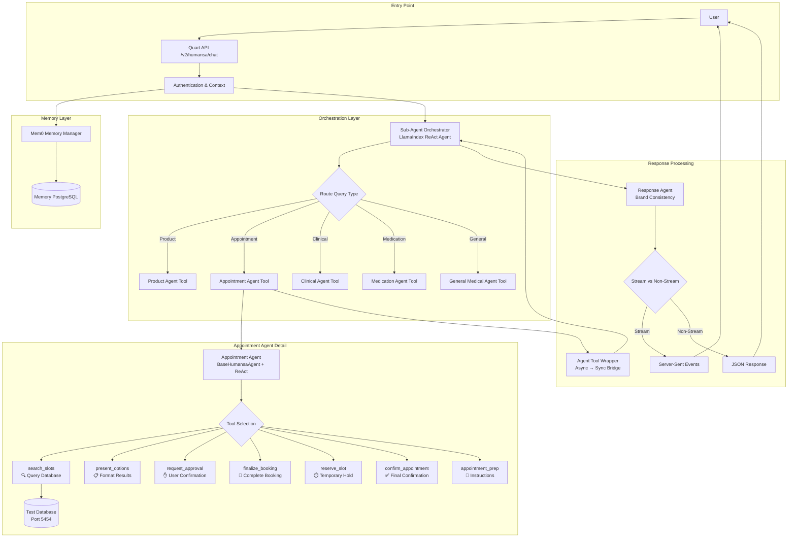
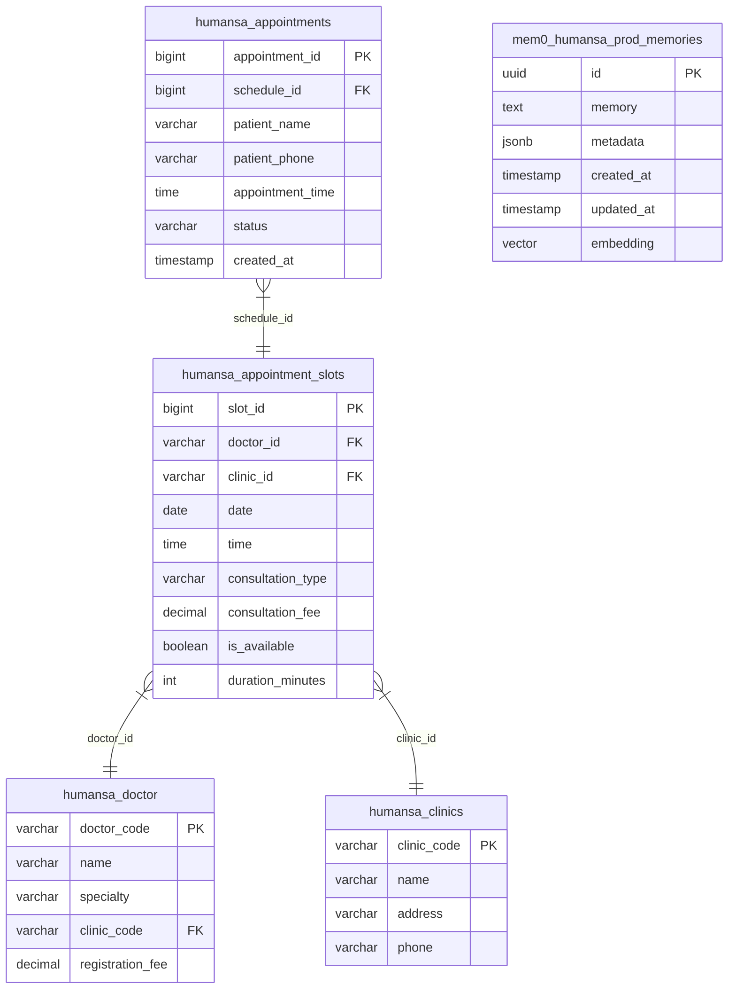
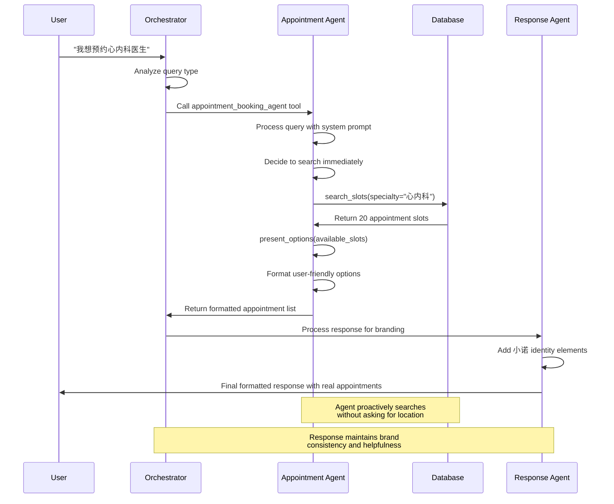

# Humansa Agent Implementation Architecture

## Simple Overview
```mermaid
graph TD
    U[User Query: "我想预约心内科医生"] --> API[/v2/humansa/chat]
    API --> ORCH[Sub-Agent Orchestrator]
    ORCH --> APPT[Appointment Agent]
    APPT --> DB[(PostgreSQL Database)]
    DB --> APPT
    APPT --> ORCH
    ORCH --> RESP[Response Agent]
    RESP --> U
```

## Detailed Flow


## Complex Implementation Details
```mermaid
graph TD
    subgraph "Infrastructure Layer"
        subgraph "Database Layer"
            TESTDB[(Test Database<br/>postgres@localhost:5454<br/>Database: test4)]
            PRODDB[(Production Database<br/>postgres@localhost:5432)]
            MEMDB[(Memory Database<br/>Schema: mem0_humansa_prod)]
        end
        
        subgraph "LLM Layer"
            AZURE[Azure OpenAI<br/>GPT-4.1 Deployment<br/>1M Token Context]
            OPENAI[OpenAI API<br/>GPT-4o-mini for Memory]
        end
        
        subgraph "Server Layer"
            QUART[Quart Async Server<br/>Port 6001 Test<br/>Port 5001 Production]
        end
    end
    
    subgraph "Application Layer"
        subgraph "API Endpoints"
            CHATAPI[/v2/humansa/chat<br/>Main Conversation]
            APPTAPI[/v2/humansa/appointment/*<br/>Direct Appointment APIs]
            MEMAPI[/v2/humansa/memory/*<br/>Memory Management]
        end
        
        subgraph "Core Components"
            subgraph "Context Management"
                CONTEXTMGR[Context Manager<br/>Request Lifecycle]
                USERMGR[User Session Manager]
            end
            
            subgraph "Memory System"
                MEM0MGR[Mem0 Manager<br/>Singleton Pattern]
                MEMADAPTER[Memory Adapter<br/>Mem0 ↔ Humansa Bridge]
                CONVMEM[Conversation Memory<br/>Embeddings + Retrieval]
            end
            
            subgraph "Agent Architecture"
                SUBORCHES[Sub-Agent Orchestrator<br/>Pattern 2: Agents as Tools]
                CONSOLORCHES[Consolidated Orchestrator<br/>Direct Tool Access]
                TRANSPORCHES[Transparent Orchestrator<br/>Tool Call Logging]
            end
        end
        
        subgraph "Sub-Agents (As Tools)"
            subgraph "Appointment Agent System"
                APPTBASE[BaseHumansaAgent<br/>Abstract Base Class]
                APPTREACT[LlamaIndex ReAct Agent<br/>Tool Calling Engine]
                
                subgraph "Appointment Tools"
                    SEARCHFN[search_available_slots<br/>AsyncPG → PostgreSQL]
                    PRESENTFN[present_appointment_options<br/>Format & Display]
                    APPROVFN[request_booking_approval<br/>User Confirmation Flow]
                    PROCESSFN[process_user_approval<br/>Response Processing]
                    FINALIZEFN[finalize_booking<br/>Database Transaction]
                    RESERVEFN[reserve_appointment_slot<br/>Temporary Lock]
                    CONFIRMFN[confirm_appointment<br/>Final Booking]
                    PREPFN[get_appointment_preparation<br/>Instructions & Tips]
                end
                
                APPTBASE --> APPTREACT
                APPTREACT --> SEARCHFN
                APPTREACT --> PRESENTFN
                APPTREACT --> APPROVFN
                APPTREACT --> PROCESSFN
                APPTREACT --> FINALIZEFN
                APPTREACT --> RESERVEFN
                APPTREACT --> CONFIRMFN
                APPTREACT --> PREPFN
            end
            
            subgraph "Other Sub-Agents"
                PRODAGENT[Product Recommendation Agent<br/>E-commerce Tools]
                CLINAGENT[Clinical Analysis Agent<br/>Diagnosis + Emergency]
                MEDAGENT[Medication Guidance Agent<br/>Drug Information]
                GENAGENT[General Medical Agent<br/>Health Information]
            end
        end
        
        subgraph "Tool Wrapper System"
            TOOLWRAP[Agent Tool Wrapper<br/>Async → Sync Bridge]
            TOOLMETA[Tool Metadata<br/>LlamaIndex Compatible]
            FUNCTOOLS[Function Tools<br/>Pydantic Schemas]
            
            APPTBASE --> TOOLWRAP
            PRODAGENT --> TOOLWRAP
            CLINAGENT --> TOOLWRAP
            MEDAGENT --> TOOLWRAP
            GENAGENTS --> TOOLWRAP
            
            TOOLWRAP --> TOOLMETA
            TOOLMETA --> FUNCTOOLS
        end
        
        subgraph "Response Processing"
            RESPAGENT[Response Agent<br/>Brand Consistency]
            BRANDPROC[Brand Processing<br/>小诺 Identity]
            STREAMING[Streaming Handler<br/>SSE Format]
        end
    end
    
    subgraph "Data Layer"
        subgraph "Test Data (Dynamic)"
            APPTSLOTS[humansa_appointment_slots<br/>1,332 slots from CURRENT_DATE]
            DOCTORS[humansa_doctor<br/>13 specialties, 7 doctors]
            CLINICS[humansa_clinics<br/>Multiple locations]
            BOOKINGS[humansa_appointments<br/>Sample bookings]
        end
        
        subgraph "Memory Data"
            EMBEDDINGS[Vector Embeddings<br/>Conversation History]
            USERDATA[User Profiles<br/>Medical History]
        end
    end
    
    subgraph "Request Flow"
        U[User: "我想预约心内科医生"] --> CHATAPI
        CHATAPI --> CONTEXTMGR
        CONTEXTMGR --> MEM0MGR
        MEM0MGR --> SUBORCHES
        
        SUBORCHES --> |Route Decision| TOOLWRAP
        TOOLWRAP --> |Execute Agent| APPTREACT
        APPTREACT --> |search_slots call| SEARCHFN
        SEARCHFN --> |SQL Query| TESTDB
        TESTDB --> |Results| SEARCHFN
        SEARCHFN --> |Return Data| APPTREACT
        APPTREACT --> |present_options call| PRESENTFN
        PRESENTFN --> |Formatted Response| TOOLWRAP
        TOOLWRAP --> |Agent Response| SUBORCHES
        SUBORCHES --> |Final Answer| RESPAGENT
        RESPAGENT --> |Branded Response| STREAMING
        STREAMING --> |JSON/SSE| U
    end
    
    subgraph "Configuration"
        ENV[Environment Variables<br/>DIGIT=2, SUBAGENT=true]
        CONFIG[Database Config<br/>Host, Port, Credentials]
        LLMCONFIG[LLM Configuration<br/>Azure Endpoints, API Keys]
    end
```

## Database Schema Detail


## Tool Call Sequence
